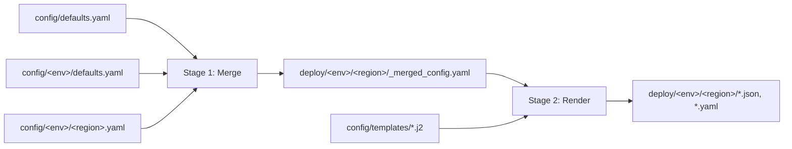

# Config Directory

Configuration for all environments and region deployments. The render script
(`scripts/render.py`) reads these files and generates the `deploy/` directory.

## Rendering Pipeline

`scripts/render.py` runs in two stages:



**Stage 1** deep-merges the config hierarchy (most-specific wins) and writes
`_merged_config.yaml` — inspect this file to see the effective values for any
region, with all `@doc` annotations preserved.

**Stage 2** feeds the merged config to Jinja2 templates in `config/templates/`,
producing the pipeline input files and ArgoCD manifests in `deploy/`.

## File Layout

```
config/
  defaults.yaml                     # Base config inherited by all environments
  templates/                        # Jinja2 templates (1-1 with deploy/ output files)
  <env>/
    defaults.yaml                   # Per-environment defaults
    <region>.yaml                   # Per-region deployment values
```

## Inheritance

All fields are deep-merged through the hierarchy, most-specific wins:

```
defaults.yaml  →  <env>/defaults.yaml  →  <env>/<region>.yaml
```

## Jinja2 Templates

All string values in config files are Jinja2-processed **after** the full merge
chain resolves. Identity variables are injected automatically by the render script.

| Variable               | Source                     | Example              |
| ---------------------- | -------------------------- | -------------------- |
| `{{ environment }}`    | environment directory name | `"integration"`      |
| `{{ aws_region }}`     | region file stem           | `"us-east-1"`        |
| `{{ account_id }}`     | resolved aws.account_id    | `"ssm:///infra/..."` |
| `{{ cluster_prefix }}` | management_cluster key     | `"mc01"`             |

## Output

Running `scripts/render.py` generates:

- **`deploy/<env>/region-definitions.json`**
  - Consumer: External processes
  - Region map with management cluster IDs per region.

- **`deploy/<env>/<region>/pipeline-provisioner-inputs/terraform.json`**
  - Consumer: `provision-pipelines.sh` (pipeline-provisioner pipeline)
  - Trigger: Pipeline provisioner
  - Contains: `domain`

- **`deploy/<env>/<region>/pipeline-provisioner-inputs/regional-cluster.json`**
  - Consumer: `provision-pipelines.sh` (pipeline-provisioner pipeline)
  - Trigger: Pipeline provisioner
  - Contains: `region`, `account_id`, `regional_id`, `delete_pipeline`

- **`deploy/<env>/<region>/pipeline-provisioner-inputs/management-cluster-<mc>.json`**
  - Consumer: `provision-pipelines.sh` (pipeline-provisioner pipeline)
  - Trigger: Pipeline provisioner
  - Contains: `region`, `account_id`, `management_id`, `delete_pipeline`

- **`deploy/<env>/<region>/pipeline-regional-cluster-inputs/terraform.json`**
  - Consumer: RC pipeline stages (`provision-infra-rc.sh`, `bootstrap-argocd-rc.sh`, `register.sh`)
  - Trigger: Regional cluster pipeline
  - Contains: Terraform variables + `delete` flag

- **`deploy/<env>/<region>/pipeline-management-cluster-<mc>-inputs/terraform.json`**
  - Consumer: MC pipeline stages (`provision-infra-mc.sh`, `bootstrap-argocd-mc.sh`, `iot-mint.sh`, `register.sh`)
  - Trigger: Management cluster pipeline
  - Contains: Terraform variables + `delete` flag

- **`deploy/<env>/<region>/argocd-values-<cluster-type>.yaml`**
  - Consumer: ArgoCD ApplicationSet
  - Trigger: ArgoCD auto-sync
  - Helm values overrides for cluster applications.

- **`deploy/<env>/<region>/argocd-bootstrap-<cluster-type>/applicationset.yaml`**
  - Consumer: `bootstrap-argocd.sh` (ECS task)
  - No trigger (applied at bootstrap time)
  - ApplicationSet manifest; pins git revision when `git.revision` is a commit hash.

## Templates

Templates in `config/templates/` map 1-1 to deploy/ output files. Each template
receives the fully-merged config values as its Jinja2 context.

## SSM Parameter References

Config values prefixed with `ssm:///` are resolved at pipeline runtime from AWS
Systems Manager Parameter Store. These parameters are **not** managed in this
repo — they are created by the account-minter in the internal repo.

| Parameter Path                                      | Description                          | Created By                       |
| --------------------------------------------------- | ------------------------------------ | -------------------------------- |
| `/infra/<env>/<region>/account_id`                  | Regional cluster AWS account ID      | account-minter                   |
| `/infra/<env>/<region>/<cluster_prefix>/account_id` | Management cluster AWS account ID    | account-minter                   |
| `/infra/region-ou-path` _(RC account)_              | AWS Organizations OU path for region | manual (planned: account-minter) |

If you need to reference a new SSM parameter in config, ensure it is first
created by the account-minter (or another provisioner in the internal repo),
then add the `ssm:///` reference in the appropriate config field.

## Examples

### defaults.yaml

Defines base values inherited by every environment:

```yaml
git:
  revision: main
  bootstrap_revision: main

aws:
  account_id: "ssm:///infra/{{ environment }}/{{ aws_region }}/account_id"
  management_cluster_account_id: "ssm:///infra/{{ environment }}/{{ aws_region }}/{{ cluster_prefix }}/account_id"

dns:
  domain: ""

terraform_common:
  app_code: "infra"
  service_phase: "dev"
  cost_center: "000"
  enable_bastion: false

applications:
  regional-cluster:
    maestro:
      mqttEndpoint: "xxx.iot.{{ aws_region }}.amazonaws.com"
```

### integration/defaults.yaml

Environment-level defaults:

```yaml
dns:
  domain: int0.rosa.devshift.net

terraform_common:
  enable_bastion: true
```

### integration/us-east-1.yaml

Region deployment values:

```yaml
management_clusters:
  mc01: {}
```

### cdoan-central/us-east-2.yaml (with overrides)

Region with explicit account IDs:

```yaml
aws:
  account_id: "754250776154"

terraform_common:
  enable_bastion: true

management_clusters:
  mc01:
    account_id: "910485845704"
```

### Configuring EC2 instance families

Instance families control which EC2 instance types are available to the Karpenter NodePool. The Helm chart generates specific sizes (xlarge, 2xlarge, 4xlarge) per family.

**Inheritance chain** (same for both cluster types):

```
defaults.yaml (regional_cluster.node_instance_families / management_cluster_defaults.node_instance_families)
  ↓ override at environment level
<env>/defaults.yaml
  ↓ override at region level
<env>/<region>.yaml
```

**Examples:**

Environment-level override (affects all regions in environment):

```yaml
# integration/defaults.yaml
regional_cluster:
  node_instance_families: ["m7i", "m7a"]

management_cluster_defaults:
  node_instance_families: ["m7i", "m7a"]
```

Region-level override (affects specific region):

```yaml
# psav-central/us-east-1.yaml
regional_cluster:
  node_instance_families: ["c6i"]
```
