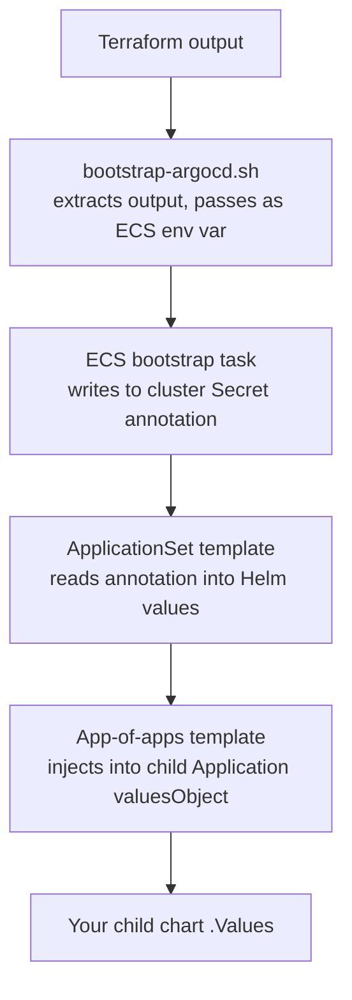

# Adding an ArgoCD Application

This guide covers three common workflows:

1. [Adding a new application](#adding-a-new-application) to the platform
2. [Plumbing a Terraform value](#plumbing-a-terraform-or-pipeline-value-to-argocd) through to an ArgoCD application
3. [Providing secrets](#providing-secrets-from-aws-secrets-manager) from AWS Secrets Manager

## Adding a New Application

### 1. Create the Helm Chart

Create a chart directory under the appropriate scope:

```text
argocd/config/shared/my-app/            # Deploys to both RC and MC
argocd/config/regional-cluster/my-app/  # RC only
argocd/config/management-cluster/my-app/ # MC only
```

Minimum chart structure:

```text
argocd/config/<scope>/my-app/
├── Chart.yaml
├── values.yaml
└── templates/
    └── deployment.yaml   # (or whatever resources you need)
```

### 2. Register in the App-of-Apps Chart

Add an entry to `argocd/config/app-of-apps/values.yaml` in the appropriate wave:

```yaml
applications:
  # Wave 0:  Foundations — CRD operators, storage, node pools (zero dependencies)
  # Wave 5:  ArgoCD — self-management handoff (depends on CRDs from wave 0)
  # Wave 10: Infrastructure — configure operators, install secondary CRD operators
  # Wave 20: Services — all platform workloads and observability

  - name: my-app
    wave: 20
    path: regional-cluster/my-app
    clusterTypes: [regional-cluster]
```

| Field          | Description                                                                                           |
| -------------- | ----------------------------------------------------------------------------------------------------- |
| `name`         | ArgoCD Application name. Also used as the target namespace.                                           |
| `wave`         | Sync-wave (0, 5, 10, 20). Controls deployment order — lower waves deploy first and must be healthy.   |
| `path`         | Relative to `argocd/config/`. Must match the chart directory created in step 1.                       |
| `clusterTypes` | Optional. Omit for `shared/` charts. Set to `[regional-cluster]` or `[management-cluster]` to filter. |

**Choosing a wave:**

- **0** — CRD operators and foundational resources with zero dependencies (e.g., `external-secrets`, `prometheus-crds`, `storageclass`)
- **5** — ArgoCD self-management only (depends on CRDs from wave 0)
- **10** — Configures wave-0 operators or installs secondary operators (e.g., `thanos-operator`, `external-secrets-config`)
- **20** — All platform workloads and observability services (e.g., `platform-api`, `monitoring`, `maestro-server`)

### 3. Use Helm Values

Each child application receives values from three layers, merged in order:

1. **Chart defaults** — `argocd/config/<scope>/my-app/values.yaml`
2. **Rendered environment overrides** — `deploy/<env>/<region>/argocd-values-<cluster_type>.yaml`
3. **Inline valuesObject** — global and infrastructure values injected by the app-of-apps template

Your chart can reference `global.*` values (cluster identity) without any extra wiring:

```yaml
# In your chart's templates/
{{ .Values.global.cluster_name }}
{{ .Values.global.aws_region }}
{{ .Values.global.environment }}
```

### 4. Render and Validate

```bash
make render
make pre-push
```

That's it. ArgoCD will deploy your application in the configured wave on the next sync.

## Plumbing a Terraform or Pipeline Value to ArgoCD

Infrastructure values (target group ARNs, KMS key ARNs, etc.) flow from Terraform outputs through the provisioning pipeline into ArgoCD charts. The pipeline runs `terraform output`, passes values to the ECS bootstrap task as env vars, and the bootstrap task writes them to the cluster Secret as annotations. The ApplicationSet reads those annotations and injects them into the app-of-apps chart.



This is the same path whether the value originates from initial provisioning or a pipeline re-run — `bootstrap-argocd.sh` uses `kubectl apply` so re-running updates the Secret in place.

### Example: Adding `my_target_group_arn`

**1. Terraform output** — expose from your module:

```hcl
# terraform/config/regional-cluster/outputs.tf
output "my_target_group_arn" {
  value = module.my_module.target_group_arn
}
```

**2. Bootstrap script** — extract and pass to ECS:

```bash
# scripts/bootstrap-argocd.sh — extract value
MY_TARGET_GROUP_ARN=$(echo "$OUTPUTS" | jq -r '.my_target_group_arn.value // ""')
```

Add to the `containerOverrides` array in the same file:

```json
{ "name": "MY_TARGET_GROUP_ARN", "value": "$MY_TARGET_GROUP_ARN" }
```

**3. ECS task definition** — add the env var to the `environment` block and write to the cluster Secret annotation:

```yaml
# terraform/modules/ecs-bootstrap/main.tf (cluster Secret template)
annotations:
  my_target_group_arn: "$MY_TARGET_GROUP_ARN"
```

**4. ApplicationSet template** — read the annotation:

```yaml
# config/templates/argocd-bootstrap/applicationset.yaml.j2
infrastructure:
  my_target_group_arn: '{{ '{{ .metadata.annotations.my_target_group_arn }}' }}'
```

**5. App-of-apps chart** — declare the value and inject into child apps:

```yaml
# argocd/config/app-of-apps/values.yaml
infrastructure:
  my_target_group_arn: ""
```

```yaml
# argocd/config/app-of-apps/templates/application.yaml
valuesObject:
  myApp:
    targetGroup:
      arn: "{{ $.Values.infrastructure.my_target_group_arn }}"
```

**6. Child chart** — use the value:

```yaml
# argocd/config/regional-cluster/my-app/templates/deployment.yaml
- name: TARGET_GROUP_ARN
  value: "{{ .Values.myApp.targetGroup.arn }}"
```

**7. Render and validate:**

```bash
make render
make pre-push
```

## Providing Secrets from AWS Secrets Manager

There are two patterns for delivering secrets to pods. Choose based on whether other Kubernetes resources need to reference the secret.

| Pattern                     | Creates K8s Secret? | Use When                                                                      | Example                         |
| --------------------------- | ------------------- | ----------------------------------------------------------------------------- | ------------------------------- |
| **ExternalSecret (ESO)**    | Yes                 | Other resources reference the Secret (e.g., Alertmanager config, pull secret) | PagerDuty integration key       |
| **CSI SecretProviderClass** | No                  | Pod reads secrets as files — no K8s Secret needed                             | Database credentials, TLS certs |

Both patterns use **Pod Identity** for AWS authentication — no IRSA/OIDC provider setup required.

### Pattern 1: ExternalSecret (Kubernetes Secret Needed)

Use this when another resource (Alertmanager, imagePullSecrets, etc.) needs a Kubernetes Secret object.

**Terraform — create the secret:**

```hcl
# terraform/modules/my-module/secrets.tf
resource "aws_secretsmanager_secret" "my_secret" {
  name                    = "${var.regional_id}-my-secret"
  recovery_window_in_days = 0
}

resource "aws_secretsmanager_secret_version" "my_secret" {
  secret_id     = aws_secretsmanager_secret.my_secret.id
  secret_string = jsonencode({
    api_key = var.api_key
  })
}
```

**Chart — create the ExternalSecret:**

```yaml
# argocd/config/regional-cluster/my-app/templates/external-secret.yaml
apiVersion: external-secrets.io/v1
kind: ExternalSecret
metadata:
  name: my-secret
  namespace: my-app
spec:
  refreshInterval: 1h
  secretStoreRef:
    name: aws-secrets-manager
    kind: ClusterSecretStore
  target:
    name: my-secret
    creationPolicy: Owner
  data:
    - secretKey: api_key
      remoteRef:
        key: {{ .Values.global.cluster_name }}-my-secret
        property: api_key
```

The `ClusterSecretStore` named `aws-secrets-manager` is deployed at wave 10 by `external-secrets-config`. Your app must be in wave 20.

**IAM** — the ESO operator's Pod Identity role already has read access to `${regional_id}-*` secrets in Secrets Manager. No additional IAM changes needed unless your secret name doesn't follow the `${regional_id}-` prefix convention.

**Reference the generated Secret like any other:**

```yaml
env:
  - name: API_KEY
    valueFrom:
      secretKeyRef:
        name: my-secret
        key: api_key
```

### Pattern 2: CSI SecretProviderClass (Direct File Mount)

Use this when your pod reads secrets as files and no other resource needs a Kubernetes Secret object. Secrets are mounted directly from AWS Secrets Manager into the pod filesystem via the CSI driver — they never exist as Kubernetes Secret objects.

**Terraform — create the secret and Pod Identity:**

```hcl
# terraform/modules/my-module/secrets.tf
resource "aws_secretsmanager_secret" "db_credentials" {
  name                    = "${var.regional_id}-my-app-db-credentials"
  recovery_window_in_days = 0
}

resource "aws_secretsmanager_secret_version" "db_credentials" {
  secret_id     = aws_secretsmanager_secret.db_credentials.id
  secret_string = jsonencode({
    username = aws_db_instance.main.username
    password = random_password.db.result
    host     = aws_db_instance.main.address
    port     = aws_db_instance.main.port
  })
}

# terraform/modules/my-module/iam.tf
resource "aws_iam_role" "my_app" {
  name = "${var.regional_id}-my-app"
  assume_role_policy = jsonencode({
    Version = "2012-10-17"
    Statement = [{
      Effect = "Allow"
      Principal = { Service = "pods.eks.amazonaws.com" }
      Action    = ["sts:AssumeRole", "sts:TagSession"]
    }]
  })
}

resource "aws_iam_role_policy" "my_app_secrets" {
  name = "${var.regional_id}-my-app-secrets"
  role = aws_iam_role.my_app.id
  policy = jsonencode({
    Version = "2012-10-17"
    Statement = [{
      Effect   = "Allow"
      Action   = ["secretsmanager:GetSecretValue", "secretsmanager:DescribeSecret"]
      Resource = [aws_secretsmanager_secret.db_credentials.arn]
    }]
  })
}

resource "aws_eks_pod_identity_association" "my_app" {
  cluster_name    = var.eks_cluster_name
  namespace       = "my-app"
  service_account = "my-app"
  role_arn        = aws_iam_role.my_app.arn
}
```

**Chart — create the SecretProviderClass:**

```yaml
# argocd/config/regional-cluster/my-app/templates/secretproviderclass.yaml
apiVersion: secrets-store.csi.x-k8s.io/v1
kind: SecretProviderClass
metadata:
  name: my-app-secrets
  namespace: my-app
spec:
  provider: aws
  parameters:
    usePodIdentity: "true"
    region: "{{ .Values.global.aws_region }}"
    objects: |
      - objectName: "{{ .Values.global.cluster_name }}-my-app-db-credentials"
        objectType: "secretsmanager"
        jmesPath:
          - path: "username"
            objectAlias: "db.user"
          - path: "password"
            objectAlias: "db.password"
          - path: "host"
            objectAlias: "db.host"
          - path: "port"
            objectAlias: "db.port"
```

**Chart — mount in the Deployment:**

```yaml
# argocd/config/regional-cluster/my-app/templates/deployment.yaml
spec:
  volumes:
    - name: secrets-store
      csi:
        driver: secrets-store.csi.k8s.io
        readOnly: true
        volumeAttributes:
          secretProviderClass: my-app-secrets
  containers:
    - name: my-app
      volumeMounts:
        - name: secrets-store
          mountPath: /mnt/secrets-store
          readOnly: true
      command:
        - /my-app
        - --db-host-file=/mnt/secrets-store/db.host
        - --db-password-file=/mnt/secrets-store/db.password
```

### Secret Naming Convention

All secrets in AWS Secrets Manager must follow the naming pattern:

```text
${regional_id}-<descriptive-name>
```

Examples: `us-east-1-rc-maestro-db-credentials`, `us-east-1-rc-pagerduty-integration-key`

This is enforced by the ESO operator's IAM policy, which scopes read access to `${regional_id}-*`.
