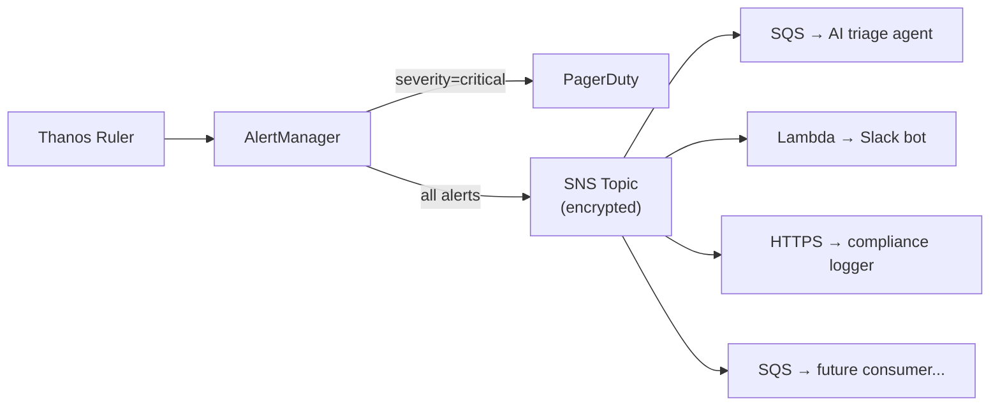

# Milestone 4: Building a Regional Observability Platform

_ROSA HyperFleet — Observability and Alerting_

## Introduction

When we set out to build observability for the ROSA HyperFleet, we faced a fundamental constraint: each AWS region operates independently with its own EKS-based Regional Cluster (RC) and a fleet of Management Clusters (MCs) running across separate AWS accounts. There is no shared network, no centralized Prometheus, and no global control plane to lean on. Metrics, logs, and alerts all had to be solved regionally — from scratch.

We are pleased to announce that we have successfully completed Milestone 4 ([ROSA-669](https://redhat.atlassian.net/browse/ROSA-669)), which lays the foundation for our observability stack. This post covers the key areas we think are worth sharing more broadly: the **metrics and logging architecture** spanning both cluster types with secure cross-account transit, an **alerting architecture designed for multiple consumers**, and how we **validate the full pipeline end-to-end** in CI.

## The Problem

A single region can have dozens of Management Clusters, each in its own AWS account, each hosting customer Hosted Control Planes. An SRE needs to:

- See metrics from every cluster in the region in a single place
- Query logs from every cluster — including MCs in separate AWS accounts — without SSH or direct cluster access
- Get paged when something breaks, with a runbook and enough context to diagnose the issue without needing direct access to the cluster
- Query historical data for incident review and capacity planning
- Add new alert consumers — an AI triage agent, a Slack integration, a compliance audit logger — without changing the core alerting pipeline every time, and without a buggy or abandoned consumer affecting the alerting capability of the region

And all of this needs to run on FIPS-compliant, FedRAMP-ready infrastructure with no static credentials anywhere.

## Aligning with RHOBS

Rather than building a bespoke metrics stack, we aligned our observability architecture with the **RHOBS (Red Hat Observability Service)** production configurations. Our Thanos deployment is managed by the RHOBS **thanos-operator** — rebuilt through the Konflux pipeline on a UBI9 base image. Beyond the operator, we aligned the configuration of every sub-component — each Thanos component (Receive, Query, Store, Compactor, Ruler), each Loki component (distributor, ingester, querier, query-frontend, compactor, index-gateway), and Vector pipeline rules — against the [RHOBS production deployment](https://gitlab.cee.redhat.com/rhobs/configuration). While the data-plane components currently use upstream community images, we're working with the RHOBS team to consume Red Hat-built images across the full stack for FIPS compliance and CVE patching.

### The thanos-operator

The [thanos-community/thanos-operator](https://github.com/thanos-community/thanos-operator) is the upstream project. The [rhobs/rhobs-konflux-thanos-operator](https://github.com/rhobs/rhobs-konflux-thanos-operator) rebuilds the same operator code on a UBI9 base image with automated Clair, ClamAV, Snyk, and Coverity scanning — the exact image provenance chain that FedRAMP auditors want to see. We consume this as an OCI Helm subchart, pinned to a specific commit hash and image digest.

This gives us two things we couldn't easily get from upstream alone:

1. **Operator-managed lifecycle** — CRDs, Deployment, and RBAC are maintained upstream; upgrading is a single chart version bump rather than maintaining ~38,000 lines of CRD YAML locally (which was our original approach, and which drifted silently until ArgoCD sync failures caught it)
2. **Alignment with Red Hat's observability direction** — we're building on the same foundation as the rest of the managed services portfolio, not a one-off stack

### The Thanos deployment

Each Regional Cluster runs a full Thanos stack deployed as two ArgoCD applications:

| Component                              | Role                                                                                       |
| -------------------------------------- | ------------------------------------------------------------------------------------------ |
| **Thanos Receive** (router + ingester) | Accepts `remote_write` from both RC Prometheus and MC Prometheus instances via API Gateway |
| **Thanos Query + Frontend**            | Federates live data from Receive and historical data from Store Gateway                    |
| **Thanos Store Gateway**               | Serves historical blocks from KMS-encrypted S3                                             |
| **Thanos Compactor**                   | Compacts and downsamples S3 blocks (90d raw → 180d at 5m → 365d at 1h)                     |
| **Thanos Ruler**                       | Evaluates all alerting and recording rules against Thanos Query                            |

Two IAM roles enforce least-privilege: a write role for the Receive ingester and Compactor (which need `s3:PutObject` and KMS key generation), and a read-only role for the Store Gateway (which only needs `s3:GetObject` and `kms:Decrypt`). All credentials come from EKS Pod Identity — no static secrets.

### Cross-account ingestion: metrics and logs

The hardest piece was getting observability data from Management Clusters — running in separate AWS accounts with no direct network path to the Regional Cluster — into the RC's Thanos and Loki securely. We solved this with a single pattern applied to both metrics and logs:

Each MC runs a **sigv4-proxy** sidecar for both metrics and logs. The proxy authenticates requests using AWS native authorization via EKS Pod Identity credentials. A dedicated **RHOBS API Gateway** (separate from the customer-facing Platform API Gateway) authenticates via AWS IAM and forwards through an internal ALB to Thanos Receive (for metrics) and Loki Distributor (for logs). The API Gateway resource policy restricts access to any authenticated principal within the same AWS Organization — meaning adding a new Management Cluster requires zero policy changes as long as its AWS account is in the org.

Cluster identity is carried by Prometheus `externalLabels` (`cluster` and `cluster_type`) for metrics, and equivalent Vector labels for logs, so both PromQL and LogQL queries filter naturally by cluster without multi-tenancy.

One detail worth calling out: Prometheus remote_write uses snappy-compressed protobuf, but REST API Gateway v1 only accepts `gzip`, `deflate`, and `identity` as `Content-Encoding` values. The signing proxy strips the `Content-Encoding: snappy` header before authenticating — this is semantically correct because snappy compression is part of the Prometheus application protocol, not HTTP transport-level compression. Thanos Receive expects snappy regardless of what the header says.


## Logging Platform: Vector + Loki

The logging stack mirrors the metrics architecture: a centralized Loki on the RC receiving logs from both local and remote Vector agents.

### Vector

Every cluster runs a **Vector** DaemonSet collecting Kubernetes logs with JSON parsing, webhook exclusion, and cluster identity labels (`cluster_name`, `cluster_type`). On the RC, Vector sinks directly to the local Loki Distributor. On MCs, Vector forwards through the sigv4-proxy-logs sidecar to the RHOBS API Gateway, which routes to the RC's Loki Distributor — the same cross-account pattern used for metrics.

The Vector pipeline configuration is aligned with the RHOBS CLF (Cluster Log Forwarder) template — same JSON parsing rules, same label conventions, same webhook exclusions — so that log data is interoperable with RHOBS production environments.

### Loki

Loki is deployed in **distributed mode** on the RC: separate distributor, ingester, querier, query-frontend, compactor, and index-gateway components. Storage uses KMS-encrypted S3 with 90-day retention. The deployment configuration is based on the RHOBS `LokiStack 1x.extra-small` sizing profile, adapted for our EKS environment (no Loki Gateway — auth is handled at the API Gateway layer).

Loki is exposed through the RHOBS API Gateway for both push (distributor) and query (query-frontend) paths, enabling the same SigV4-authenticated access pattern for both ingestion and querying — including from e2e tests running outside the cluster.

### AWS infrastructure logs

In addition to application logs collected by Vector, AWS infrastructure logs — EKS control plane audit logs, RDS logs, API Gateway access logs, IoT Core logs, and CloudTrail (when enabled) — are collected via CloudWatch Logs with 365-day retention and KMS encryption. Grafana's CloudWatch Logs datasource provides cross-account querying with assume-role for MC log groups.

## Alerting Architecture: Designed for Fan-Out

This is the part we're most excited about. Traditional alerting setups put AlertManager at the center of routing, with every new consumer requiring a config change and reload. That works fine for three receivers; it doesn't work when you want an extensible pipeline where different teams can independently subscribe to the alerts they care about.

### The two-phase design

**Phase 1 — PagerDuty stays on the critical path.** All critical alerts (`severity=critical`) route directly from AlertManager to PagerDuty. This path has no additional dependencies, no intermediate queues, no SNS — just AlertManager's native PagerDuty receiver. When an SRE gets paged, we don't want that page to depend on SNS availability. That said, PagerDuty itself is an implementation detail — the provider is swappable via feature flags, which matters for our FedRAMP/GovCloud teams where not every provider is an option.

**Phase 2 — Everything else fans out through SNS.** A second AlertManager route publishes all alerts to an encrypted SNS topic.



### Why this matters

**Adding a new consumer requires zero AlertManager changes.** A team that wants to receive platform alerts subscribes to the SNS topic with an optional filter policy — filtering by alert labels like `team`, `severity`, or `component` — and deploys their consumer independently. No config reload, no PR to the alerting chart, no risk of breaking routing for everyone else.

**SNS filter policies replace AlertManager routing logic for downstream consumers.** Instead of building increasingly complex AlertManager route trees, each subscriber declares what it wants:

```hcl
resource "aws_sns_topic_subscription" "ai_triage" {
  topic_arn = aws_sns_topic.alerts.arn
  protocol  = "sqs"
  endpoint  = aws_sqs_queue.ai_triage.arn
  filter_policy = jsonencode({
    severity = ["critical", "warning"]
  })
}
```

**Durability depends on the subscriber, not AlertManager.** SQS subscribers get retry and dead-letter queue support. Lambda subscribers get automatic retries. AlertManager's limited retry buffer is no longer the bottleneck for non-paging consumers. This should significantly reduce the load on AlertManager if consumers are failing as well, delegating the reliability to the subscriber.

### Cross-cluster rule evaluation

One subtle but important piece: alerting rules often need metrics from multiple clusters. For example, our HCP Availability SLA alerts need `HostedCluster` status conditions from Management Clusters — but RC Prometheus only sees its own local TSDB.

**Thanos Ruler** solves this. It evaluates all `PrometheusRule` CRs against Thanos Query (which federates both RC and MC metrics), and sends firing alerts to AlertManager. This makes Thanos Ruler the single evaluation point for all rules, eliminating duplicate evaluation between RC Prometheus and Thanos Ruler.

Platform alerting rules are deployed as `PrometheusRule` CRs via a dedicated `alerting-rules` Helm chart, with unit tests run by `promtool` in CI. SLA alerts use the multi-window, multi-burn-rate pattern from the [Google SRE Workbook](https://sre.google/workbook/alerting-on-slos/) — a fast-burn alert (5-minute window, 14.4x burn rate) catches severe outages quickly, while a slow-burn alert (30-minute window, 6x burn rate) detects partial degradation.

## What We Shipped

Milestone 4 spanned 20 epics across metrics gathering, log forwarding, alerting, and dashboarding. Here's the summary:

### Metrics Foundation

Thanos stack managed by the RHOBS thanos-operator, deployed automatically to every new region via ArgoCD, with S3-backed long-term storage and KMS encryption. Prometheus runs as an HA pair (2 replicas) on both RC and MC.

### Metrics Gathering

Full Prometheus + YACE (Yet Another Cloudwatch Exporter) coverage across both cluster types. On the Kubernetes side: kube-state-metrics (with CustomResourceState for HostedCluster conditions), node-exporter, ServiceMonitors, and PodMonitors. On the AWS side: YACE scrapes CloudWatch metrics for EKS, IoT/MQTT, API Gateway, RDS, ALB, DynamoDB, AmazonMQ, and ACM certificates on the RC, and EKS control-plane metrics on MCs.

### Secure Cross-Account Transit

AWS IAM-authenticated pipelines for both metrics and logs from MC → RHOBS API Gateway → Thanos Receive / Loki Distributor, with organization-scoped IAM policies and no direct MC-to-RC network path. Every credential comes from EKS Pod Identity — no static secrets anywhere.

### Log Forwarding

Vector DaemonSets on both RC and MC collecting Kubernetes logs with JSON parsing and cluster identity labels. RC Vector sinks to the local Loki Distributor; MC Vector forwards through a sigv4-proxy sidecar to the RHOBS API Gateway. Loki runs in distributed mode on the RC with KMS-encrypted S3 storage and 90-day retention. AWS infrastructure logs (EKS audit logs, RDS logs, API Gateway access logs, IoT Core, CloudTrail) are collected via CloudWatch Logs with 365-day retention.

### Alerting

The full alerting pipeline: Thanos Ruler evaluating PrometheusRule CRs against cross-cluster metrics, AlertManager with PagerDuty + SNS fan-out, SNS topic with Terraform module for subscriber management, and initial SLA alerts for HCP availability using multi-window burn-rate patterns.

### Grafana

Grafana is the single pane of glass for the region, combining three types of data sources:

- **Thanos Query Frontend** — 15+ dashboards deployed via Helm covering infrastructure (EKS, API Gateway, RDS, ALB, DynamoDB), platform health (RC, MC, HCP, ArgoCD), observability stack health (Vector, Loki), and HCP SLA tracking with error budget burn rates
- **Loki Query Frontend** — Log Explorer for querying application logs from both RC and MC by cluster, namespace, or container
- **CloudWatch Logs** — AWS infrastructure logs (EKS audit, RDS, API Gateway, IoT Core) with cross-account assume-role for MC log groups

Combined with YACE exposing AWS metrics, this means an SRE can investigate infrastructure-level issues entirely from Grafana — correlating CloudWatch metrics and logs side by side — without needing to log in to the AWS console.


### HCP Availability Monitoring

HCP availability is derived from the `KubeAPIServerAvailable` status condition on HostedCluster CRs, exported by kube-state-metrics CustomResourceState on Management Clusters and remote-written to Thanos on the RC. A recording rule (`hcp:hostedcluster_available`) converts this into a 0/1 gauge, with lifecycle-aware exclusions for clusters that are installing or being deleted. This feeds the SLA burn-rate alerts and HCP Health dashboards. External synthetic monitoring (probing customer API endpoints from outside the cluster) is planned as future work.

### End-to-End Testing

Observability is validated at two levels:

- **E2E tests** query Thanos and Loki through the RHOBS API Gateway (the same SigV4-authenticated path used by production consumers) to validate that metrics and logs from both RC and MC are flowing through the full pipeline. These tests verify CloudWatch exporter metrics, Vector sink metrics, Loki distributor metrics, and log presence by `cluster_type` — covering the entire cross-account path end-to-end.
- **Alerting rule unit tests** run `promtool test rules` in CI against every `PrometheusRule` CR, validating recording rule logic, alert firing conditions, and lifecycle suppression behavior.

We also plan to run these same end-to-end tests as pre-merge checks in upstream repos, like hypershift-operator, so upstream teams can catch observability regressions before they ship.

## What's Next

The foundation is in place: every region has its own self-contained observability stack — metrics, logs, alerting, and dashboards — with an alerting pipeline designed to grow with the platform. Adding a new alert consumer is an SNS subscription, not an architecture change.

We're still working through the authentication story around Grafana and whether there will be any kind of "global" dashboard that gives an overview of the fleet as a whole. The key constraint is maintaining our goal of preventing any customer-identifying information from being persisted outside of the individual regions.

On the alerting side, we need a more sustainable way to silence alerts on clusters that shouldn't be paged on — clusters in an installing or deprovisioning state, or clusters in limited support. We're working with the upstream RHOBS team to develop a more robust alert silencing solution that we can integrate directly into Cluster Lifecycle Manager.

We're also working with the RHOBS team to consume RHOBS-maintained images and packaging across the full observability stack — so we get FIPS-compliant builds, CVE patching, and managed CRD/operator lifecycle without maintaining it ourselves.

---

_For questions or feedback, reach out in #team-rosa-hyperfleet on Slack._
