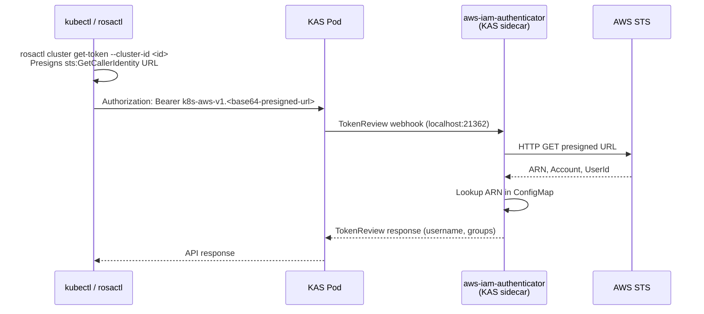
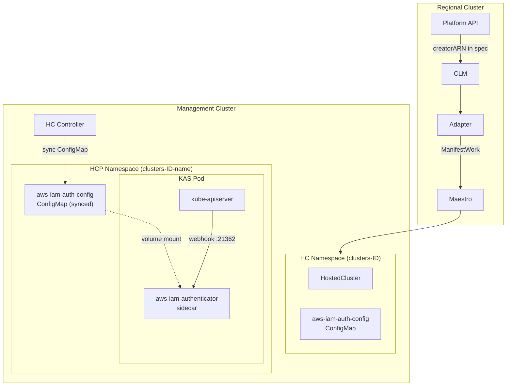

# AWS IAM Authentication for Hosted Clusters (Experimental)

> **Status: Experimental** — This design reflects an early proof-of-concept.
> Implementation details (image references, flag names, exact flow) may have
> diverged from the current codebase. Refer to the code and PR descriptions
> as the source of truth.

**Last Updated Date**: 2026-06-10

## Summary

Hosted clusters authenticate users via AWS IAM using `aws-iam-authenticator` as a KAS sidecar. Customers use their existing AWS credentials to access clusters — identical to how EKS authentication works. The cluster creator is automatically mapped as `cluster-admin` during provisioning.

## Context

- **Problem Statement**: Hosted clusters need user-facing authentication. The only access method today is the `system:admin` client certificate kubeconfig extracted from the management cluster. Customers need a managed authentication experience using their existing AWS IAM credentials, consistent with how they authenticate to the Platform API via SigV4.

- **Constraints**:
  - Must use AWS IAM as the identity source — no separate identity systems
  - Must not introduce a central failure point — each cluster authenticates independently
  - Minimal HyperShift changes

- **Assumptions**:
  - Customers have `sts:GetCallerIdentity` permissions (universally available to all IAM principals)

## Design Rationale

The `aws-iam-authenticator` sidecar approach was chosen because it has no central failure point, no signing keys, no OIDC infrastructure, and mirrors EKS authentication exactly.

## Architecture

### Authentication Flow



### Component Layout



## Implementation

### Provisioning Flow

1. **Platform API** captures the cluster creator's IAM ARN from the SigV4 request context (`X-Amz-Caller-Arn` header from API Gateway) and stores it in the cluster spec as `creatorARN`.

2. **Adapter** reads `creatorARN` via CEL expression and templates it into the ManifestWork, which delivers to the HC namespace:
   - A `HostedCluster` with annotation `hypershift.openshift.io/aws-iam-authenticator: "true"`
   - An `aws-iam-auth-config` ConfigMap mapping the creator ARN to `system:masters`

3. **HyperShift HC controller** syncs the `aws-iam-auth-config` ConfigMap from the HC namespace to the HCP namespace (where KAS runs). Gated on the `aws-iam-authenticator` annotation.

4. **HyperShift CPO** (custom build) detects the annotation and:
   - Injects the `aws-iam-authenticator` sidecar into the KAS pod (EKS Distro image, listening on port 21362)
   - Redirects the KAS webhook token config to `https://localhost:21362/authenticate`

### Empty ConfigMap Handling

If `creatorARN` is not set (e.g. API change not deployed), the ConfigMap is still emitted with an empty `mapUsers: []`. The sidecar starts and serves normally but rejects all tokens — KAS falls through to other auth methods (client certs). This avoids deployment ordering issues.

### Changes by Repository

| Repository                   | Files                                     | Change                                                      |
| ---------------------------- | ----------------------------------------- | ----------------------------------------------------------- |
| `rosa-regional-platform`     | `manifestwork.yaml`                       | `aws-iam-auth-config` ConfigMap, HC annotation              |
| `rosa-regional-platform`     | `adapter-task-config.yaml`                | `creatorARN` CEL capture                                    |
| `rosa-regional-platform-api` | `pkg/handlers/cluster.go`                 | Inject `creatorARN` from SigV4 caller identity              |
| `rosa-regional-platform-cli` | `internal/commands/cluster/kubeconfig.go` | `rosactl cluster kubeconfig` command                        |
| `hypershift`                 | `hostedcluster_controller.go`             | ConfigMap sync HC->HCP, annotation in `mirroredAnnotations` |
| `hypershift`                 | `kas/deployment.go`                       | `aws-iam-authenticator` sidecar injection                   |
| `hypershift`                 | `kas/oauth.go`                            | Webhook redirect to localhost:21362                         |

### Key Configuration

**ConfigMap** (`aws-iam-auth-config`):

```yaml
clusterID: <cluster-id>
server:
  mapUsers:
    - userARN: arn:aws:iam::123456789012:user/alice
      username: cluster-creator
      groups:
        - system:masters
```

**Kubeconfig** (generated by `rosactl cluster kubeconfig`):

```yaml
users:
  - name: my-cluster-iam
    user:
      exec:
        apiVersion: client.authentication.k8s.io/v1beta1
        command: /path/to/rosactl
        args: [cluster, get-token, --cluster-id, <cluster-id>]
```

## Related Documentation

- [aws-iam-authenticator](https://github.com/kubernetes-sigs/aws-iam-authenticator)
- [Maestro MQTT Resource Distribution](maestro-mqtt-resource-distribution.md)
