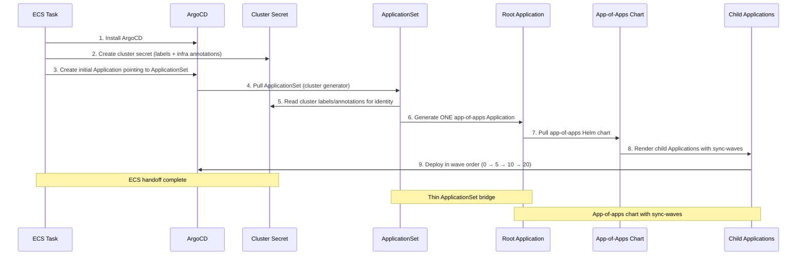

# GitOps Cluster Configuration Architecture

**Last Updated Date**: 2026-05-30

## Summary

The ROSA Regional Platform uses an app-of-apps pattern with a thin ApplicationSet bridge for GitOps cluster configuration. This provides ordered deployment via sync-waves, hash-based version pinning for progressive delivery, and region-aware configuration — while keeping each cluster independently self-managing.

## Context

Each cluster (Regional and Management) runs its own ArgoCD instance and self-configures independently. The configuration system must share common application definitions across clusters while supporting region-specific overrides, ordered deployment (CRD operators before consumers), and progressive delivery to production.

- **Problem Statement**: How to manage application configuration across regions and environments with deployment ordering, progressive delivery, and production safety
- **Constraints**: Fully private EKS clusters (no direct API access from outside VPC), region-specific customizations, cross-application deployment ordering, scale to hundreds of regions
- **Assumptions**: ArgoCD is the GitOps controller, CRD-installing operators must deploy before CRD consumers

## Architecture Overview

### Foundation Concepts

**ECS Bootstrap**: ECS Fargate tasks run inside the cluster's private subnets to install ArgoCD, create the cluster identity Secret, and create the initial Application pointing to the rendered ApplicationSet. After handoff, ArgoCD takes full control.

**App-of-Apps Pattern**: A root Application deploys a Helm chart that renders child Application CRs. This enables cross-application deployment ordering through sync-waves, unlike independent Applications from an ApplicationSet which have no ordering guarantees.

**Sync-Waves (Two-Level Ordering)**:

1. **Parent level (cross-application)**: Child Application CRs are annotated with sync-wave numbers (0, 5, 10, 20). ArgoCD syncs each wave in order, waiting for health before proceeding.
2. **Child level (intra-application)**: Sync-waves inside a chart are evaluated only within that application's sync and don't interact with other applications' waves.

**CRD Splitting**: CRDs consumed by other applications are split into standalone charts at wave 0, separate from their operator at a higher wave. Example: `prometheus-crds` installs ServiceMonitor/PrometheusRule CRDs at wave 0; `monitoring` (kube-prometheus-stack with `crds.enabled: false`) deploys at wave 20. For cert-manager, CRDs are bundled with the operator at wave 0 (`crds.enabled: true`), while the ClusterIssuer is a separate chart at wave 10 so that the cert-manager webhook is healthy before the CR is created.

**Application Health Gating**: Sync-wave ordering requires ArgoCD to evaluate child Application health before advancing to the next wave. This is enabled by a custom Lua health check in `argocd/config/shared/argocd/values.yaml` (`resource.customizations.health.argoproj.io_Application`) that maps child Application health status onto the parent's health assessment. Without this, ArgoCD treats newly created Application CRs as Healthy immediately, causing all waves to apply simultaneously.

**ApplicationSet Bridge**: A thin ApplicationSet uses only the cluster generator to read the cluster identity Secret and generate a single app-of-apps Application, passing infrastructure values from Secret annotations (target group ARNs, KMS key ARNs, DynamoDB config) into Helm values.

**Cluster Identity Secret**: A Kubernetes Secret per cluster containing labels (cluster_type, environment, region_deployment, aws_region) and annotations (git repo, revision, infrastructure values from Terraform) that the ApplicationSet reads to configure the root Application.

### GitOps Configuration Flow



### ApplicationSet: Thin Bridge to App-of-Apps

Each cluster uses a **rendered ApplicationSet** customized per environment through the render script.

**Integration Environment (Live Config)**:

```yaml
# deploy/integration/us-east-1/argocd-bootstrap-regional-cluster/applicationset.yaml
apiVersion: argoproj.io/v1alpha1
kind: ApplicationSet
metadata:
  name: root-applicationset
  namespace: argocd
spec:
  goTemplate: true
  preserveResourcesOnDeletion: true
  generators:
    - clusters:
        selector:
          matchLabels:
            argocd.argoproj.io/secret-type: cluster
  template:
    metadata:
      name: app-of-apps
    spec:
      sources:
        - helm:
            valuesObject:
              git:
                repo: "{{ .metadata.annotations.git_repo }}"
                chartRevision: "{{ .metadata.annotations.git_revision }}"
                valuesRevision: "{{ .metadata.annotations.git_revision }}"
              global:
                cluster_type: "{{ .metadata.labels.cluster_type }}"
                environment: "{{ .metadata.labels.environment }}"
                aws_region: "{{ .metadata.labels.aws_region }}"
                # ... other labels/annotations
              infrastructure:
                api_target_group_arn: "{{ .metadata.annotations.api_target_group_arn }}"
                thanos_kms_key_arn: "{{ .metadata.annotations.thanos_kms_key_arn }}"
                # ... other infrastructure annotations
          path: argocd/config/app-of-apps
          repoURL: "{{ .metadata.annotations.git_repo }}"
          targetRevision: "{{ .metadata.annotations.git_revision }}"
        - ref: values
          repoURL: '{{ .metadata.annotations.git_repo | replace "github.com" "github.com:443" }}'
          targetRevision: "{{ .metadata.annotations.git_revision }}"
```

**Staging/Production (Hash-Pinned Config)**:

When `git.revision` is a commit hash in the region config (e.g., `config/staging/us-east-1.yaml`), `chartRevision` and `targetRevision` are pinned to that hash, while `valuesRevision` still tracks the cluster secret's branch:

```yaml
valuesObject:
  git:
    chartRevision: "826fa76d08fc2ce87c863196e52d5a4fa9259a82" # Pinned
    valuesRevision: "{{ .metadata.annotations.git_revision }}" # Latest
```

**Key details**:

1. Uses only the cluster generator (not matrix) to generate a single Application named `app-of-apps`
2. Reads Terraform-provided infrastructure values from cluster Secret annotations into Helm values
3. Integration uses `git_revision` from cluster secret; staging/production uses a hardcoded commit hash from the region config for `chartRevision`
4. Charts pinned to specific commits for stability; values always track the cluster secret's revision

### App-of-Apps Chart with Sync-Waves

**App-of-Apps Chart Structure**:

```text
argocd/config/app-of-apps/
├── Chart.yaml
├── values.yaml             # Application topology with sync-wave assignments
└── templates/
    └── application.yaml    # Template rendering child Application CRs
```

**Sync-Wave Assignments** (from `app-of-apps/values.yaml`):

| Wave | Name           | Purpose                                               | Applications                                                                                                                                                                                                                     |
| ---- | -------------- | ----------------------------------------------------- | -------------------------------------------------------------------------------------------------------------------------------------------------------------------------------------------------------------------------------- |
| 0    | Foundations    | CRD operators, storage, node pools (zero deps)        | storageclass, prometheus-crds, cert-manager (MC), external-secrets, eks-nodepool                                                                                                                                                 |
| 5    | ArgoCD         | Self-management handoff (depends on CRDs from wave 0) | argocd                                                                                                                                                                                                                           |
| 10   | Infrastructure | Configure operators, install secondary CRD operators  | cert-manager-clusterissuer (MC), thanos-operator (RC), external-secrets-config (both)                                                                                                                                            |
| 20   | Services       | All platform workloads and observability              | monitoring (both), alerting-rules (RC), thanos (RC), cloudwatch-exporter, loki (RC), vector, grafana (RC), hypershift (MC), maestro-server (RC), maestro-agent (MC), platform-api (RC), cluster-cleanup (RC), hyperfleet-\* (RC) |

Each child Application uses the same two-source pattern: chart at `chartRevision`, values ref at `valuesRevision`. Applications are filtered by `clusterTypes` so RC and MC apps deploy only where appropriate.

### Configuration Hierarchy

Values flow through two layers:

1. **Chart Defaults**: `argocd/config/*/values.yaml`
2. **Rendered Overrides**: `deploy/<env>/<region_deployment>/argocd-values-<cluster_type>.yaml`

```text
Cluster Secret → ApplicationSet → App-of-Apps Chart → Child Applications
```

### ArgoCD Self-Management

After ECS bootstrap, ArgoCD manages its own updates through the `argocd` child Application (wave 5). Placing it in wave 5 ensures CRD operators (wave 0) are installed before the controller restart (bootstrap → self-managed), while the restart still happens before any workload waves deploy. Each cluster's ArgoCD operates independently.

## Progressive Deployment Strategy

Hash-based versioning through region config:

```yaml
# config/integration/us-east-1.yaml — follows HEAD
git:
  revision: main

# config/staging/us-east-1.yaml — pinned to tested commit
git:
  revision: "826fa76d08fc2ce87c863196e52d5a4fa9259a82"
```

Changes merge to main → integration validates at HEAD → staging pins to validated commit → production promotes the pinned commit.

## Cross-Cutting Concerns

### Operability

- `config/` hierarchy is the single configuration entry point
- `app-of-apps/values.yaml` is the single reference for all applications and their wave assignments
- ArgoCD UI shows wave-by-wave health progression
- Git revert for rollback; wave ordering lets you stop a rollout mid-way

## Alternatives Considered

### 1. Static Repository Paths

Application pointing at static path for all clusters. Rejected — no region-specific configurations.

### 2. Dynamic Repository Paths

Render script creates duplicated apps per region. Rejected — chart duplication scales poorly, version drift between regions.

### 3. ApplicationSet with Dynamic Paths (Unversioned)

ApplicationSet with cluster secret for identity but no version pinning. Rejected — no progressive deployment controls.

### 4. ApplicationSet with Matrix Generator (Previous Approach — Used Until 2026-05-30)

**Approach**: ApplicationSet with matrix generator (cluster × git directories) auto-discovers chart directories and generates ~20 independent Applications with hash-based versioning.

**Why we moved away**: Generated Applications are independent peers with no ordering guarantees. Sync-waves only order resources _within_ a single Application, not across Applications. In practice, CRD-installing operators and CRD consumers raced each other, requiring retry loops (limit 5, exponential backoff) that papered over the problem but didn't solve it.

**What it did well**: Auto-discovery (add directory = deploy app), hash-based versioning, scales to hundreds of regions.

**Decision**: Superseded by app-of-apps — we kept hash-based versioning but gained deterministic cross-application ordering through sync-waves.

### 5. ApplicationSet with RollingSync

**Approach**: Matrix generator with wave assignment encoded in directory structure (e.g., `regional-cluster/0-operators/storageclass/`). `strategy.type: RollingSync` provides cross-application ordering with health-gating between steps.

**Pros**: Auto-discovery via directory structure, `git mv` to change waves, less indirection than app-of-apps, native ArgoCD progressive rollout.

**Cons**:

- **RollingSync disables selfHeal**: The ApplicationSet controller takes over sync orchestration, so in-cluster drift won't auto-revert — a hard requirement for zero-operator-access
- **Beta** with low adoption and a [pattern of ordering bugs](https://github.com/argoproj/argo-cd/issues?q=is%3Aissue+RollingSync+progressive+sync) (race conditions on remote clusters, concurrent sync violating step order) — app-of-apps with sync-waves is the established pattern for heterogeneous platform components
- Designed for homogeneous workloads (same app across clusters), not heterogeneous platform components
- Requires `--enable-progressive-syncs` feature flag

**Decision**: Rejected — loss of selfHeal is the dealbreaker.

## Trade-offs

We trade auto-discovery convenience (new apps must be added to `app-of-apps/values.yaml`) for deterministic cross-application ordering and elimination of CRD race conditions. All regions deploy identical chart combinations; region config controls progression from integration → staging → production.
