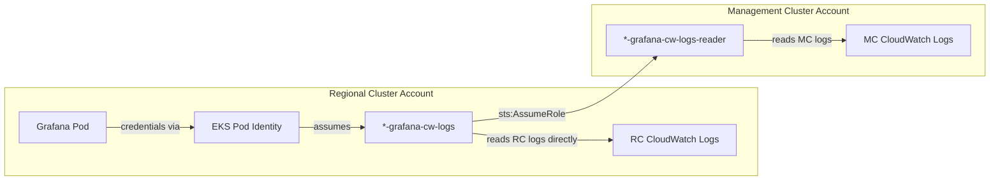

# Infrastructure CloudWatch Logging

**Last Updated**: 2026-05-27

## Summary

All AWS services deployed in Regional Cluster (RC) and Management Cluster (MC) accounts emit operational logs to Amazon CloudWatch Logs. Each log group is Terraform-managed with 365-day retention and KMS encryption at rest, satisfying FedRAMP Moderate controls AU-09 (protection of audit information) and AU-11 (audit record retention).

## Scope

This document covers **AWS infrastructure-level logs** — logs produced by AWS services themselves (EKS control plane, RDS, AmazonMQ, IoT Core, API Gateway, ECS). It does NOT cover application-level logs collected by Vector and stored in Loki (see [Logging Platform](logging-platform.md)).

## FedRAMP Moderate Controls

| Control | Requirement | How Satisfied |
| ------- | ----------- | ------------- |
| AU-02 | Audit events defined and logged | API Gateway access logs capture caller identity, method, status, latency |
| AU-09 | Protection of audit information | KMS encryption (customer-managed key with auto-rotation) on all log groups |
| AU-11 | Audit record retention | 365-day `retention_in_days` on all Terraform-managed log groups |

## Regional Cluster Account

| AWS Service | Log Group Name | Terraform Module | Log Level | Retention | KMS |
| --- | --- | --- | --- | --- | --- |
| EKS Control Plane | `/aws/eks/${cluster_id}/cluster` | `eks-cluster` | api, audit, authenticator, controllerManager, scheduler | 365 days | `aws_kms_key.cloudwatch_logs` |
| ECS Bootstrap | `/ecs/${cluster_id}/bootstrap` | `ecs-bootstrap` | Container stdout/stderr | 365 days | `aws_kms_key.bootstrap_logs` |
| ECS Bastion | `/ecs/${cluster_id}/bastion` | `bastion` | Container stdout/stderr + ECS Exec | 365 days | `aws_kms_key.bastion_logs` |
| Maestro RDS (postgresql) | `/aws/rds/instance/${regional_id}-maestro/postgresql` | `maestro-infrastructure` | postgresql | 365 days | `aws_kms_key.rds_logs` |
| Maestro RDS (upgrade) | `/aws/rds/instance/${regional_id}-maestro/upgrade` | `maestro-infrastructure` | upgrade | 365 days | `aws_kms_key.rds_logs` |
| HyperFleet RDS (postgresql) | `/aws/rds/instance/${regional_id}-hyperfleet/postgresql` | `hyperfleet-infrastructure` | postgresql | 365 days | `aws_kms_key.rds_logs` |
| HyperFleet RDS (upgrade) | `/aws/rds/instance/${regional_id}-hyperfleet/upgrade` | `hyperfleet-infrastructure` | upgrade | 365 days | `aws_kms_key.rds_logs` |
| HyperFleet AmazonMQ (general) | `/aws/amazonmq/broker/${broker_id}/general` | `hyperfleet-infrastructure` | general | 365 days | `aws_kms_key.mq_logs` |
| HyperFleet AmazonMQ (connection) | `/aws/amazonmq/broker/${broker_id}/connection` | `hyperfleet-infrastructure` | connection | 365 days | `aws_kms_key.mq_logs` |
| IoT Core | `AWSIotLogsV2` | `maestro-infrastructure` | INFO | 365 days | `aws_kms_key.iot_logs` |
| Platform API Gateway (access) | `/aws/api-gateway/${regional_id}/${stage}/access` | `api-gateway` | Structured JSON (requestId, caller, status, latency) | 365 days | `aws_kms_key.api_gateway_logs` |
| Platform API Gateway (execution) | `API-Gateway-Execution-Logs_${api_id}/${stage}` | `api-gateway` | ERROR | 365 days | `aws_kms_key.api_gateway_logs` |
| RHOBS API Gateway (access) | `/aws/api-gateway/${regional_id}-rhobs/${stage}/access` | `rhobs-api-gateway` | Structured JSON (requestId, caller, status, latency) | 365 days | `aws_kms_key.api_gateway_logs` |

## Management Cluster Account

| AWS Service | Log Group Name | Terraform Module | Log Level | Retention | KMS |
| --- | --- | --- | --- | --- | --- |
| EKS Control Plane | `/aws/eks/${cluster_id}/cluster` | `eks-cluster` | api, audit, authenticator, controllerManager, scheduler | 365 days | `aws_kms_key.cloudwatch_logs` |
| ECS Bootstrap | `/ecs/${cluster_id}/bootstrap` | `ecs-bootstrap` | Container stdout/stderr | 365 days | `aws_kms_key.bootstrap_logs` |
| ECS Bastion | `/ecs/${cluster_id}/bastion` | `bastion` | Container stdout/stderr + ECS Exec | 365 days | `aws_kms_key.bastion_logs` |

## KMS Key Pattern

Each module creates a dedicated KMS key for its CloudWatch log groups following a consistent pattern:

- Customer-managed key with 30-day deletion window
- Automatic annual key rotation enabled
- Policy grants `kms:*` to account root and CW Logs service principal
- CW Logs permission scoped to the specific log group ARN pattern via `kms:EncryptionContext:aws:logs:arn` condition
- Named alias: `alias/${identifier}-<purpose>-logs`

## Services NOT Producing CloudWatch Logs

| AWS Service | Reason |
| --- | --- |
| CloudFront (OIDC) | CloudFront only supports logging to S3 buckets or Kinesis Data Firehose — no native CloudWatch Logs integration exists |
| S3 (Loki, Thanos, OIDC) | S3 Server Access Logging delivers logs to a target S3 bucket — no native CloudWatch Logs integration exists. Access auditing is covered by CloudTrail instead |

## Accessing Logs via Grafana

Infrastructure CloudWatch Logs are accessible from the Regional Cluster's Grafana instance through dedicated CloudWatch datasources. No additional tools or AWS Console access is required.

### Datasources

| Datasource Name | Account | Authentication |
| --- | --- | --- |
| CloudWatch Logs (Regional) | RC account | EKS Pod Identity (direct) |
| CloudWatch Logs (`<mc-id>`) | MC account(s) | EKS Pod Identity → cross-account AssumeRole |

MC datasources are dynamically generated — one per Management Cluster. When a new MC is provisioned, its datasource appears automatically after the next RC pipeline run.

### IAM Architecture



- **RC role** (`<regional_id>-grafana-cw-logs`): Pod Identity role with `logs:*` read permissions and permission to assume any `*-grafana-cw-logs-reader` role cross-account.
- **MC role** (`<mc_id>-grafana-cw-logs-reader`): Trusts only the RC Grafana role (scoped by `aws:PrincipalArn` condition). Grants `logs:*` read permissions in the MC account.

### How to Query

1. Open Grafana → **Explore** (compass icon in sidebar)
2. Select the datasource from the dropdown:
   - **CloudWatch Logs (Regional)** for RC account logs
   - **CloudWatch Logs (mc01)** etc. for MC account logs
3. Switch the query mode to **CloudWatch Logs** using the toggle at the top of the query editor (it defaults to CloudWatch Metrics)
4. Choose a Log Group from the dropdown (matches the log group names in the tables above)
4. Write a [CloudWatch Logs Insights](https://docs.aws.amazon.com/AmazonCloudWatch/latest/logs/CWL_QuerySyntax.html) query, for example:

```
fields @timestamp, @message
| filter @message like /error/i
| sort @timestamp desc
| limit 100
```

### Common Queries

**EKS API server audit — denied requests:**

```
fields @timestamp, user.username, verb, objectRef.resource, objectRef.namespace, responseStatus.code
| filter responseStatus.code >= 400
| sort @timestamp desc
```

**RDS slow queries (postgresql log group):**

```
fields @timestamp, @message
| filter @message like /duration:/
| sort @timestamp desc
```

**API Gateway 5xx errors (access log group):**

```
fields @timestamp, httpMethod, path, status, responseLatency, requestId
| filter status >= 500
| sort @timestamp desc
```

## Related

- [Terraform Resource Adoption](terraform-resource-adoption.md) — how auto-created log groups are imported into Terraform state
- [Logging Platform](logging-platform.md) — application-level log collection (Vector + Loki)
- [Monitoring Platform](monitoring-platform.md) — metrics pipeline (Prometheus + Thanos)
