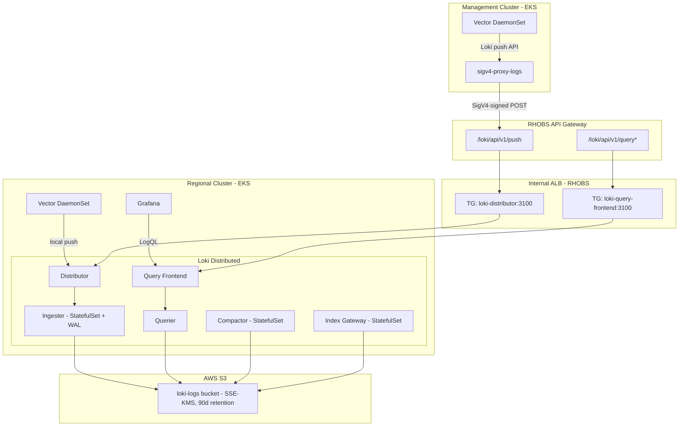

# Logging Platform

**Last Updated**: 2026-05-18

## Summary

The ROSA HyperFleet logging stack provides centralized log collection from both Regional Clusters (RC) and Management Clusters (MC). It consists of:

- **Vector** (DaemonSet) — log collector on RC and MC, deployed via the upstream `vector/vector` Helm chart (v0.52.0)
- **Loki** (Distributed mode) — log aggregation on RC, deployed via the upstream `grafana/loki` Helm chart (v7.0.0, Loki 3.6.7)
- **Grafana Dashboards** — three logging dashboards (Log Explorer, Vector Health, Loki Health) in the regional Grafana instance
- **E2E Tests** — validate log ingestion from RC and MC via the RHOBS API Gateway

All configuration is aligned 1:1 with the [RHOBS production configuration](https://gitlab.cee.redhat.com/rhobs/configuration) so that a future migration to RHOBS-native deployment requires only changing the deployment mechanism, not the operational config.

## Context

**Problem**: Regional clusters need centralized platform logs from both RC services and multiple management clusters across AWS accounts. Logs must be queryable via Grafana for operational visibility and retained for compliance. The same SRE team managing the current RHOBS stack (Loki on OpenShift) will manage this platform, so tooling alignment is critical.

**Why not consume RHOBS directly?**

We evaluated deploying the same stack that RHOBS uses internally:

1. **Loki on RHOBS** is deployed as [individual YAML bundles](https://gitlab.cee.redhat.com/rhobs/configuration/-/tree/main/resources/clusters/production/rhobsp01ue1/logs/bundle) — CRDs, ServiceAccounts, Roles, Deployments, etc. — generated by a Go code generator (`magefiles/loki.go`). There is no Helm chart, no OLM operator, and no consumable packaging for external teams.

2. **Vector on RHOBS** is deployed via the **Cluster Logging Operator** using a `ClusterLogForwarder` CR, which manages the Vector DaemonSet internally. This operator is OpenShift-specific and not available on EKS.

3. **FIPS compliance**: Both Vector and Loki on RHOBS are FIPS-compliant because Red Hat rebuilds the binaries with BoringCrypto (Go) and FIPS-validated Rust TLS modules. These custom builds are only available through the Cluster Logging Operator and Loki Operator on OpenShift.

**Constraints**:

- EKS Auto Mode (no OpenShift operators available)
- EKS Pod Identity for IAM auth — no static credentials
- KMS encryption at rest (S3 bucket-level default, transparent to Loki)
- Minimize locally-maintained operator code
- Configuration parity with RHOBS for operational continuity

## Decision

Deploy Loki and Vector using **upstream official Helm charts** (`grafana/loki`, `vector/vector`) as subchart dependencies, with a 1:1 configuration mapping to RHOBS. This approach provides:

- Minimal maintenance (upstream charts handle Kubernetes resource generation)
- Easy version bumps (standard Helm dependency update)
- Operational familiarity (same resources, same labels, same metrics as RHOBS)
- Migration path (if RHOBS provides a consumable package in the future, only the deployment mechanism changes — not the runtime configuration)

## RHOBS Configuration Mapping

### Vector (CLF CR → Helm values)

The Vector configuration maps directly to the RHOBS [ClusterLogForwarder template](https://gitlab.cee.redhat.com/rhobs/configuration/-/blob/main/resources/collection/logging/hypershift-cluster-log-forwarder-template.yaml):

| RHOBS CLF CR Field                                 | Our Implementation                                                 | Parity                                |
| -------------------------------------------------- | ------------------------------------------------------------------ | ------------------------------------- |
| `collector.resources` (200m/1Gi req, 750m/2Gi lim) | `vector.resources` in `values.yaml`                                | Identical                             |
| `collector.tolerations` (`operator: Exists`)       | `vector.tolerations`                                               | Identical                             |
| `filters[].type: parse` (parse-json)               | `transforms.parse_json` (VRL `parse_json`)                         | Equivalent logic                      |
| `inputs[].excludes` (webhook containers)           | `exclude_paths_glob_patterns: ["/var/log/pods/*/webhook*/**"]`     | Equivalent                            |
| `openshiftLabels.cluster_name`                     | `transforms.add_cluster_metadata` (VRL `.cluster_name = ...`)      | Equivalent                            |
| `outputs[].type: otlp` (Loki via token-refresher)  | `sinks.loki` (direct push to distributor on RC, sigv4-proxy on MC) | Different transport, same destination |
| Monitoring: Prometheus metrics from CLO            | `PodMonitor` via upstream chart (`port: prom-exporter`)            | Same metrics, different discovery     |

### Loki (LokiStack CR → Helm values)

The Loki configuration maps to the RHOBS [LokiStack CR](https://gitlab.cee.redhat.com/rhobs/configuration/-/blob/main/magefiles/loki.go) and [size definitions](https://github.com/grafana/loki/blob/main/operator/internal/manifests/internal/sizes.go):

**Deployment topology and resources** (`1x.extra-small` size):

| RHOBS LokiStack `1x.extra-small`                      | Our `loki/values.yaml`                                                      | Parity  |
| ----------------------------------------------------- | --------------------------------------------------------------------------- | ------- |
| Distributor: 2 replicas, 1 CPU / 1Gi req              | `distributor.replicas: 1` (eph) / 3-6 (prod), same resources                | Matched |
| Ingester: 2 replicas, 2 CPU / 8Gi req                 | `ingester.replicas: 1` (eph) / 3-6 (prod), same resources                   | Matched |
| Querier: 2 replicas, 1.5 CPU / 3Gi req                | `querier.replicas: 1` (eph) / 2 (prod), same resources                      | Matched |
| QueryFrontend: 2 replicas, 1 CPU / 1Gi req            | `queryFrontend.replicas: 1` (eph) / 2 (prod), same resources                | Matched |
| Compactor: 1 replica, 1 CPU / 2Gi req                 | `compactor.replicas: 1`, same resources                                     | Matched |
| IndexGateway: 2 replicas, 500m / 1Gi req              | `indexGateway.replicas: 1` (eph) / 2 (prod), same resources                 | Matched |
| No CPU limits (only memory limits)                    | Same — CPU requests only, memory limits set                                 | Matched |
| Anti-affinity: `requiredDuringScheduling` on hostname | `preferredDuringScheduling` on hostname + zone (relaxed for small clusters) | Adapted |

**LokiStack CR spec → Loki config**:

| RHOBS LokiStack CR field                                | Our `loki/values.yaml` equivalent                        | Parity                      |
| ------------------------------------------------------- | -------------------------------------------------------- | --------------------------- |
| `spec.size: "1x.extra-small"`                           | Per-component resources set explicitly (see above)       | Matched                     |
| `spec.storage.schemas[0].version: v13`                  | `schemaConfig.configs[0].schema: v13`                    | Identical                   |
| `spec.storage.schemas[0].effectiveDate: "2025-06-06"`   | `schemaConfig.configs[0].from: "2025-06-06"`             | Identical                   |
| `spec.storage.secret.type: s3`                          | `storage.type: s3`                                       | Identical                   |
| `spec.storageClassName: "gp3-csi"`                      | `persistence.storageClass: gp3`                          | Equivalent (EKS uses `gp3`) |
| `spec.limits.global.ingestionLimits.ingestionRate`      | `limits_config.ingestion_rate_mb: 20`                    | Matched to overrides        |
| `spec.limits.global.ingestionLimits.ingestionBurstSize` | `limits_config.ingestion_burst_size_mb: 256`             | Matched to overrides        |
| `spec.limits.global.ingestionLimits.maxLineSize`        | `limits_config.max_line_size: 2097152`                   | Matched                     |
| `spec.limits.global.ingestionLimits.perStreamRateLimit` | `limits_config.per_stream_rate_limit: 15MB`              | Matched                     |
| `spec.limits.global.queryLimits.queryTimeout`           | `limits_config.query_timeout: 5m`                        | Matched                     |
| `spec.limits.global.retention.days: 90`                 | `limits_config.retention_period: 2160h` (90d)            | Identical                   |
| `spec.replication.factor: 2`                            | `commonConfig.replication_factor: 1` (eph) / 2 (prod)    | Matched for prod            |
| `spec.template.ruler: disabled`                         | `ruler.enabled: false`                                   | Identical                   |
| `spec.template.gateway: 2 replicas`                     | `gateway.enabled: false` (single-tenant, auth at API GW) | Adapted — not needed        |
| Monitoring: ServiceMonitor via Loki Operator            | `serviceMonitor.enabled: true` via upstream chart        | Same metrics                |

**Disabled components** (not present in RHOBS for our use case):

| Component               | Why disabled                                                           |
| ----------------------- | ---------------------------------------------------------------------- |
| Query Scheduler         | Not used in RHOBS LokiStack; query-frontend handles queuing internally |
| Gateway (nginx)         | Single-tenant; authentication is handled at API Gateway level          |
| Ruler                   | No alerting rules on logs (alerting done via Thanos Ruler on metrics)  |
| Caches (chunks/results) | Can enable later with memcached for query performance                  |
| Bloom filters           | Experimental; not used in RHOBS production                             |

## Architecture



### Data Flow

1. **RC Vector** collects logs from all pods on the regional cluster via Kubernetes log discovery. It adds `cluster_type: "regional-cluster"` and `cluster_name` labels, then pushes directly to the Loki Distributor service (local, no network hop)
2. **MC Vector** collects logs from all pods on each management cluster. It adds `cluster_type: "management-cluster"` and `cluster_name` labels, then pushes to an in-cluster sigv4-proxy
3. **sigv4-proxy** signs the request with SigV4 using Pod Identity credentials and forwards to the RHOBS API Gateway
4. **API Gateway** (REST API v1) authenticates via AWS_IAM and evaluates the resource policy for cross-account access
5. **Distributor** validates, hashes, and routes log entries to the appropriate **Ingester**
6. **Ingester** writes to a Write-Ahead Log (WAL) on local PVC and periodically flushes chunks to S3

### Cluster Identity

Cluster identity is carried by Vector transforms (labels on log entries) rather than Loki tenant headers. Each Vector instance adds:

- `cluster_name`: the EKS cluster name (unique per cluster)
- `cluster_type`: `regional-cluster` or `management-cluster`

All logs are stored under a single Loki tenant. Cluster identity is enforced at the ingestion layer (IAM resource policy controls which accounts can write) and at the query layer (LogQL filters by `cluster_name`/`cluster_type` labels).

## Implementation

### ArgoCD Apps

| App (`argocd/config/`)       | Cluster | Chart                              | Purpose                                              |
| ---------------------------- | ------- | ---------------------------------- | ---------------------------------------------------- |
| `regional-cluster/loki/`     | RC      | `grafana/loki` v7.0.0 (subchart)   | Loki Distributed + platform templates (SA, TGB, PDB) |
| `regional-cluster/vector/`   | RC      | `vector/vector` v0.52.0 (subchart) | Vector DaemonSet → local Loki Distributor            |
| `management-cluster/vector/` | MC      | `vector/vector` v0.52.0 (subchart) | Vector DaemonSet → sigv4-proxy → API Gateway         |
| `regional-cluster/grafana/`  | RC      | (existing)                         | Logging dashboards in `dashboards/logging/`          |

### Helm Chart Structure

Both Vector and Loki use upstream charts as subchart dependencies:

```text
argocd/config/regional-cluster/loki/
├── Chart.yaml          # depends on grafana/loki v7.0.0
├── values.yaml         # RHOBS-aligned component config
└── templates/
    ├── serviceaccount.yaml      # Pod Identity SA
    ├── targetgroupbinding.yaml  # ALB TGBs (distributor + query-frontend)
    ├── pdb.yaml                 # PDBs per component (conditional)
    └── _helpers.tpl             # Shared labels

argocd/config/regional-cluster/vector/
├── Chart.yaml          # depends on vector/vector v0.52.0
├── values.yaml         # RHOBS-aligned pipeline config under vector: key
└── templates/
    └── namespace.yaml  # Namespace resource

argocd/config/management-cluster/vector/
├── Chart.yaml          # depends on vector/vector v0.52.0
├── values.yaml         # Same as RC + sigv4-proxy config
└── templates/
    ├── namespace.yaml
    ├── serviceaccount.yaml            # sigv4-proxy SA (Pod Identity)
    ├── sigv4-proxy-deployment.yaml
    ├── sigv4-proxy-service.yaml
    └── sigv4-proxy-pdb.yaml
```

### Terraform Resources

**`terraform/modules/loki-infrastructure/`**:

- `aws_s3_bucket` — `${cluster_id}-loki-logs-${account_id}`, versioning + SSE-KMS + lifecycle (90d)
- `aws_kms_key` — dedicated key for Loki S3 encryption
- `aws_iam_role.loki_writer` — single IAM role for all Loki pods (S3 read/write/delete + KMS)
- `aws_eks_pod_identity_association` — association for ServiceAccount `loki` in namespace `loki`
- `local.s3_endpoint` — FIPS endpoint (`s3-fips.*.amazonaws.com`) for US regions, standard otherwise

**`terraform/modules/rhobs-api-gateway/`** (extended for Loki):

- `POST /loki/api/v1/push` — org-scoped write (MC accounts in same org)
- `GET /loki/api/v1/query`, `GET /loki/api/v1/query_range` — RC-account only
- ALB target group `loki-distributor` (port 3100, health: `/ready`)
- ALB target group `loki-query-frontend` (port 3100, health: `/ready`)
- ALB listener rules routing by path prefix

### Grafana Dashboards

Three dashboards deployed as ConfigMaps with `grafana_dashboard: "1"` label (sidecar folder: "Logging"):

| Dashboard               | Purpose                               | Key Panels                                                                                                                                                          |
| ----------------------- | ------------------------------------- | ------------------------------------------------------------------------------------------------------------------------------------------------------------------- |
| **Loki / Log Explorer** | Browse and filter logs                | Cluster/Namespace/Pod/Container/Level variables, volume by cluster/namespace/pod/level, raw log viewer                                                              |
| **Vector / Health**     | Vector operational health per cluster | Cluster selector, throughput, sink health (HTTP status codes), buffer utilization, source lag, per-pod resources                                                    |
| **Loki / Health**       | Loki component health                 | Per-component pod counts, write path (distributor→ingester), read path (query latency), ring health, cache hit ratio, TSDB staleness, S3 latency, per-pod resources |

### Monitoring

- **Vector**: PodMonitor (upstream chart, port `prom-exporter` on 9090) → Prometheus → Thanos
- **Loki**: ServiceMonitor (upstream chart, port 3100 `/metrics`) → Prometheus → Thanos
- **E2E tests** (`rosa-hyperfleet-api/test/e2e/`):
  - `logging_test.go` — validates RC and MC logs exist in Loki via API Gateway
  - `observability_test.go` — validates Vector and Loki metrics flow to Thanos via remote-write

### Key Configuration

| Setting                | Value                            |
| ---------------------- | -------------------------------- |
| Loki Helm chart        | `grafana/loki` v7.0.0            |
| Vector Helm chart      | `vector/vector` v0.52.0          |
| Loki deployment mode   | Distributed                      |
| StorageClass           | `gp3`                            |
| Schema                 | `v13` (TSDB)                     |
| Replication factor     | 1 (eph) / 2 (prod)               |
| Retention              | 90 days                          |
| Buffer (Vector)        | Disk, 256MB max, block when full |
| Zone-aware replication | Disabled                         |
| Gateway (nginx)        | Disabled (single-tenant)         |
| Query Scheduler        | Disabled (not used in RHOBS)     |

## Security

### What is FIPS-compliant

- **S3 endpoints**: Terraform auto-selects FIPS endpoints (`s3-fips.*.amazonaws.com`) for all US regions (including GovCloud). Configured in `terraform/modules/loki-infrastructure/main.tf`.
- **KMS encryption**: All S3 writes encrypted with SSE-KMS using a dedicated key with auto-rotation enabled.
- **IAM authentication**: EKS Pod Identity — no static credentials. API Gateway uses AWS_IAM auth.
- **Network isolation**: No direct MC-to-RC network path. All cross-account traffic via API Gateway with org-scoped resource policies.

### What is NOT FIPS-compliant (known gap)

- **Loki binary**: The upstream `grafana/loki` container image uses standard Go crypto libraries (not BoringCrypto). TLS connections from Loki to S3 use non-FIPS-validated modules.
- **Vector binary**: The upstream `vector/vector` container image uses Rust's standard TLS stack (rustls/native-tls), which is not FIPS-validated.

**Path to FIPS compliance** (if required for FedRAMP Moderate):

1. **Loki**: Replace upstream image with a custom build using `GOEXPERIMENT=boringcrypto`, or migrate to the Loki Operator (which provides FIPS builds on OpenShift).
2. **Vector**: No upstream FIPS build exists. Options: (a) contribute FIPS Rust TLS backend upstream, (b) replace Vector with Fluent Bit compiled with OpenSSL FIPS module, (c) wait for RHOBS to provide an EKS-compatible FIPS Vector package.

For FedRAMP Moderate in US commercial regions, the FIPS S3 endpoints satisfy the network-level requirement (SC-13 for data in transit to S3). The binary-level gap affects internal TLS handshakes only.

## Alternatives Considered

| Option                                                               | Rejected because                                                                                                                                                                                             |
| -------------------------------------------------------------------- | ------------------------------------------------------------------------------------------------------------------------------------------------------------------------------------------------------------ |
| **RHOBS bundle deployment** (manual YAMLs from `configuration` repo) | No packaging (Helm chart, OLM). Deployment is 100% manual YAML files generated by Go code. Requires maintaining a custom CI pipeline to render and apply individual resources. Not viable for GitOps/ArgoCD. |
| **Loki Operator (`LokiStack` CR) on EKS**                            | Requires CRD installation, cert-manager, admission webhooks, custom OCI chart packaging. The operator expects OpenShift APIs. Too much scaffolding for EKS.                                                  |
| **Cluster Logging Operator + CLF CR**                                | OpenShift-only. Not available on EKS. Would require forking and adapting for vanilla Kubernetes.                                                                                                             |
| **Loki SimpleScalable mode**                                         | Bundles components together (distributor+ingester in "write"), preventing independent scaling; not aligned with RHOBS production architecture which uses individual components                               |

## Consequences

### Positive

- Unified observability stack (Thanos for metrics, Loki for logs) on the same RC infrastructure
- Same query language (LogQL) and tooling as RHOBS — SRE team can reuse existing knowledge
- Upstream Helm charts — minimal maintenance, standard version bumps, community support
- 1:1 RHOBS config mapping — future migration to RHOBS-native deployment changes only packaging, not config
- Distributed mode maps 1:1 to RHOBS LokiStack component topology — shared runbooks, familiar scaling patterns
- S3 encryption is fully transparent at the bucket level — no application-side KMS config needed
- FIPS S3 endpoints auto-selected for US regions via Terraform

### Negative

- More Kubernetes resources to manage than SimpleScalable (6 Deployments/StatefulSets vs. 3)
- Vector standalone requires separate Helm chart management (no CLO abstraction on EKS)
- Upstream chart version must be manually bumped to consume upstream fixes
- No operator to handle schema migrations or rolling upgrades automatically
- **FIPS binary gap**: Upstream Vector and Loki images are not FIPS-validated (documented path to resolution above)

## Related

- [Infrastructure CloudWatch Logging](infrastructure-logging.md) — AWS service-level logs (EKS, RDS, API GW, IoT Core)
- [Thanos Metrics Infrastructure](thanos-metrics-infrastructure.md) — parallel pattern for metrics
- [MC Metrics Pipeline via Remote Write](mc-metrics-remote-write.md) — cross-account ingestion pattern
- [Metrics Platform Overview](monitoring-platform.md) — end-to-end observability architecture
- [grafana/loki Helm chart](https://github.com/grafana/helm-charts/tree/main/charts/loki)
- [vector/vector Helm chart](https://github.com/vectordotdev/helm-charts)
- [RHOBS Configuration Repository](https://gitlab.cee.redhat.com/rhobs/configuration)
- [RHOBS CLF Template](https://gitlab.cee.redhat.com/rhobs/configuration/-/blob/main/resources/collection/logging/hypershift-cluster-log-forwarder-template.yaml)
- [Loki Operator Size Definitions](https://github.com/grafana/loki/blob/main/operator/internal/manifests/internal/sizes.go)
