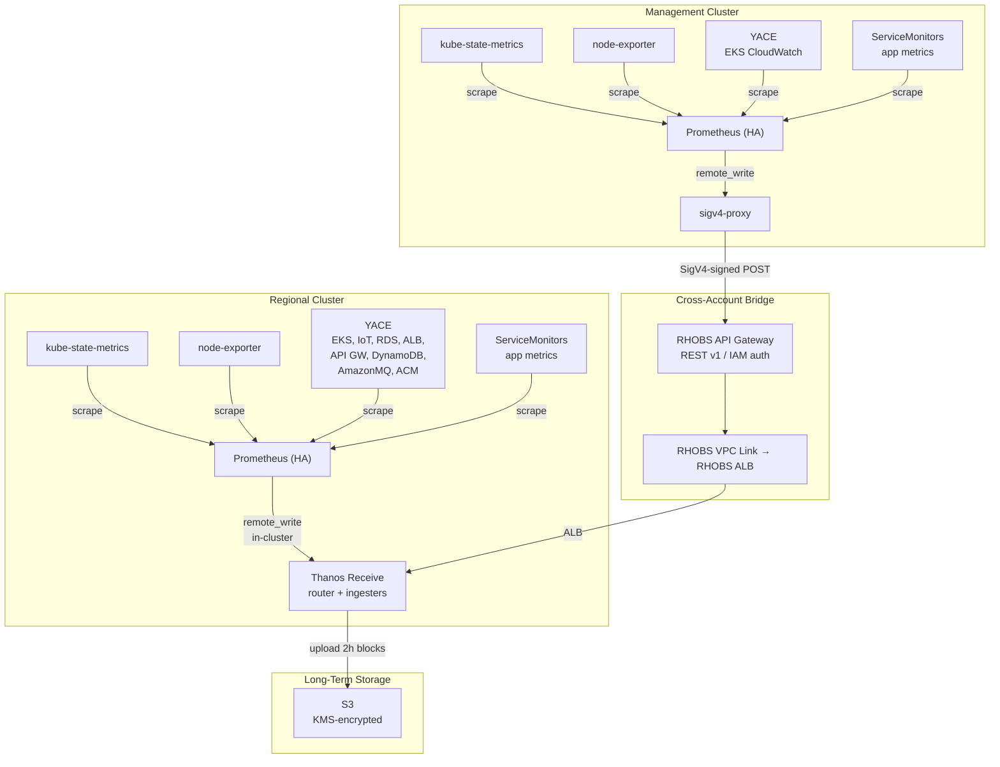
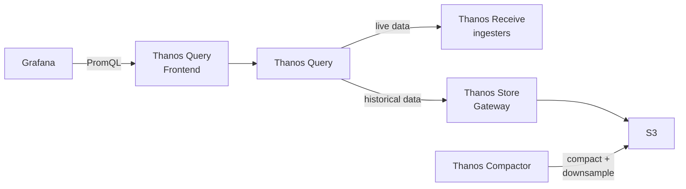

# Metrics Platform Overview

**Last Updated**: 2026-05-13

## Summary

The ROSA HyperFleet collects, stores, and visualizes operational metrics across regional and management clusters using Prometheus, Thanos, and Grafana. Management cluster metrics are forwarded to the regional cluster via Prometheus remote_write through a SigV4-authenticated API Gateway, providing a single pane of glass for cross-cluster observability.

## Architecture

### Ingestion Flow

### Query Flow

## Components by Cluster

### Regional Cluster

| Component                  | Replicas | Purpose                                                        |
| -------------------------- | -------- | -------------------------------------------------------------- |
| Prometheus                 | 2 (HA)   | Scrapes local metrics + YACE; remote-writes to Thanos Receive  |
| Thanos Receive (router)    | 1        | Accepts remote_write from RC Prometheus and MC via API Gateway |
| Thanos Receive (ingester)  | 1        | Stores metrics in TSDB, uploads 2h blocks to S3                |
| Thanos Query               | 2        | Federates live (Receive) and historical (Store) data           |
| Thanos Query Frontend      | 1        | Caches and splits queries for Grafana                          |
| Thanos Store Gateway       | 2        | Serves historical blocks from S3                               |
| Thanos Compactor           | 1        | Compacts and downsamples S3 blocks                             |
| Thanos Ruler               | 2        | Evaluates alerting and recording rules against Thanos Query    |
| CloudWatch Exporter (YACE) | 1        | Scrapes AWS CloudWatch for platform services                   |
| Grafana                    | 1        | Dashboards and visualization                                   |

### Management Cluster

| Component                  | Replicas | Purpose                                                    |
| -------------------------- | -------- | ---------------------------------------------------------- |
| Prometheus                 | 2 (HA)   | Scrapes local metrics + YACE; remote-writes to sigv4-proxy |
| sigv4-proxy                | 1        | Signs requests with SigV4 for API Gateway authentication   |
| CloudWatch Exporter (YACE) | 1        | Scrapes AWS CloudWatch for EKS control plane metrics       |

## Metrics Sources

### Prometheus (Kubernetes Metrics)

Both clusters run kube-prometheus-stack with:

- **kube-state-metrics**: Kubernetes object states (pods, deployments, nodes)
- **node-exporter**: Host-level metrics (CPU, memory, disk, network)
- **ServiceMonitors/PodMonitors**: Application-level metrics

Each Prometheus instance injects `cluster` and `cluster_type` labels via `externalLabels` to identify the source cluster in cross-cluster queries.

### CloudWatch Exporter (YACE)

YACE polls AWS CloudWatch APIs and exposes metrics in Prometheus format. Both clusters align their Prometheus scrape interval with YACE's CloudWatch polling interval (120s).

**Regional Cluster** scrapes:

| AWS Namespace            | Metrics                                                                                            | Purpose                       |
| ------------------------ | -------------------------------------------------------------------------------------------------- | ----------------------------- |
| `AWS/EKS`                | apiserver_storage_size_bytes, scheduler_pending_pods, scheduler_schedule_attempts_total            | EKS control plane health      |
| `AWS/IoT`                | Connect.Success, Connect.AuthError, PublishIn.Success, PublishOut.Success                          | Maestro MQTT broker           |
| `AWS/ApiGateway`         | Count, Latency, 4XX/5XXError, IntegrationLatency                                                   | Platform + RHOBS API Gateways |
| `AWS/RDS`                | CPUUtilization, FreeableMemory, ReadLatency, WriteLatency, BurstBalance, DatabaseConnections, IOPS | CLM + Maestro databases       |
| `AWS/ApplicationELB`     | RequestCount, TargetResponseTime, HealthyHostCount, HTTPCode counts                                | API load balancer             |
| `AWS/DynamoDB`           | ConsumedRead/WriteCapacityUnits, UserErrors, ThrottledRequests, SuccessfulRequestLatency           | Authorization tables          |
| `AWS/AmazonMQ`           | MessageCount, MessageUnacknowledgedCount, ConsumerCount, QueueCount, NetworkIn/Out                 | HyperFleet message broker     |
| `AWS/CertificateManager` | DaysToExpiry                                                                                       | API certificate lifecycle     |

**Management Cluster** scrapes:

| AWS Namespace | Metrics                                                                                 | Purpose                  |
| ------------- | --------------------------------------------------------------------------------------- | ------------------------ |
| `AWS/EKS`     | apiserver_storage_size_bytes, scheduler_pending_pods, scheduler_schedule_attempts_total | EKS control plane health |

### Thanos HA Deduplication

Both clusters run Prometheus in HA (2 replicas), producing duplicate series. Thanos Query deduplicates using `replicaLabels`:

- `prometheus_replica` — Prometheus HA pair
- `replica` — generic replica label
- `rule_replica` — recording/alerting rule replicas

## Cross-Cluster Remote Write

Management cluster metrics reach the regional cluster through a secure cross-account pipeline. See [MC Metrics Pipeline via Remote Write](mc-metrics-remote-write.md) for detailed design rationale.

**Key points:**

- MC Prometheus remote-writes to a local sigv4-proxy service
- sigv4-proxy signs requests using EKS Pod Identity credentials (`execute-api` service name)
- A dedicated REST API Gateway (RHOBS) authenticates via AWS IAM and forwards to Thanos Receive through a VPC Link and internal ALB
- Cluster identity is carried by Prometheus `externalLabels` (`cluster`, `cluster_type`), not by Thanos tenant headers
- The RHOBS API Gateway resource policy restricts `POST /api/v1/receive` to any authenticated principal within the same AWS Organization; query endpoints (`GET /api/v1/query`, `GET /api/v1/query_range`) are restricted to the RC account only

## Grafana Dashboards

Grafana on the RC queries Thanos Query Frontend for a unified view of all clusters.

| Dashboard                     | Scope   | Key Metrics                                                                      |
| ----------------------------- | ------- | -------------------------------------------------------------------------------- |
| EKS Control Plane             | RC + MC | etcd DB size (CW), scheduler queue/attempts (CW), API server request rates (KSM) |
| EKS Standards                 | RC + MC | Node resource usage, pod health (KSM + node-exporter)                            |
| API Gateway                   | RC      | Request count, latency, error rates per gateway (CW)                             |
| RDS                           | RC      | CPU, burst balance, connections, IOPS, storage (CW)                              |
| ALB                           | RC      | Request count, response time, healthy hosts (CW)                                 |
| DynamoDB                      | RC      | Read/write capacity, latency, throttled requests (CW)                            |
| Platform Services             | RC      | IoT/MQTT, AmazonMQ, ACM certificate expiry (CW)                                  |
| HCP Health                    | RC + MC | Hosted control plane status                                                      |
| ArgoCD Application Overview   | RC      | Application sync status, health                                                  |
| ArgoCD Notifications Overview | RC      | Notification delivery status                                                     |
| ArgoCD Operational Overview   | RC      | Controller performance, reconciliation                                           |

Additionally, three community dashboards are imported from grafana.com: Node Exporter Full (1860), Kubernetes Cluster Monitoring (7249), and Kubernetes Pods (6417).

Dashboards are provisioned as ConfigMaps via Helm templates and loaded by the Grafana sidecar.

## Data Retention

| Tier                      | Retention | Resolution                |
| ------------------------- | --------- | ------------------------- |
| Prometheus local          | 14 days   | Raw (scrape interval)     |
| Thanos Receive            | 2 hours   | Raw (before upload to S3) |
| Thanos S3 (raw)           | 90 days   | Raw                       |
| Thanos S3 (5m downsample) | 180 days  | 5-minute                  |
| Thanos S3 (1h downsample) | 365 days  | 1-hour                    |

## Security

- **Authentication**: AWS IAM SigV4 for cross-account metrics ingestion; EKS Pod Identity for all IAM credentials
- **Authorization**: RHOBS API Gateway resource policy enforces per-path access: `POST /api/v1/receive` allows any principal in the same AWS Organization (`aws:PrincipalOrgID`); `GET /api/v1/query` and `GET /api/v1/query_range` are restricted to the RC account only (`aws:PrincipalAccount`)
- **Encryption**: S3 at rest via KMS; all cross-account traffic through HTTPS API Gateway
- **Network isolation**: No direct MC-to-RC network path; all traffic flows through API Gateway + VPC Link
- **FIPS**: S3 FIPS endpoints for US regions; YACE runs with `--fips` flag

## Related

- [MC Metrics Pipeline via Remote Write](mc-metrics-remote-write.md) — detailed design of the cross-account remote-write path
- [Thanos Metrics Infrastructure](thanos-metrics-infrastructure.md) — Thanos operator deployment and S3 storage
- [Alerting Architecture](alerting-architecture.md) — alerting rules and notification routing
