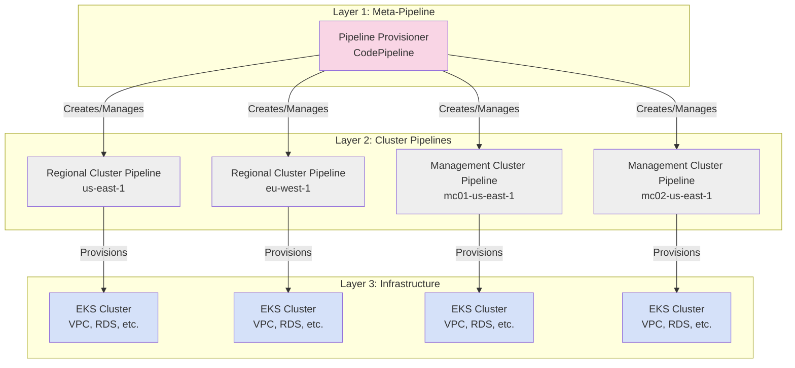
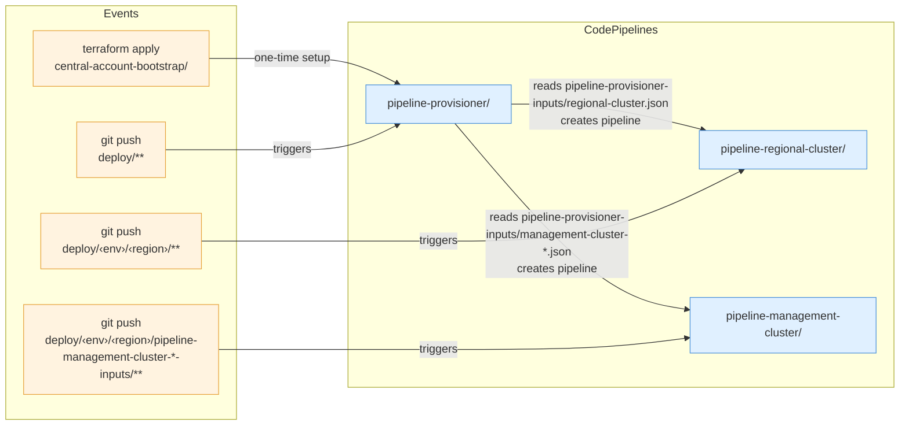
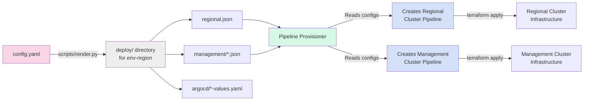
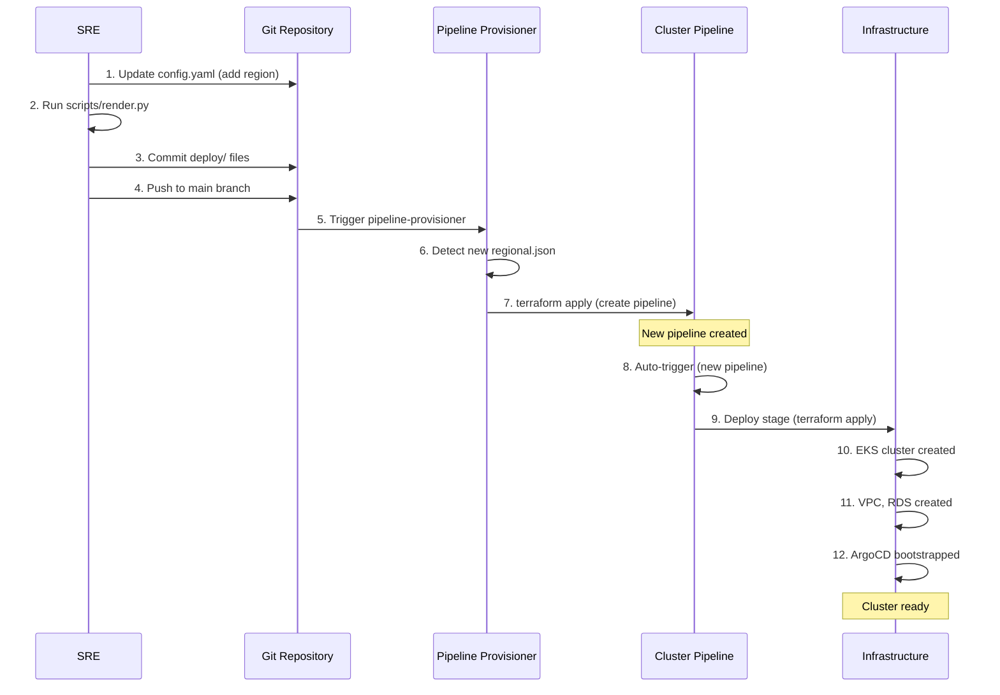
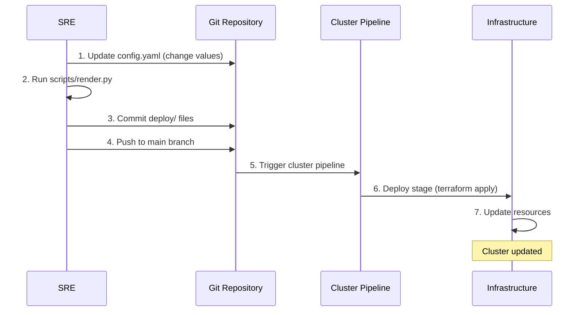
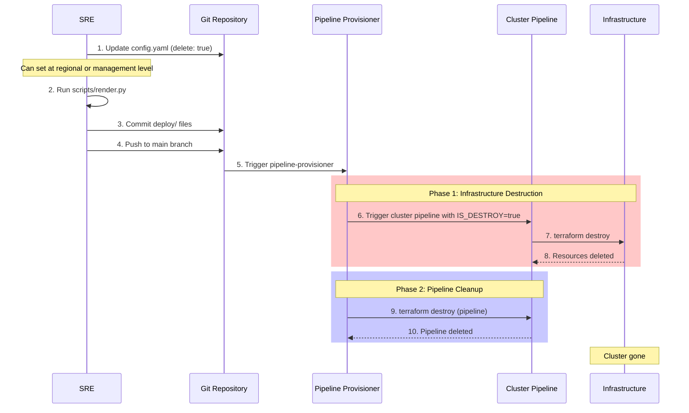

# Pipeline-Based Cluster Lifecycle Management

**Last Updated Date**: 2026-03-04

## Summary

The ROSA HyperFleet implements a hierarchical, Git-driven pipeline architecture where a central pipeline-provisioner dynamically creates and manages per-cluster CodePipeline pipelines based on declarative configuration files, enabling scalable, auditable, and automated infrastructure lifecycle management across multiple AWS accounts and regions.

## Architecture Overview

### Three-Tier Pipeline Hierarchy



### Event Triggers



**Layer 1 - Pipeline Provisioner (Meta-Pipeline)**:

- Single CodePipeline in central account
- **Bootstrap (Manual)**: Created once via `./scripts/bootstrap-central-account.sh`
- **Runtime (Automatic)**: Triggers on git push to `deploy/` or pipeline config changes
- Stages: Source → Build-Platform-Image → Provision
- The Provision stage runs `scripts/provision-pipelines.sh`, which reads `deploy/` and dynamically creates/updates/deletes Layer 2 pipelines

**Layer 2 - Cluster Pipelines**:

- One CodePipeline per cluster (RC or MC)
- Each pipeline provisions/manages a single cluster's infrastructure
- Is idempotent and can run in normal or destroy mode
- Runs in central account, stores terraform state in the target account, and deploys to target accounts
- RC stages: Source → Deploy → Bootstrap-ArgoCD
- MC stages: Source → Deploy → Bootstrap-ArgoCD → Register

**Layer 3 - Infrastructure**:

- Actual AWS resources (EKS, VPC, RDS, etc.)
- Managed by Layer 2 pipelines via Terraform
- Deployed in target accounts (separate from central account)

### Configuration Flow



1. **config.yaml** - Single source of truth for all deployments
2. **scripts/render.py** - Processes config.yaml, generates environment-specific configs
3. **deploy/** - Generated directory structure with per-region/per-cluster configs and helm chart values files
4. **Pipeline Provisioner** - Reads `deploy/` structure, creates/updates pipelines
5. **Cluster Pipelines** - Read their own configs from `deploy/<env>/<region>/` and provision infrastructure

## Layer 1: Pipeline Provisioner (Meta-Pipeline)

### Purpose

The pipeline-provisioner is a "meta-pipeline" that manages other pipelines. It's responsible for:

- **Creating** new cluster pipelines when new regions/clusters are added to config.yaml
- **Updating** existing pipelines when configuration changes
- **Deleting** pipelines when clusters are marked for deletion

### Bootstrap (One-Time)

The pipeline-provisioner must be created once manually:

```bash
GITHUB_REPOSITORY=openshift-online/rosa-hyperfleet \
GITHUB_BRANCH=main \
TARGET_ENVIRONMENT=staging \
./scripts/bootstrap-central-account.sh
```

This runs `scripts/bootstrap-state.sh` (creates S3 state bucket) and then `terraform apply` on `terraform/config/central-account-bootstrap/` (creates the CodePipeline, CodeBuild project, CodeStar connection, IAM roles, and ECR repository).

After bootstrap, you must manually authorize the GitHub CodeStar connection in the AWS Console.

### Runtime Operation

After bootstrap, the pipeline-provisioner runs automatically when changes are pushed to `deploy/` or pipeline config directories. It executes `scripts/provision-pipelines.sh`, which scans `deploy/<env>/` for `regional.json` and `management/*.json` files and runs terraform to create/update/delete the corresponding cluster pipelines.

### State Management

**Pipeline definition state** is stored in the central account:

- **Bucket**: `terraform-state-${CENTRAL_ACCOUNT_ID}`
- **RC Key**: `pipelines/regional-${ENVIRONMENT}-${REGION_DEPLOYMENT}-${REGIONAL_ID}.tfstate`
- **MC Key**: `pipelines/management-${ENVIRONMENT}-${REGION_DEPLOYMENT}-${MANAGEMENT_ID}.tfstate`

This is the terraform state for the CodePipeline/CodeBuild resources themselves (not the cluster infrastructure).

See: `terraform/modules/pipeline-provisioner/`, `scripts/provision-pipelines.sh`

## Layer 2: Cluster Pipelines

Each cluster (regional or management) gets its own dedicated CodePipeline that manages that cluster's infrastructure lifecycle.

### Regional Cluster Pipeline

Provisions a Regional Cluster (EKS + VPC + RDS + Platform API).

- Stages: Source → Deploy → Bootstrap-ArgoCD
- Triggers on changes to `deploy/<env>/<region>/pipeline-regional-cluster-inputs/terraform.json`

See: `terraform/config/pipeline-regional-cluster/`, `terraform/config/regional-cluster/`

### Management Cluster Pipeline

Provisions a Management Cluster (EKS for hosting customer control planes).

- Stages: Source → Deploy → Bootstrap-ArgoCD → Register
- Triggers on changes to `deploy/<env>/<region>/pipeline-management-cluster-<cluster>-inputs/terraform.json`
- Deploys to management cluster account (may differ from regional account)
- The **Register** stage calls the Regional Cluster Platform API to register the Management Cluster as a known consumer, passing:
  - `cluster_id`, `management_id`, `region`, `alias` — cluster identity
  - `cloudfront_url` — the OIDC issuer base URL (sourced from the MC's HyperShift CloudFront domain)

See: `terraform/config/pipeline-management-cluster/`, `terraform/config/management-cluster/`

### State Management

**Infrastructure state** is stored in target accounts:

- **Bucket**: `terraform-state-${TARGET_ACCOUNT_ID}`
- **Regional Key**: `regional-cluster/${CLUSTER_ID}.tfstate`
- **Management Key**: `management-cluster/${CLUSTER_ID}.tfstate`

State is co-located with resources for security isolation and simplified disaster recovery.

## Cluster Lifecycle

### 1. Cluster Creation



### 2. Cluster Update



Updates are triggered directly on the cluster pipeline (no need for the pipeline-provisioner to run first, unless pipeline configuration itself changed).

### 3. Cluster Deletion (Two-Phase)



**Two-phase deletion** ensures infrastructure is destroyed before the pipeline that manages it. This preserves state file access during destruction and prevents orphaned resources.

**Deletion granularity**: The `delete: true` flag can be set at two levels:

- **Regional Cluster Level** (`regional.json`): Destroys the entire Regional Cluster and all associated infrastructure
- **Management Cluster Level** (`management/<mc>.json`): Destroys only that specific Management Cluster; the Regional Cluster and other MCs remain intact

The entire deletion flow is automatic and Git-driven - no manual intervention required.

## Design Decisions

- **Hierarchical meta-pipeline over monolithic or manual**: Isolates failures to single regions, enables parallelism, scales to hundreds of clusters, and keeps pipeline management Git-driven
- **Git-driven configuration over API or direct terraform**: Provides audit trail, peer review via PRs, rollback via git revert, and consistent declarative state
- **Separate state per account**: Pipeline state in central account (co-located with pipeline resources), infrastructure state in target accounts (co-located with infra). Provides security isolation and simplifies disaster recovery
- **Multi-stage pipelines**: Separates infrastructure provisioning from application bootstrap, giving independent failure domains and clear debugging boundaries

## Key File Reference

### Configuration

| File                                     | Purpose                                                 |
| ---------------------------------------- | ------------------------------------------------------- |
| `config.yaml`                            | Single source of truth for all deployments              |
| `scripts/render.py`                      | Generates environment-specific configs from config.yaml |
| `deploy/<env>/<region>/terraform/*.json` | Generated per-cluster pipeline configs                  |

### Pipeline Provisioner (Layer 1)

| File                                          | Purpose                                             |
| --------------------------------------------- | --------------------------------------------------- |
| `terraform/config/central-account-bootstrap/` | One-time bootstrap terraform config                 |
| `terraform/modules/pipeline-provisioner/`     | Pipeline provisioner definition and buildspecs      |
| `scripts/bootstrap-central-account.sh`        | One-time bootstrap script                           |
| `scripts/provision-pipelines.sh`              | Reads deploy/ and creates/updates/deletes pipelines |

### Cluster Pipelines (Layer 2)

| File                                            | Purpose                               |
| ----------------------------------------------- | ------------------------------------- |
| `terraform/config/pipeline-regional-cluster/`   | RC pipeline definition and buildspecs |
| `terraform/config/pipeline-management-cluster/` | MC pipeline definition and buildspecs |
| `terraform/config/regional-cluster/`            | RC infrastructure terraform module    |
| `terraform/config/management-cluster/`          | MC infrastructure terraform module    |

### State Locations

| State             | Bucket                                  | Key Pattern                                                                         |
| ----------------- | --------------------------------------- | ----------------------------------------------------------------------------------- |
| RC pipeline       | `terraform-state-${CENTRAL_ACCOUNT_ID}` | `pipelines/regional-${ENVIRONMENT}-${REGION_DEPLOYMENT}-${REGIONAL_ID}.tfstate`     |
| MC pipeline       | `terraform-state-${CENTRAL_ACCOUNT_ID}` | `pipelines/management-${ENVIRONMENT}-${REGION_DEPLOYMENT}-${MANAGEMENT_ID}.tfstate` |
| RC infrastructure | `terraform-state-${TARGET_ACCOUNT_ID}`  | `regional-cluster/${CLUSTER_ID}.tfstate`                                            |
| MC infrastructure | `terraform-state-${TARGET_ACCOUNT_ID}`  | `management-cluster/${CLUSTER_ID}.tfstate`                                          |
