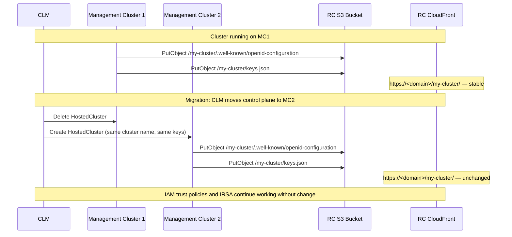

# Regional OIDC Ownership for HyperShift Hosted Clusters

**Last Updated Date**: 2026-04-10

## Summary

The HyperShift OIDC S3 bucket and CloudFront distribution are owned by the Regional Cluster account — one shared resource per region — rather than provisioned per management cluster. Management clusters write OIDC documents to the regional bucket cross-account via S3 bucket policy. This gives every hosted cluster a stable OIDC issuer URL that does not change when its control plane migrates between management clusters.

## Context

- **Problem Statement**: The OIDC issuer URL for a HyperShift hosted cluster is embedded in AWS IAM trust policies and in ServiceAccount tokens issued to workloads. It must remain stable for the lifetime of the cluster. With the previous per-management-cluster (per-MC) OIDC model, the issuer URL was the CloudFront domain of the MC that initially hosted the cluster. Migrating a cluster's control plane to a different MC — for maintenance, capacity rebalancing, or MC decommission — changes the CloudFront domain, and therefore the issuer URL. Any IAM role whose trust policy references the old issuer URL stops working immediately, breaking IRSA for every workload on the migrated cluster.

- **Constraints**: The OIDC issuer URL is written into ServiceAccount tokens at cluster creation time and into IAM trust policies by customers. Neither can be updated automatically during a migration. The solution must not require HyperShift operator modifications. MC accounts are in a dedicated OU within the organization.

- **Assumptions**: Each region has exactly one Regional Cluster account. All MC accounts for a region belong to a known AWS Organizations OU. MCs are platform-managed accounts governed by SCPs, not customer-operated accounts. CloudFront's global availability is sufficient for the OIDC serving path.

## Architecture

### OIDC Document Flow

```mermaid
graph LR
    subgraph "MC Account (any)"
        HO[HyperShift Operator<br/>Pod Identity Role]
    end

    subgraph "RC Account"
        S3[S3 OIDC Bucket<br/>/{cluster-name}/...]
        CF[CloudFront Distribution<br/>stable domain per region]
    end

    STS[AWS STS<br/>token validation]

    HO -->|cross-account PutObject<br/>via bucket policy| S3
    CF -->|OAC origin request| S3
    STS -->|GET /{cluster-name}/.well-known/openid-configuration| CF
    STS -->|GET /{cluster-name}/keys.json| CF
```

### Control Plane Migration — Before and After



### Cross-Account Write Authorization

The RC S3 bucket policy grants write access to MC HyperShift operator roles using a dual condition: both `aws:PrincipalOrgPaths` (restricting to the MC OU) and an explicit allowlist of MC account IDs must match. No STS hop is required — the MC HyperShift operator's Pod Identity role is granted direct cross-account access via the bucket policy.

```
Condition:
  StringEquals:
    aws:PrincipalOrgPaths: "<org-id>/r-xxxx/<mc-ou-id>/"
  StringEquals:
    aws:PrincipalAccount: ["<mc-account-1>", "<mc-account-2>", ...]
```

Actions granted: `s3:PutObject`, `s3:GetObject`, `s3:DeleteObject`, `s3:ListBucket`.

### Path Structure

OIDC documents are stored under `/{hosted-cluster-name}/`. The path is keyed to the cluster identity, not to the MC hosting it. This is the property that makes migration transparent: the path — and therefore the issuer URL — is stable regardless of which MC currently holds the control plane.

### Data Flow for New Region Provisioning

The RC Terraform module provisions the regional OIDC resources and exports `oidc_cloudfront_domain` and `oidc_bucket_name` as outputs. The MC provisioning pipeline reads these values from RC Terraform state — the same pattern used for `rhobs_api_url` — and injects them into MC Terraform variables. The MC then configures HyperShift to write to the regional bucket using its cross-account role.

## Alternatives Considered

1. **Per-MC CloudFront with custom domain names**: Custom domains (via Route 53 and ACM) decouple the CloudFront distribution's identity from its domain, so the issuer URL could be kept stable while the distribution changes. However, this requires provisioning a Route 53 record and ACM certificate per MC, with DNS propagation delays on MC provisioning and decommission. It does not address the underlying ownership model — each MC still owns its own resources — and adds Route 53 as a dependency in the OIDC serving path. Rejected because it adds complexity without solving the migration problem cleanly.

2. **RC Platform API as OIDC write proxy**: MCs send OIDC documents to the Platform API, which writes to S3 on their behalf. This is the strongest isolation model: the MC never has direct S3 access to the RC account. However, it requires either modifying HyperShift's S3 write interface or introducing a translation sidecar on every MC. This is a meaningful change to the HyperShift integration surface. Deferred to the roadmap; the cross-account bucket policy model is considered acceptable for the current trust boundary (platform-managed MC accounts).

## Design Rationale

- **Justification**: A single regional OIDC resource removes the coupling between OIDC issuer URL and the MC that happens to be hosting a given cluster. The issuer URL is determined by the region and the cluster name — two things that do not change during migrations. All other design choices (path structure, TTL, cross-account access model) follow from this primary goal.

- **No-cache TTL (`default_ttl = 0`, `max_ttl = 0`)**: OIDC discovery documents and JWKS keys change only on key rotation. Setting TTL to zero eliminates the need for cross-account CloudFront cache invalidation after a key rotation: the origin (S3) is always authoritative. OIDC endpoints are low-traffic — AWS STS fetches them only when validating tokens — so no-cache has negligible performance cost.

- **`force_destroy = false`**: The regional OIDC bucket is a permanent regional resource. Accidentally destroying it would break OIDC validation for every hosted cluster in the region simultaneously. This is explicitly different from the per-MC module, which used `force_destroy = true` because per-MC buckets were disposable.

- **`s3:DeleteObject` granted to MC accounts**: Removing this permission would not improve security, because `s3:PutObject` (which allows overwrite) is already granted. Restricting to `PutObject`-only would prevent HyperShift from cleaning up documents for deleted hosted clusters, creating orphaned objects in the bucket.

- **Comparison**: The per-MC model was simple and self-contained but coupled OIDC identity to physical infrastructure. The regional model introduces a cross-account dependency but eliminates the migration breakage problem. The Platform API proxy alternative provides stronger isolation but requires upstream changes; it remains the preferred long-term direction.

## Consequences

### Positive

- OIDC issuer URLs are stable across control plane migrations between management clusters. IRSA roles for customer workloads continue to function without any trust policy updates.
- Adding or decommissioning a management cluster does not affect OIDC serving for any other cluster in the region.
- A single CloudFront distribution per region is operationally simpler than one per MC: one domain to monitor, one certificate, one cache behavior to reason about.
- Cross-account write authorization is declarative (bucket policy) and audited via CloudTrail. Adding or removing an MC account requires a single policy update.
- No CloudFront cache invalidation is needed on OIDC key rotation, because TTL is set to zero.

### Negative

- The RC account is now in the OIDC document-serving path for all hosted clusters in the region. Previously, each MC served its own OIDC independently, with no RC dependency at read time. An RC account outage now affects OIDC validation for all clusters in the region. CloudFront's global HA and S3's durability are considered sufficient mitigation; this trade-off is accepted in exchange for issuer URL stability.
- Path isolation between MC accounts is enforced by bucket policy conditions (OU membership and account allowlist) and CloudTrail audit, not by IAM path prefix conditions. A compromised MC account could in principle overwrite OIDC documents for a hosted cluster assigned to a different MC. This is accepted because MCs are platform-managed accounts under SCP governance, not customer-operated environments.
- Adding a new MC account requires updating the RC bucket policy with the new account ID — the same operational pattern as the metrics API Gateway resource policy.
- This change applies to new and empty management clusters only on initial rollout. Hosted clusters already running on existing MCs continue to use their per-MC CloudFront OIDC URLs. A separate migration procedure and a CLM pre-flight check (verifying that an OIDC path is empty before cluster name assignment) are required follow-ons.

## Cross-Cutting Concerns

### Reliability

- **Scalability**: One bucket and one CloudFront distribution per region, regardless of the number of MCs or hosted clusters. Path-per-cluster means no naming collisions and no structural changes as the cluster count grows.
- **Observability**: CloudTrail logs all `PutObject`, `DeleteObject`, and `GetObject` calls to the regional OIDC bucket. CloudFront access logs and S3 server access logs provide the serving audit trail. AWS STS token validation errors surface in CloudTrail as `AssumeRoleWithWebIdentity` failures.
- **Resiliency**: S3 provides 11 nines of durability. CloudFront is a globally distributed CDN; regional S3 availability does not directly affect CloudFront edge cache hits. With `max_ttl = 0`, every request is a cache miss — a short S3 outage would cause STS token validation failures until S3 recovers. CloudFront's distributed edge fleet provides availability; the single point of concern is the S3 origin.

### Security

- The regional OIDC bucket is fully private. Public reads are served exclusively through CloudFront via Origin Access Control (OAC); no S3 bucket ACLs or public-access exceptions are used.
- Cross-account write access uses a dual condition (OU path and explicit account allowlist), reducing blast radius from a compromised account to that account's namespace within the bucket.
- OIDC key material (the private signing key) is never written to the OIDC bucket. Only the public JWKS (`keys.json`) and the discovery document are stored there.
- CloudTrail provides a full write audit trail. Any unexpected `PutObject` to another cluster's path is detectable.

### Performance

- `max_ttl = 0` means every STS token validation fetches OIDC documents directly from S3 via CloudFront with no edge caching. OIDC documents are small (a few kilobytes) and fetched infrequently (only during role assumption). The latency impact is negligible for typical workloads.
- CloudFront `PriceClass_100` (US, Canada, Europe) matches the initial target regions and keeps costs minimal.

### Cost

- One CloudFront distribution and one S3 bucket per region, replacing one distribution and one bucket per MC. For a region with ten MCs, this reduces distribution count by nine. CloudFront costs are proportional to requests and data transfer, not to the number of distributions; the cost profile is similar.
- Zero-TTL caching increases origin request volume relative to a cached configuration. At OIDC traffic volumes (STS role assumptions only), the incremental S3 GET cost is negligible.

### Operability

- The RC Terraform module is the single provisioning point for regional OIDC resources. MC pipelines consume the outputs; they do not manage OIDC infrastructure.
- Rotating OIDC signing keys requires no CloudFront cache invalidation — the new JWKS is live immediately upon `PutObject` completion.
- Debugging OIDC validation failures: check CloudTrail for `AssumeRoleWithWebIdentity` failures, then verify the OIDC discovery document is reachable at `https://<cloudfront-domain>/<cluster-name>/.well-known/openid-configuration`. CloudFront logs identify whether the request reached S3.