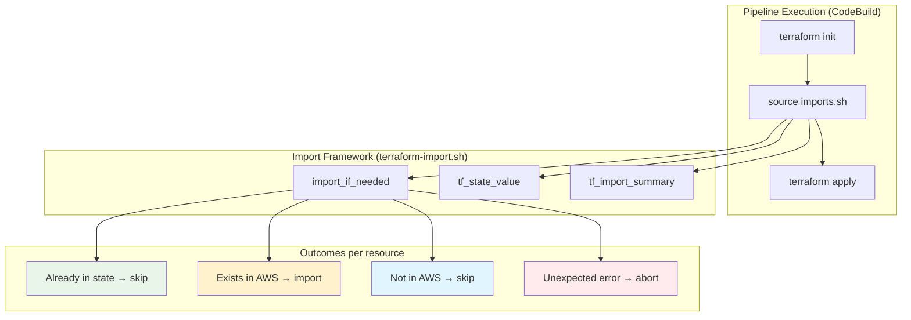

# Terraform Resource Adoption Framework

**Last Updated Date**: 2026-05-26

## Summary

The ROSA HyperFleet uses a pipeline pre-step import framework to adopt pre-existing AWS resources into Terraform state. This enables full lifecycle management of resources that were originally auto-created by AWS services, created by imperative scripts, or provisioned outside of Terraform for any reason. The framework is generic — it works for any AWS resource type — and is fully idempotent.

## Context

- **Problem Statement**: When Terraform needs to manage a resource that already exists in AWS (auto-created by a service, manually provisioned, or previously managed outside of state), declaring the resource in HCL causes `terraform apply` to fail with a conflict error (e.g., `ResourceAlreadyExistsException`). The resource must first be imported into state. This import must work identically whether the resource already exists (existing environments) or doesn't exist yet (fresh environments).
- **Constraints**:
  - A single commit must work on both fresh (ephemeral) and existing (integration, production) environments without environment-specific branching
  - Pipelines run in AWS CodeBuild with no interactive access
  - Terraform's declarative `import {}` block (introduced in 1.5) does not support conditional execution and fails on fresh environments where the target resource doesn't exist yet
  - The solution must be idempotent and safe for unlimited repeated pipeline runs
- **Assumptions**:
  - `jq` is available in the CodeBuild environment
  - Terraform state backend (S3) is initialized before imports run
  - Resources to import are identifiable by deterministic naming conventions or by attributes of other resources already in state

## Alternatives Considered

1. **Terraform `import {}` block (declarative)**: Native Terraform 1.5+ feature. Declared inline with resources. Fails unconditionally if the target doesn't exist in AWS — incompatible with fresh environments.
2. **`terraform_data` + `local-exec` (imperative workaround)**: Uses shell provisioners to run `aws` CLI commands. Resources are never truly managed by Terraform — no drift detection, no lifecycle management, no `terraform destroy` cleanup.
3. **Pipeline pre-step with `terraform import` CLI (chosen)**: Runs between `terraform init` and `terraform apply`. Idempotent, handles all environment states gracefully, and results in full Terraform ownership of the resource.

## Design Rationale

- **Justification**: The pipeline pre-step approach is the only pattern that satisfies all constraints simultaneously: works on fresh environments (import is skipped), works on existing environments (resource is adopted), and results in full Terraform lifecycle management with drift detection.
- **Evidence**: Terraform's official guidance recommends `terraform import` CLI for automated workflows where conditional logic is needed. The `import {}` block is designed for one-time use cases, not continuous pipelines.
- **Comparison**: Unlike `terraform_data`, adopted resources participate in `terraform plan` (drift detection), `terraform apply` (in-place updates), and `terraform destroy` (cleanup on environment teardown). Unlike `import {}` blocks, the pre-step doesn't fail when the resource hasn't been created yet.

## Architecture

### Component Overview



### File Structure

```text
scripts/pipeline-common/
└── terraform-import.sh          # Generic library (shared across all pipelines)

terraform/config/
├── regional-cluster/
│   └── imports.sh               # RC-specific import entries (optional)
└── management-cluster/
    └── imports.sh               # MC-specific import entries (optional)

scripts/buildspec/
├── provision-infra-rc.sh        # Sources imports.sh if present
└── provision-infra-mc.sh        # Sources imports.sh if present
```

Both `imports.sh` files are **optional**. The buildspec checks `[ -f imports.sh ]` before sourcing — if the file doesn't exist, the pipeline proceeds directly to `terraform apply`. Each cluster type (RC, MC) can independently have or not have an `imports.sh`.

### Pipeline Integration

The buildspec sources `imports.sh` conditionally — only during `apply` (not `destroy`), and only if the file exists:

```bash
terraform init -reconfigure ...

# Idempotent state imports (adopt pre-existing AWS resources into TF state)
if [ "${TERRAFORM_ACTION}" == "apply" ] && [ -f imports.sh ]; then
    source imports.sh
fi

terraform "${TERRAFORM_ACTION}" -auto-approve
```

## Framework API

### `import_if_needed <terraform-address> <aws-resource-id>`

Core function that idempotently imports a single resource. Handles four outcomes:

| Scenario                             | Behavior                                    | Pipeline Impact                         |
| ------------------------------------ | ------------------------------------------- | --------------------------------------- |
| Resource already in TF state         | Skip (~10ms, no AWS API call)               | None                                    |
| Resource exists in AWS, not in state | `terraform import` succeeds                 | Resource now managed                    |
| Resource doesn't exist in AWS        | Import fails with known "not found" pattern | None (expected on fresh env)            |
| Unexpected error (permissions, API)  | Counted as failure                          | Pipeline aborted by `tf_import_summary` |

### `tf_state_value <terraform-address> <jq-path>`

Extracts an attribute from a resource already in Terraform state. Used for dynamic import IDs that depend on other resources (e.g., broker IDs, API Gateway IDs, any server-assigned UUID).

Uses `terraform state pull | jq` for reliable JSON parsing.

### `tf_import_summary`

Prints a summary and acts as a pipeline gate — exits non-zero if any imports failed with unexpected errors, preventing `terraform apply` from running with an inconsistent state.

## Idempotency Guarantees

The framework is designed to be **unconditionally safe** at any point in time, on any environment, in any state:

| Environment State                               | What Happens                     | Result                               |
| ----------------------------------------------- | -------------------------------- | ------------------------------------ |
| Fresh (first deploy, no AWS resources exist)    | All imports report `[not-found]` | Terraform creates resources normally |
| Existing (AWS resources exist, not in TF state) | Imports report `[imported]`      | Terraform updates config in-place    |
| Migrated (AWS resources exist AND in TF state)  | All imports report `[skip]`      | No-op, ~10ms per entry               |
| Partially migrated (some in state, some not)    | Mix of `[skip]` and `[imported]` | Each resource handled independently  |

This means:

- **Running imports.sh once is sufficient** — after a single successful pipeline run on an environment, all subsequent runs are pure no-ops
- **Running imports.sh indefinitely is harmless** — since every call checks state first, there is zero side effect on already-managed resources
- **Order does not matter** — each `import_if_needed` call is independent (except when using `tf_state_value` to look up a dependency)
- **Concurrent pipeline runs are safe** — Terraform state locking prevents race conditions

## Implementation Guide

### How to Adopt a New Resource (Single Commit)

When you need Terraform to manage a resource that may already exist in AWS, include **all of the following in a single commit**:

#### 1. Declare the Terraform resource in the module

Add the `resource` block with the desired configuration. Check the [Terraform AWS provider docs](https://registry.terraform.io/providers/hashicorp/aws/latest/docs) for the resource type's import ID syntax.

```hcl
resource "aws_cloudwatch_log_group" "example" {
  name              = "/aws/service/${var.instance_id}/logs"
  retention_in_days = 365
  kms_key_id        = aws_kms_key.example.arn

  tags = merge(local.common_tags, {
    Name = "${var.regional_id}-example-logs"
  })
}
```

#### 2. Add the import entry in `imports.sh`

Create `imports.sh` if it doesn't exist yet, or append to it. Classify the import as static or dynamic:

- **Static**: The AWS resource ID is derivable from environment variables or constants
- **Dynamic**: The AWS resource ID depends on an attribute of another resource already in Terraform state (e.g., a server-assigned UUID)

```bash
#!/usr/bin/env bash
set -uo pipefail
source "$(dirname "${BASH_SOURCE[0]}")/../../../scripts/pipeline-common/terraform-import.sh"

echo "--- Importing resources ---"

# Static import — ID built from known environment variables
import_if_needed \
    'module.example.aws_cloudwatch_log_group.example' \
    "/aws/service/${TF_VAR_instance_id}/logs"

# Dynamic import — ID depends on another resource in state
PARENT_ID=$(tf_state_value 'module.example.aws_service.parent' '.values.id')
if [ -n "$PARENT_ID" ]; then
    import_if_needed \
        'module.example.aws_cloudwatch_log_group.child' \
        "/aws/service/${PARENT_ID}/child-logs"
else
    echo "  [skip] child log group — parent not yet provisioned"
fi

tf_import_summary
```

#### 3. Commit both changes together

The Terraform resource declaration and the corresponding `imports.sh` entry **must be in the same commit**. This ensures:

- The commit works on fresh environments (resource doesn't exist → import skipped → Terraform creates it)
- The commit works on existing environments (resource exists → import succeeds → Terraform updates it in-place)
- There is no intermediate state where one part exists without the other

### Checklist

- [ ] `resource` block added in the Terraform module
- [ ] `imports.sh` entry added (static or dynamic)
- [ ] `tf_import_summary` called at the end of `imports.sh`
- [ ] Tested on an existing environment — verify `[imported]` in pipeline logs
- [ ] Tested on a fresh environment — verify `[not-found]` or `[skip]`

## Lifecycle and Retention Policy

Import entries become permanent no-ops after the first successful pipeline run on each environment. There are two valid approaches:

### Recommended: Keep imports.sh permanently

- **Zero risk** — idempotent entries have no side effects
- **Negligible overhead** — ~10ms per entry (state check only, no AWS API call)
- **Self-documenting** — serves as a historical record of what was migrated and why
- **Defensive** — handles edge cases like state corruption recovery or environment rebuild from scratch

### Alternative: Remove after full rollout

If the team prefers minimal code:

1. Confirm the PR has been deployed to **all** environments (ephemeral, integration, staging, production)
2. Remove the specific `import_if_needed` entries from `imports.sh`
3. If `imports.sh` becomes empty, delete the file entirely (the buildspec's `[ -f imports.sh ]` check handles this gracefully)

The framework library (`terraform-import.sh`) itself should remain as long as any `imports.sh` file exists in the repository.

**Our recommendation is to keep `imports.sh` entries permanently.** The cost is negligible and the safety margin is worth it — environments can be rebuilt, state can be recovered, and the imports will silently do the right thing without anyone having to remember what was migrated.

## Example: CloudWatch Log Group Adoption

This is the concrete implementation that motivated the framework. AWS services auto-create CloudWatch log groups when logging is enabled, but without retention policies or encryption. The framework imports these into Terraform state so that `aws_cloudwatch_log_group` resources can enforce 365-day retention and KMS encryption.

### Terraform infrastructure (added to the module)

Each log group needs a `aws_cloudwatch_log_group` resource and a KMS key for encryption. The KMS key policy must grant the CloudWatch Logs service principal access:

```hcl
# KMS key for CloudWatch log encryption (FedRAMP AU-09)
resource "aws_kms_key" "rds_logs" {
  description             = "KMS key for RDS CloudWatch log encryption"
  deletion_window_in_days = 30
  enable_key_rotation     = true

  policy = jsonencode({
    Version = "2012-10-17"
    Statement = [
      {
        Sid       = "EnableRootAccess"
        Effect    = "Allow"
        Principal = { AWS = "arn:aws:iam::${data.aws_caller_identity.current.account_id}:root" }
        Action    = "kms:*"
        Resource  = "*"
      },
      {
        Sid       = "AllowCloudWatchLogs"
        Effect    = "Allow"
        Principal = { Service = "logs.${data.aws_region.current.id}.amazonaws.com" }
        Action    = ["kms:Encrypt", "kms:Decrypt", "kms:ReEncrypt*", "kms:GenerateDataKey*", "kms:DescribeKey"]
        Resource  = "*"
        Condition = {
          ArnLike = {
            "kms:EncryptionContext:aws:logs:arn" = "arn:aws:logs:${data.aws_region.current.id}:${data.aws_caller_identity.current.account_id}:log-group:/aws/rds/instance/*"
          }
        }
      }
    ]
  })

  tags = merge(local.common_tags, { Name = "${var.regional_id}-rds-logs" })
}

resource "aws_kms_alias" "rds_logs" {
  name          = "alias/${var.regional_id}-maestro-rds-logs"
  target_key_id = aws_kms_key.rds_logs.key_id
}

# Log group with retention + KMS (FedRAMP AU-09, AU-11)
resource "aws_cloudwatch_log_group" "rds_postgresql" {
  name              = "/aws/rds/instance/${var.regional_id}-maestro/postgresql"
  retention_in_days = 365
  kms_key_id        = aws_kms_key.rds_logs.arn

  # Ensure the DB instance exists before we claim its log group
  depends_on = [aws_db_instance.maestro]

  tags = merge(local.common_tags, {
    Name = "${var.regional_id}-maestro-rds-postgresql-logs"
  })
}
```

For resources with server-assigned IDs (e.g., AmazonMQ), the log group name references the parent resource directly:

```hcl
resource "aws_cloudwatch_log_group" "mq_general" {
  name              = "/aws/amazonmq/broker/${aws_mq_broker.hyperfleet.id}/general"
  retention_in_days = 365
  kms_key_id        = aws_kms_key.mq_logs.arn

  depends_on = [aws_mq_broker.hyperfleet]

  tags = merge(local.common_tags, {
    Name = "${var.regional_id}-hyperfleet-mq-general-logs"
  })
}
```

### Import entries (added to `imports.sh`)

#### Static imports (deterministic IDs)

RDS creates log groups with predictable names based on the DB instance identifier:

```bash
# RDS instance identifier is: ${regional_id}-maestro
# RDS creates: /aws/rds/instance/<identifier>/<log-type>
import_if_needed \
    'module.maestro_infrastructure.aws_cloudwatch_log_group.rds_postgresql' \
    "/aws/rds/instance/${TF_VAR_regional_id}-maestro/postgresql"
```

#### Dynamic imports (server-assigned IDs)

AmazonMQ and API Gateway use UUIDs in their log group names. These are only known after the parent resource is created:

```bash
# Broker ID is a UUID assigned by AWS — look it up from state
BROKER_ID=$(tf_state_value \
    'module.hyperfleet_infrastructure.aws_mq_broker.hyperfleet' '.values.id')
if [ -n "$BROKER_ID" ]; then
    import_if_needed \
        'module.hyperfleet_infrastructure.aws_cloudwatch_log_group.mq_general' \
        "/aws/amazonmq/broker/${BROKER_ID}/general"
else
    # First deploy: broker hasn't been created yet, so no log group exists.
    # Terraform will create both the broker and the log group.
    echo "  [skip] AmazonMQ log groups — broker not yet provisioned"
fi
```

### Pipeline output across environment states

**Fresh environment** (first deploy — nothing exists in AWS):

```text
--- Importing resources ---
  [not-found] ...rds_postgresql — resource does not exist in AWS (expected on fresh env)
  [not-found] ...rds_upgrade — resource does not exist in AWS (expected on fresh env)
  [skip] AmazonMQ log groups — broker not yet provisioned
  [skip] API GW execution log group — API not yet provisioned

=== Import summary ===
  Imported:          0
  Already in state:  0
  Not found (fresh): 2
  FAILED:            0
======================
```

**Existing environment** (resources exist in AWS, not yet in TF state):

```text
--- Importing resources ---
  [imported] ...rds_postgresql <- /aws/rds/instance/int-regional-maestro/postgresql
  [imported] ...rds_upgrade <- /aws/rds/instance/int-regional-maestro/upgrade
  [imported] ...mq_general <- /aws/amazonmq/broker/b-abc123/general
  [imported] ...mq_connection <- /aws/amazonmq/broker/b-abc123/connection
  [imported] ...api_gateway_execution <- API-Gateway-Execution-Logs_xyz789/prod

=== Import summary ===
  Imported:          5
  Already in state:  0
  Not found (fresh): 0
  FAILED:            0
======================
```

**All subsequent runs** (everything already managed — permanent steady state):

```text
--- Importing resources ---
  [skip] ...rds_postgresql — already in state
  [skip] ...rds_upgrade — already in state
  [skip] ...mq_general — already in state
  [skip] ...mq_connection — already in state
  [skip] ...api_gateway_execution — already in state

=== Import summary ===
  Imported:          0
  Already in state:  5
  Not found (fresh): 0
  FAILED:            0
======================
```

## Consequences

### Positive

- Full Terraform lifecycle management: drift detection, in-place updates, and proper cleanup on `terraform destroy`
- Single commit works across all environment types without conditional logic or feature flags
- Pipeline-native: no manual intervention, no `terraform import` in a developer's terminal
- Unconditionally idempotent: safe to run forever with zero side effects
- Self-documenting: import entries serve as a permanent record of what was migrated and why

### Negative

- Adds a pipeline pre-step (~10ms per resource on subsequent runs, ~2-5s per resource on first import)
- `terraform state pull` is called once per `tf_state_value` invocation — acceptable overhead for typical use (< 10 dynamic lookups) but would need caching if scaled to hundreds
- Error classification relies on pattern matching against known AWS error messages — new error formats may require adding patterns to `_TF_IMPORT_NOT_FOUND_PATTERNS`

## Cross-Cutting Concerns

### Reliability

- **Idempotency**: Every outcome (skip, import, not-found, failure) is deterministic and repeatable regardless of how many times the pipeline runs
- **Pipeline safety**: `tf_import_summary` acts as a hard gate — the pipeline aborts before `terraform apply` if any unexpected failures occurred
- **State consistency**: Imports run after `terraform init` (state is accessible) and before `terraform apply` (state is not locked)

### Security

- No credentials beyond what Terraform already has (same IAM role in CodeBuild)
- Import stderr is captured in a temp file and cleaned up immediately — sensitive data in error messages is not persisted
- `tf_state_value` uses `terraform state pull` which respects backend access controls

### Performance

- Fast path check (`terraform state show`) avoids AWS API calls for already-managed resources (~10ms)
- On steady state (all resources managed), the entire `imports.sh` is a series of no-ops
- `terraform state pull` downloads the full state JSON — acceptable for states under 100MB, may need caching for very large states

### Operability

- Clear, structured log output with `[skip]`, `[imported]`, `[not-found]`, and `[FAILED]` prefixes for easy log searching
- Summary at the end provides at-a-glance status for pipeline observers
- Debug output (when enabled) shows resolved dynamic IDs for troubleshooting
