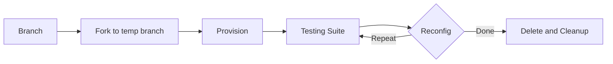
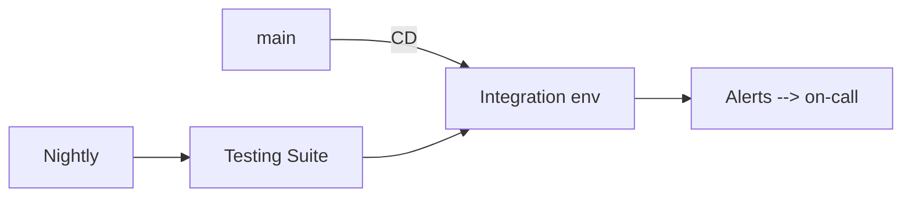
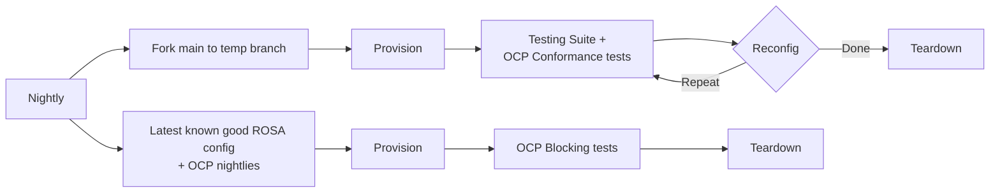
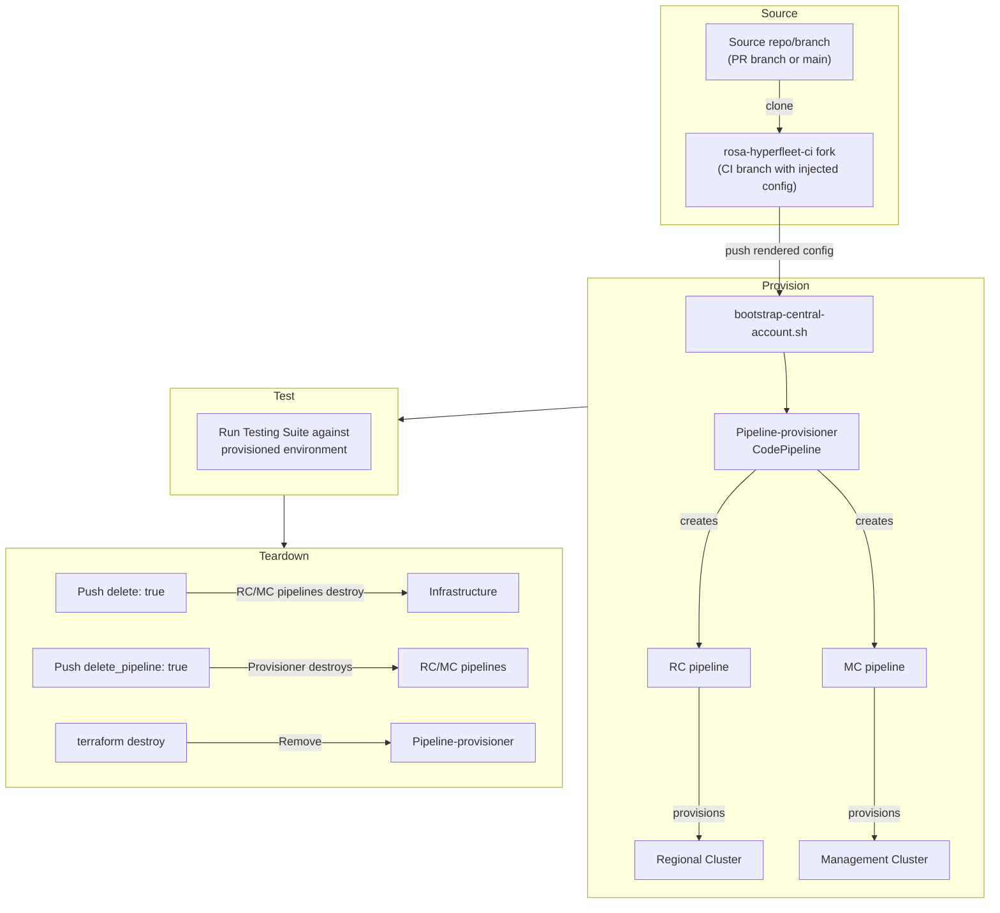

# Testing Strategy

**Last Updated Date**: 2026-03-06

## Summary

The ROSA HyperFleet testing strategy validates every change by provisioning real regional infrastructure and running end-to-end tests against it. A reusable Testing Suite is shared across three complementary CI flows — pre-merge, nightly integration, and nightly ephemeral — providing coverage across PR branches and `main`.

## Context

- **Problem Statement**: The platform provisions and manages real AWS infrastructure (EKS clusters, RDS, networking). Changes must be validated against actual environments, not mocks, to catch integration issues before they reach production.
- **Constraints**: Provisioning a full region takes significant time and AWS resources. Tests must balance thoroughness with cost and feedback speed.
- **Assumptions**: A dedicated CI AWS account is available for ephemeral environments. The pipeline-provisioner can create and tear down full environments reliably.

## Testing Suite

The Testing Suite is a reusable component shared by all CI flows. It:

- Acts against an already-provisioned environment (does not create or modify infrastructure)
- Uses the Platform API to CRUD Hosted Control Planes
- Runs workloads inside those HCPs to validate the customer experience

## Load Testing

The nightly pipeline includes k6-based load tests that stress the Platform API under realistic traffic patterns. Load tests run after functional e2e tests pass, against the same provisioned environment.

Two load test scripts target different concerns:

- **Platform API load** (`ci/load-test/scripts/platform-api-load.js`): Ramps to 50 concurrent virtual users over 2 minutes, holds for 10 minutes, then ramps down. Exercises health endpoints, management cluster CRUD, resource bundle listing, and ManifestWork posting. Thresholds: p99 latency < 5s, error rate < 1%.
- **HCP lifecycle load** (`ci/load-test/scripts/hcp-lifecycle-load.js`): Creates multiple HostedClusters concurrently via the Platform API, polls for visibility, and posts ManifestWork to each. Validates that Maestro MQTT distribution and HyperShift operator scaling handle parallel cluster creation.

Results are saved as JSON to Prow artifacts (`${ARTIFACT_DIR}/load-test-results/`). A baseline comparison script (`ci/load-test/compare-baseline.py`) checks for performance regressions against a baseline stored in S3, failing if any metric regresses beyond a configurable threshold (default 20%).

## Machine-Type Matrix

Nightly ephemeral tests validate the platform across different EC2 instance families, not just the default `t3.medium/t3a.medium`. Override files in `ci/nightly-overrides/machine-types/` are injected via `--provision-override-file` to swap instance types without changing the config hierarchy.

| Job         | Instance Types         | Schedule              |
| ----------- | ---------------------- | --------------------- |
| nightly-m6i | `m6i.large`            | Mon/Wed/Fri 05:00 UTC |
| nightly-c6i | `c6i.xlarge`           | Tue/Thu/Sat 05:00 UTC |
| default     | `t3.medium/t3a.medium` | Daily 04:00 UTC       |

Jobs are staggered to avoid ephemeral account contention (only one MC account available per run). Each machine-type job uses the same `rosa-hyperfleet-ephemeral-e2e` step-registry workflow.

## CI Flows

|               | Source                                        | Environment   | Trigger |
| ------------- | --------------------------------------------- | ------------- | ------- |
| **Pre-merge** | PR branch                                     | Ephemeral     | PR      |
| **Nightly**   | main                                          | Persistent    | Nightly |
| **Nightly**   | main                                          | Ephemeral x N | Nightly |
| **Nightly**   | Latest known good ROSA config + OCP nightlies | Ephemeral     | Nightly |

### Pre-merge (from PR branch, ephemeral env)

Triggered on pull requests. Validates that the PR branch can provision a working environment and pass the Testing Suite.

1. Fork the PR branch to a CI-owned temp branch (CI needs to push commits, e.g. for the deletion flow)
2. Provision a new environment from the temp branch, including the pipeline-provisioner
3. Run the Testing Suite
4. Optionally reconfigure the environment (modify `config.yaml` on the temp branch) and re-run the Testing Suite (repeatable N times)
5. Commit `delete: true` to the temp branch, wait for RC, MCs, and their pipelines to be deleted
6. Clean up the environment, including pipeline-provisioner deletion

### Nightly: Integration (from main, persistent env)

A long-lived environment deployed from `main` via continuous delivery. Validates that `main` is always healthy.

- The integration environment is deployed from `main` and has a pre-existing pipeline-provisioner (set up once)
- A nightly job runs the Testing Suite against this environment
- The RRP team is on-call during business hours; alerts come from the environment itself, not from the nightly job

### Nightly: Ephemeral (from main, N ephemeral envs)

Runs the full provision-test-teardown cycle against `main`, exercising multiple reconfiguration scenarios including upgrades.

- Same mechanics as pre-merge, but sourced from `main`
- Multiple parallel runs with different reconfiguration combinations (including upgrades)
- Includes OCP conformance tests
- A separate track provisions with the latest known good ROSA config and OCP nightlies, then runs OCP blocking tests

## Ephemeral Environment Internals

Both pre-merge and nightly ephemeral flows use the same provision/teardown machinery. A unique ephemeral prefix (e.g. `eph-a1b2c3`) namespaces all resources to enable parallel runs in dedicated CI AWS accounts.

Implementation: `ci/ephemeral-provider/`, entry point: `ci/ephemeral-provider/main.py`.

## Design Rationale

- **Temp branches**: CI forks to a temp branch so it can push GitOps commits (e.g. config changes, `delete: true`) during testing without affecting the source branch.
- **Reconfig loops**: Reconfiguration includes both changes to the underlying regional infrastructure through GitOps (`config.yaml`) and HCP lifecycle operations through the Platform API. This validates that the platform handles day-2 operations correctly.
- **Persistent integration env**: Catches issues that only manifest over time (state drift, resource leaks) and provides a stable target for alerting and on-call validation.
- **Ephemeral envs from main**: Validates the full lifecycle (provision → test → teardown) against `main`, complementing the persistent integration environment.

## Cross-Cutting Concerns

### Cost

- Ephemeral environments are torn down after each run to minimize AWS costs
- Parallel ephemeral runs in nightlies multiply cost; the number of combinations should be tuned based on budget
- The persistent integration environment runs continuously but is a single environment

### Reliability

- **Observability**: The integration environment feeds alerts to the on-call rotation, providing continuous signal on `main` health
- **Resiliency**: Pre-merge validation prevents broken changes from reaching `main`; nightlies catch regressions that slip through

### Operability

- The pipeline-provisioner is set up once for the integration environment but provisioned and torn down per-run for ephemeral environments
- CI-owned temp branches and a dedicated CI repo avoid polluting source repositories
