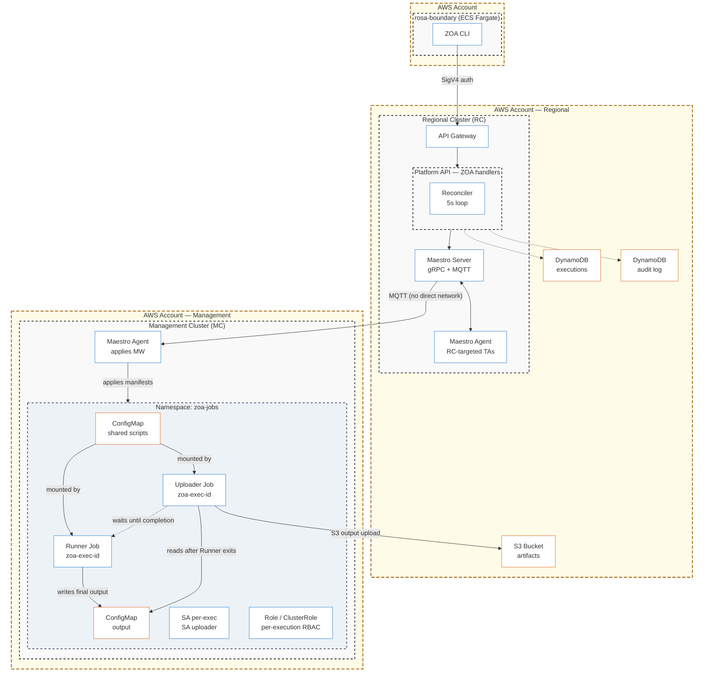
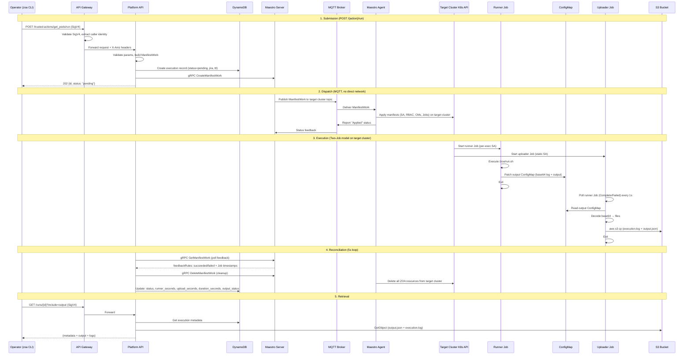

# Zero Operator Access (ZOA) — Architecture

**Last Updated Date**: 2026-06-14

## Summary

Zero Operator Access (ZOA) is the operational access framework for ROSA HCP v2 Regional Platform. It eliminates persistent operator access to managed clusters by routing all operational tasks through mediated, auditable channels. Operators never SSH, kubectl, or assume roles into customer infrastructure — they execute pre-approved Trusted Actions via an API.

## Problem Statement

Traditional managed-service operations require operators to have standing access (kubeconfig, IAM roles, bastion hosts) to diagnose and remediate issues. This creates:

- **Unaudited access paths**: Operators can run arbitrary commands without record
- **Persistent credentials**: Long-lived kubeconfigs and IAM roles expand the attack surface
- **No accountability**: Shared credentials obscure who did what and when
- **Compliance gaps**: FedRAMP requires complete audit trails for privileged operations

ZOA eliminates all of these by making every operational action:

- Pre-defined (approved via PR)
- Mediated (routed through the Platform API)
- Auditable (recorded in DynamoDB with full caller identity)
- Time-bounded (ephemeral, auto-cleaned)
- Least-privileged (scoped RBAC per execution)

## System Components

### Component Overview



### Component Responsibilities

| Component                 | Location          | Role                                                    |
| ------------------------- | ----------------- | ------------------------------------------------------- |
| **API Gateway**           | AWS (regional)    | SigV4 authentication, request routing                   |
| **Platform API**          | RC (EKS pod)      | TA validation, job generation, dispatch, reconciliation |
| **Maestro Server**        | RC (EKS pod)      | ManifestWork storage, MQTT distribution                 |
| **Maestro Agent**         | RC + MC (EKS pod) | Applies ManifestWorks, reports status via MQTT          |
| **DynamoDB (executions)** | AWS (regional)    | Execution metadata, status tracking                     |
| **DynamoDB (audit)**      | AWS (regional)    | API call audit trail                                    |
| **S3**                    | AWS (regional)    | Artifact storage (output.json, execution.log)           |
| **KMS**                   | AWS (regional)    | Encryption at rest for DynamoDB and S3                  |
| **zoa-jobs namespace**    | RC + MC           | Execution environment (Jobs, RBAC, ConfigMaps)          |

## Request Flow — Sequence Diagram

The following diagram shows what happens for every API call, covering all component interactions:



### Per-Endpoint Data Flow Summary

| Endpoint                   | Components Touched                                                                           |
| -------------------------- | -------------------------------------------------------------------------------------------- |
| `POST /{action}/run`       | API Gateway → Platform API → DynamoDB (executions) → Maestro → MQTT → Agent → Target (RC/MC) |
| `GET /runs/{id}`           | API Gateway → Platform API → DynamoDB (executions) + S3                                      |
| `GET /runs`                | API Gateway → Platform API → DynamoDB (executions)                                           |
| `GET /` (catalog)          | API Gateway → Platform API (in-memory registry)                                              |
| `GET /{action}` (describe) | API Gateway → Platform API (in-memory registry)                                              |
| `GET /audit`               | API Gateway → Platform API → DynamoDB (audit table)                                          |

## Network Architecture

### Key Constraint: No Direct Network Path from RC to MC

The Regional Cluster cannot reach the Management Cluster's Kubernetes API directly. All communication to MCs flows through Maestro's MQTT-based protocol:

```
RC → Maestro Server (gRPC) → MQTT Broker → Maestro Agent (target) → Target Kubernetes API
```

For MC-targeted TAs, the MQTT path crosses the network boundary. For RC-targeted TAs, the Maestro Agent on the RC applies the ManifestWork locally.

This means:

- Platform API cannot kubectl into remote clusters
- Status feedback flows back the same path: Target → MQTT → Maestro Server → Platform API (gRPC)
- Output must be uploaded to S3 directly from the target cluster (via the uploader Job)

### Authentication Flow

```
Operator Terminal
  │
  │ eval "$(aws configure export-credentials --format env --profile rrp-regional-dev)"
  │
  ▼
curl/zoa CLI
  │
  │ SigV4 signature (AWS_ACCESS_KEY_ID + AWS_SECRET_ACCESS_KEY + AWS_SESSION_TOKEN)
  │
  ▼
API Gateway (us-east-1)
  │
  │ Validates SigV4, extracts caller identity (Account ID + ARN)
  │ Passes identity via X-Amz-* headers
  │
  ▼
Platform API
  │
  │ Reads: Account ID, Caller ARN, Operator name (from session name in ARN)
  │ Records in DynamoDB: full caller identity with every execution
  │
  ▼
Maestro (gRPC CreateManifestWork)
  │
  │ No additional auth — internal service call within RC
  │
  ▼
MQTT → Maestro Agent → Job on target cluster
```

### S3 Output Pipeline (Two-Job Architecture)

```
Runner Job (on target cluster)
  │
  │ SA: zoa-runner-<exec-id> (per-execution, no S3 access)
  │ Writes output to ConfigMap: zoa-output-<exec-id>
  │
  ▼
Uploader Job (on target cluster)
  │
  │ SA: zoa-uploader → IAM Role (S3 PutObject + KMS Encrypt)
  │ Waits for runner job to complete
  │ Reads output from ConfigMap
  │ aws s3 cp output.json s3://<bucket>/<exec-id>/output.json
  │ aws s3 cp execution.log s3://<bucket>/<exec-id>/execution.log
  │
  ▼
S3 Bucket (regional, SSE-KMS encrypted)
  │
  │ Lifecycle: Standard → Intelligent-Tiering (30d) → Expire (365d)
  │
  ▼
Platform API (on RC)
  │
  │ Pod Identity: platform-api role → IAM (S3 GetObject + KMS Decrypt)
  │ Proxies content to consumers (no presigned URLs exposed)
  │
  ▼
Operator (via GET /runs/{id}?include=output)
```

## Execution Flow (End-to-End)

### 1. Submission

```
Operator: zoa run get_pods -t mc-useast1-1 -n maestro
         │
         ▼
Platform API receives POST /api/v0/trusted-actions/get_pods/run
  - Validates SigV4 identity
  - Validates required fields: `target_cluster` and `jira` (e.g. ROSAENG-1234)
  - Loads TA template from registry (ConfigMap)
  - Validates params (namespace required for get_pods)
  - Enforces write cooldown and max-concurrent limits (write TAs; skipped for dry-run and force)
  - Derives runner SA from scope + type (kube-api → per-exec SA)
  - Generates execution UUID
  - Creates DynamoDB record (status: pending, output_status: pending, jira, ttl=365d)
  - Builds ManifestWork (SA, RBAC, output CM, scripts CM, uploader RBAC, runner Job, upload Job)
  - Dispatches via Maestro gRPC CreateManifestWork
  - Returns {id, status: "pending"} to caller
```

### 2. Dispatch

```
Maestro Server
  - Stores ResourceBundle in database
  - Publishes to MQTT topic for target cluster consumer (RC or MC)
         │
         ▼ MQTT
         │
Maestro Agent (on target cluster — RC or MC)
  - Receives ManifestWork via MQTT subscription
  - Applies all manifests to target cluster Kubernetes API:
    1. ServiceAccount: zoa-runner-<exec-id> (per-execution)
    2. ClusterRole/Role (per-execution RBAC)
    3. ClusterRoleBinding/RoleBinding → runner SA
    4. ConfigMap: zoa-output-<exec-id> (empty, for output transfer)
    5. Role/RoleBinding: output CM patch permission for runner SA
    6. ConfigMap: zoa-scripts-<exec-id> (entrypoint.sh + run.sh)
    7. Role/RoleBinding: zoa-uploader-<exec-id> (dynamic, scoped to output CM + runner Job)
    8. Runner Job: zoa-<exec-id> (executes TA, writes to output CM)
    9. Uploader Job: zoa-<exec-id>-upload (reads CM, uploads to S3)
  - Reports status back via MQTT (Applied, Available)
```

### 3. Execution (Two-Job Model)

```
Kubernetes Job Controller (on target cluster) — starts BOTH Jobs in parallel:

Runner Job (zoa-<exec-id>):
  - SA: zoa-runner-<exec-id> (per-execution, Kubernetes-only permissions)
  - Image: quay.io/slopezz/zoa-tools:<pinned-tag>
  /zoa/entrypoint.sh
    │
    ├── Logs metadata: [zoa] execution_id=... action=... target=...
    ├── Executes /zoa/run.sh (the TA script)
    │     └── kubectl get pods -n maestro -o json > /artifacts/output.json
    ├── Captures exit code
    ├── Patches ConfigMap zoa-output-<exec-id> with:
    │     - data.output.json (if exists)
    │     - data.execution.log
    │     - data.exit-code
    └── Exits with TA script's exit code

Uploader Job (zoa-<exec-id>-upload):
  - SA: zoa-uploader (static, S3 PutObject + KMS Encrypt only)
  - Image: quay.io/slopezz/zoa-tools:<pinned-tag>
  /zoa/upload_entrypoint.sh
    │
    ├── Poll runner Job every 1s for Complete or Failed condition
    │     Budget: EXECUTION_TIMEOUT env var (from execution_timeout_seconds or per-TA override)
    │     Detects failed runners in ~1s (no wasted wait)
    ├── Reads ConfigMap zoa-output-<exec-id>
    ├── Uploads execution.log to S3 (always)
    ├── Uploads output.json to S3 (if present in CM)
    └── Exits 0 on success, 1 on upload failure
```

### 4. Reconciliation

```
Platform API Reconciler (5-second loop on RC)
  │
  ├── Queries DynamoDB: status-index WHERE status IN (pending, running)
  │
  ├── For each pending/running execution:
  │     │
  │     ├── Calls Maestro gRPC GetManifestWork
  │     │
  │     ├── Parses feedbackRules from BOTH Jobs:
  │     │     Runner:   .status.succeeded, .status.failed, .status.startTime, .status.completionTime
  │     │     Uploader: .status.succeeded, .status.failed, .status.completionTime
  │     │
  │     ├── On Applied condition (pending → running):
  │     │     └── UpdateStatus in DynamoDB (updated_at)
  │     │
  │     ├── On full completion (both Jobs done):
  │     │     ├── Compute durations from Job timestamps:
  │     │     │     runner_seconds  = runner.completionTime - runner.startTime
  │     │     │     upload_seconds  = uploader.completionTime - runner.completionTime
  │     │     │     duration_seconds = now - created_at (total wall-clock)
  │     │     ├── Delete ResourceBundle from Maestro (gRPC)
  │     │     │     └── Cascades: Agent removes ManifestWork → all resources on target cluster
  │     │     └── Update DynamoDB: status, completed_at, updated_at, runner_seconds,
  │     │                          upload_seconds, duration_seconds, output_status (uploaded|failed)
  │     │
  │     └── On timeout (exceeded execution_timeout + upload_timeout + 120s dispatch buffer):
  │           ├── Delete ResourceBundle from Maestro (cleanup first)
  │           └── Update DynamoDB: status=timed_out, duration_seconds
  │
  └── Sleep 5s → repeat
```

### 5. Retrieval

```
Operator: zoa get <exec-id>
         │
         ▼
Platform API receives GET /api/v0/trusted-actions/runs/<exec-id>?include=output
  - Reads DynamoDB for execution metadata
  - Reads output_path (full S3 URI from DynamoDB)
  - Fetches s3://<bucket>/<exec-id>/output.json
  - Returns combined response: metadata + output JSON
         │
         ▼
Operator sees structured output (pipeable to jq)
```

## Infrastructure

### DynamoDB Executions Table

```
Table: <env>-regional-zoa-executions
  PK: executionId (String)

GSI: account-index
  PK: accountId (String)
  SK: createdAt (String, RFC3339)
  Projection: ALL

GSI: status-index
  PK: status (String)
  SK: createdAt (String, RFC3339)
  Projection: ALL

TTL: ttl attribute (epoch seconds) — records auto-expire after 365 days
```

### DynamoDB Audit Table

```
Table: <env>-regional-zoa-audit-log
  PK: accountId (String)
  SK: timestamp (String, RFC3339 with nanosecond precision — format 2006-01-02T15:04:05.000000000Z)

Fields (all present on every entry, empty string when N/A):
  id, callerArn, operator, method, path, action, targetCluster,
  executionId, jira, approvalState, statusCode

TTL: ttl attribute (epoch seconds) — entries auto-expire after 365 days
```

The sort key uses nanosecond-precision timestamps to guarantee uniqueness when multiple API calls arrive in the same second. `approvalState` mirrors the execution's approval lifecycle (`not_required`, `pending`, `approved`, `rejected`).

Records every audited API call with consistent fields. Audited endpoints:

- `POST /{action}/run` — populates action, targetCluster, executionId, jira
- `GET /runs/{id}` — populates executionId (accessed ID)
- `GET /runs` — identity + path only
- `GET /audit` — identity + path only (self-referential for compliance)

Not audited: `GET /` (catalog) and `GET /{action}` (describe) — public metadata, high frequency noise.

Rejected POST requests (400/429) are also recorded with available context at point of failure. The `path` field stores the full request URI including query parameters for GET requests.

### S3 Bucket

```
Bucket: <env>-regional-zoa-outputs-<account-id>
  Encryption: SSE-KMS (dedicated ZOA key)
  Versioning: Enabled
  Lifecycle:
    - Transition to Intelligent-Tiering: 30 days
    - Expiration: 365 days (FedRAMP retention)
    - Noncurrent version expiration: 30 days
    - Abort incomplete multipart: 7 days
```

### IAM Roles (Pod Identity)

| Role                         | Associated SAs                                  | Cluster | Permissions                                                  |
| ---------------------------- | ----------------------------------------------- | ------- | ------------------------------------------------------------ |
| `<regional-id>-zoa-job`      | `zoa-uploader`, `zoa-aws-read`, `zoa-aws-write` | RC      | `s3:PutObject` + `kms:GenerateDataKey` + AWS read (EKS, VPC) |
| `<management-id>-zoa-job`    | `zoa-uploader`, `zoa-aws-read`, `zoa-aws-write` | MC      | `s3:PutObject` + `kms:GenerateDataKey` + AWS read (EKS, VPC) |
| `<regional-id>-platform-api` | `platform-api`                                  | RC      | `s3:GetObject` + `kms:Decrypt` + `dynamodb:*` on ZOA tables  |

Pod Identity associations are wired on **both** RC and MC — TAs can target either cluster type. The `aws-api-read` and `aws-api-write` policies grow incrementally as new AWS-scoped TAs are added, granting only the minimum required permissions for implemented TAs — never more.

**Key design principle**: Runner SAs (`zoa-runner-<exec-id>`, `zoa-aws-read`, `zoa-aws-write`) have **zero** access to the ZOA S3 bucket. Only `zoa-uploader` can write to S3, ensuring SA isolation between operational actions and output transport.

### Terraform Module

```
terraform/modules/zoa/
  ├── dynamodb.tf       # Executions table + GSIs + Audit log table (both with TTL)
  ├── s3.tf             # Output bucket + lifecycle + encryption
  ├── kms.tf            # Dedicated KMS key
  ├── iam.tf            # Job role + Platform API policy attachments (incl. audit table)
  ├── variables.tf      # Environment prefix, retention, billing mode
  └── outputs.tf        # Table name, audit table name, bucket name, KMS ARN (consumed by bootstrap)
```

### Kubernetes Infrastructure (`zoa-jobs` Helm Chart)

Static ZOA infrastructure is deployed via the `zoa-jobs` Helm chart at `argocd/config/shared/zoa-jobs/`. The root ArgoCD ApplicationSet discovers charts under `argocd/config/shared/*` and deploys them to both Regional and Management clusters with `CreateNamespace=true`, which creates the `zoa-jobs` namespace automatically.

The chart provisions static ServiceAccounts (`zoa-uploader`, `zoa-aws-read`, `zoa-aws-write`, plus breakglass SAs). Pod Identity associations for AWS-scoped SAs are wired via Terraform (`terraform/modules/zoa/` and `terraform/modules/zoa-job-pod-identity/`). Per-execution resources (runner SA, RBAC, Jobs, ConfigMaps) are created dynamically by each ManifestWork on the target cluster.

## TA Template System

Each TA template defines: `name`, `scope`, `type`, `description`, `authorization`, `params`, and `script`. Kube-scoped TAs also include an `rbac` section. Optional fields include `timeout_seconds`, `write_cooldown_seconds`, and `dry_run_action`.

**Scopes:** `kube-api` (Kubernetes operations), `aws-api` (AWS CLI operations)

**Types:** `read`, `write`

**Authorization:** `authorization.approval: none` on all current TAs. The API records `approval_state` on every execution and audit entry. Future TAs may require approval; runtime states are `not_required`, `pending`, `approved`, and `rejected`.

### How TAs Are Loaded

```
TA YAML files (argocd/config/regional-cluster/platform-api/ta-templates/)
  │
  ▼ (Helm template packs them into ConfigMap)
ConfigMap: zoa-ta-templates (mounted into Platform API pod at /templates/)
  │
  ▼ (Platform API reads on startup)
TemplateRegistry (in-memory map of action_name → TATemplate struct)
  │
  ▼ (On each execution request)
BuildManifestWork(template, renderContext) → ManifestWork with all K8s manifests
```

### Template → ManifestWork Generation

What the TA author writes (~15 lines):

```yaml
name: get_pods
scope: kube-api
type: read
params: [...]
rbac:
  rules: [...]
script: |
  kubectl get pods ...
```

What Platform API generates (full ManifestWork with ~200 lines of K8s manifests):

- ServiceAccount (per-execution `zoa-runner-<exec-id>`)
- Role/ClusterRole (from `rbac.rules`)
- RoleBinding/ClusterRoleBinding (SA → Role)
- Output ConfigMap (`zoa-output-<exec-id>`)
- RBAC for runner SA to patch the output ConfigMap
- Dynamic uploader Role/RoleBinding (`zoa-uploader-<exec-id>`, scoped via `resourceNames`)
- Script ConfigMap (entrypoint.sh wrapper + run.sh from `script`)
- Runner Job (executes TA script, writes output to ConfigMap)
- Uploader Job (reads ConfigMap, uploads to S3)
- Job (image, volumes, env vars, resources, labels, TTL)
- ManifestWork feedbackRules (extract Job status)

### Job Boilerplate (Centrally Managed)

The Job "frame" is NOT defined by TA authors. It comes from `zoa-job-config` ConfigMap:

| Config                      | Default                           | Purpose                                                            |
| --------------------------- | --------------------------------- | ------------------------------------------------------------------ |
| `image`                     | `quay.io/slopezz/zoa-tools:<tag>` | Container image for runner and uploader Jobs                       |
| `cpu_request`               | `25m`                             | Pod CPU request                                                    |
| `memory_request`            | `64Mi`                            | Pod memory request                                                 |
| `cpu_limit`                 | `250m`                            | Pod CPU limit                                                      |
| `memory_limit`              | `256Mi`                           | Pod memory limit                                                   |
| `execution_timeout_seconds` | `1800`                            | Global timeout for reconciler (per-TA `timeout_seconds` overrides) |
| `upload_timeout_seconds`    | `120`                             | Reserved time budget for S3 upload after runner finishes           |
| `write_cooldown_seconds`    | `300`                             | Global write cooldown (seconds) between same action on same target |
| `ttl_seconds`               | `3600`                            | K8s TTL after Job completion (safety GC via Job controller)        |
| `dynamodb_ttl_days`         | `365`                             | DynamoDB record auto-expiry (execution + audit entries)            |
| `max_concurrent_per_target` | `10`                              | Max running + pending executions per target cluster                |
| `entrypoint.sh`             | (wrapper script)                  | Runner wrapper: logging, ConfigMap output patch, exit handling     |
| `upload_entrypoint.sh`      | (wrapper script)                  | Uploader wrapper: waits for runner, reads ConfigMap, uploads to S3 |

Changing any of these updates ALL future TA executions — no per-TA changes needed.

## Cleanup and Lifecycle

### Normal Cleanup (Reconciler-Driven)

```
1. Reconciler detects Job terminal status (succeeded/failed) via ManifestWork feedback
2. Reconciler deletes ResourceBundle from Maestro (gRPC)
3. Maestro Agent removes ManifestWork from its local state
4. Agent cascades deletion: Job, Pod, ConfigMap, Role, RoleBinding — all removed from target cluster
5. Reconciler updates DynamoDB with terminal status and duration
```

### Timeout Model

Three layers protect against stuck executions. Each layer is a fallback for the one above — under normal operation, only Layer 1 fires.

**Layer 1 — Reconciler timeout (primary enforcement)**

```
Formula: execution_timeout + upload_timeout + 120s (dispatch buffer)
Default: 1800 + 120 + 120 = 2040s (~34 min)
```

The dispatch buffer (hardcoded 120s) accounts for Maestro MQTT delivery, pod scheduling, and image pull before the uploader poll loop starts. The reconciler polls DynamoDB every 5s and checks `created_at` against this budget.

When exceeded:

1. Delete ResourceBundle from Maestro (stops all Jobs via cascade)
2. Update DynamoDB: status=timed_out, duration_seconds

Fires when: Normal operation. Every timed-out execution goes through this path.

**Layer 2 — activeDeadlineSeconds (K8s safety net per-Job)**

```
Formula: execution_timeout + upload_timeout + 180s
Default: 1800 + 120 + 180 = 2100s (~35 min, intentionally > Layer 1)
Set on BOTH runner and uploader Job specs.
```

When exceeded: Kubernetes forcibly terminates the pod and marks the Job as Failed with reason=DeadlineExceeded.

Fires when the reconciler FAILED to delete the ResourceBundle:

- Platform API pod crashed or restarted (reconciler loop stopped)
- Maestro gRPC is unreachable (DeleteManifestWork fails repeatedly)
- DynamoDB query failed (reconciler never found this execution)

In these cases, the ManifestWork stays on the target cluster with Jobs still running. `activeDeadlineSeconds` ensures K8s itself kills the pods after ~35 min, preventing infinite resource consumption. The reconciler will eventually recover and clean up the ResourceBundle on its next successful poll — by then the Jobs are already dead.

**Layer 3 — ttlSecondsAfterFinished (garbage collection)**

```
Value: 3600s (1 hour after Job finishes)
Set on BOTH runner and uploader Job specs.
```

This is a native K8s Job controller feature — it deletes the **Job object** (not the pod) from the cluster after the specified duration post-completion.

Fires when a Job already reached terminal state (Complete or Failed) but the ManifestWork was never deleted:

- Reconciler deleted the ResourceBundle, but Maestro Agent failed to cascade the ManifestWork deletion (Agent bug, CRD issue)
- `activeDeadlineSeconds` killed the pod (Layer 2), Job became Failed, but the ResourceBundle/ManifestWork still exist on cluster

What it does NOT cover: Jobs stuck in a running state that never finish — those are handled by Layer 2.

**Summary**

```
Happy path:       Reconciler detects completion/timeout → deletes RB → done (~seconds)
Reconciler down:  activeDeadlineSeconds kills pods (~2100s) → TTL cleans Job objects (+3600s)
Both fail:        Jobs run until activeDeadlineSeconds, then GC after TTL
```

### What Persists After Cleanup

| What                          | Where                  | Retention                  |
| ----------------------------- | ---------------------- | -------------------------- |
| Execution metadata            | DynamoDB               | 365 days (TTL auto-expiry) |
| output.json                   | S3                     | 365 days                   |
| execution.log                 | S3                     | 365 days                   |
| API call audit log            | DynamoDB (audit table) | 365 days (TTL auto-expiry) |
| K8s resources (Job, RBAC, CM) | Target cluster (RC/MC) | Deleted on completion      |

## Audit Trail

Every execution produces audit data at multiple layers:

| Layer                                    | What's Recorded                                                                                                                       | Query Method                                        |
| ---------------------------------------- | ------------------------------------------------------------------------------------------------------------------------------------- | --------------------------------------------------- |
| Platform API (DynamoDB executions table) | execution_id, operator, caller_arn, jira, action, target, status, approval_state, duration, revision, updated_at, dry_run, force      | `zoa runs` CLI or direct API                        |
| S3 (artifacts)                           | Full execution log, structured output                                                                                                 | `zoa logs <id>` or `zoa get <id>`                   |
| Kubernetes (labels on all resources)     | execution-id, operator, action, scope, type, revision, target                                                                         | `kubectl get jobs -l zoa.rosa.io/operator=slopezma` |
| Platform API (DynamoDB audit table)      | Every audited API call: method, path (full URI), action, target, execution_id, jira, approval_state, operator, status_code, timestamp | `zoa audit` CLI                                     |
| AWS CloudTrail                           | SigV4 caller identity on API Gateway invocation                                                                                       | CloudTrail console                                  |
| Maestro (MQTT events)                    | ManifestWork create/delete events with metadata                                                                                       | Maestro server logs                                 |

### Correlation

Given an execution ID, you can trace the full chain:

```
DynamoDB: execution metadata + timing
  → S3: full execution log + structured output
  → Target cluster (MC/RC, while running): kubectl get jobs -l zoa.rosa.io/execution-id=<id>
  → CloudTrail: API Gateway access log for the POST request
```

## Future Considerations

### TA Repository Separation

TAs may move to their own Git repository with independent release cycles. Platform API reads from a mounted directory — the source is transparent. A promotion pipeline would control which revision is active per environment.

### Breakglass API

A future `/api/v0/breakglass/` endpoint will provide escalated access patterns:

- Requires additional approval workflow (not just SigV4 auth)
- Different CLI verb: `zoa breakglass ...` (deliberately more typing)
- Uses elevated static ServiceAccounts (`zoa-breakglass-read`, `zoa-breakglass-write`)
- Stricter audit requirements and time limits

### Approval Workflow

All current TAs declare `authorization.approval: none`, and executions record `approval_state: not_required`. The data model supports future approval-gated TAs:

- `pending` — awaiting required approvers
- `approved` — authorized to proceed
- `rejected` — explicitly denied

When enabled, write TAs with structured approval policies will require peer approval before dispatch. `approval_state` is tracked on both execution records and audit entries.

---

## Related Documentation

- [ZOA Trusted Actions — Implementation Details](./zoa-trusted-actions.md) — TA template format, CLI design, API endpoints
- [ZOA Security Model](./zoa-security-model.md) — SA isolation strategies, RBAC model, audit
- [Maestro MQTT Resource Distribution](./maestro-mqtt-resource-distribution.md) — ManifestWork dispatch mechanism
