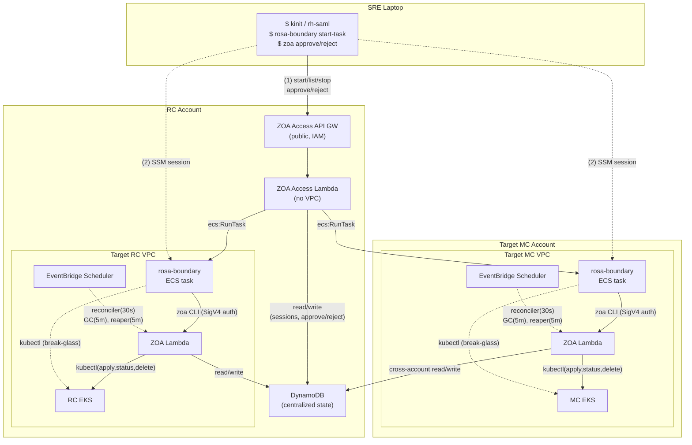
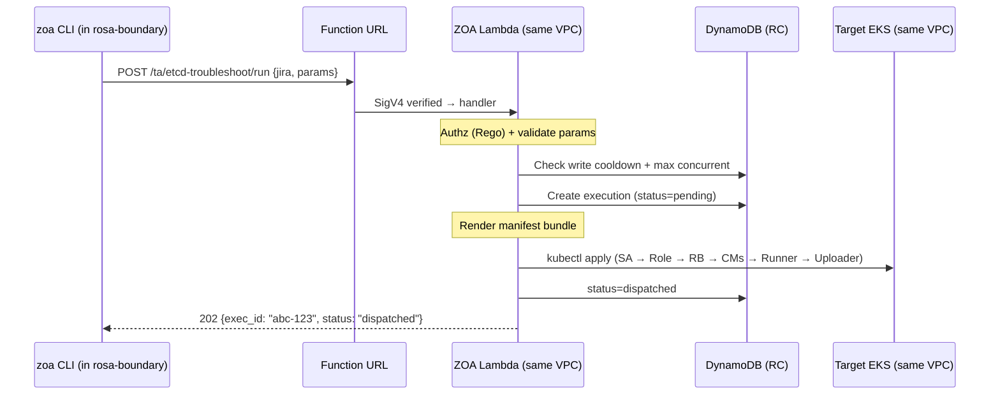
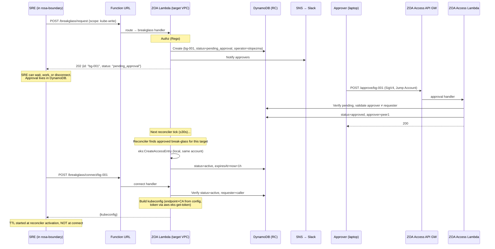

# Zero Operator Access (ZOA) — Lambda Architecture

**Status:** Proposal

This is a theoretical architecture proposal for improving ZOA's failure domain resilience by replacing Platform API pods, Hyperfleet Operator, and kube-applier with AWS Lambda as the execution layer. The ZOA business logic (authorization, audit, execution lifecycle, templates) remains the same — only the transport layer changes. This proposal is independent of the current ZOA implementation and can be pursued incrementally.

> **Note**: This is an AI-assisted design document. The architecture, design decisions, and overall approach are validated, but there may be minor inaccuracies in implementation details. Treat this as the design proposal — specifics will be refined during implementation.

---

## Table of Contents

1. [Context & Motivation](#1-context--motivation)
2. [Architecture](#2-architecture)
3. [Detailed Design](#3-detailed-design)
   - [Container Placement](#31-container-placement-rosa-boundary)
   - [Trusted Action Execution](#32-trusted-action-execution)
   - [Break-Glass Access](#33-break-glass-access)
   - [Approval Workflow](#34-approval-workflow)
   - [Garbage Collection & Lifecycle](#35-garbage-collection--lifecycle)
4. [Security Model](#4-security-model)
5. [Observability](#5-observability)
6. [Data Model](#6-data-model-dynamodb-per-region)
7. [Deployment Pipeline](#7-deployment-pipeline)
8. [Cross-Platform Comparison](#8-cross-platform-comparison)
9. [Implementation Phases](#9-implementation-phases)
10. [Design Decisions](#10-design-decisions-resolved)
11. [Open Questions](#11-open-questions)
12. [References](#12-references)

---

## 1. Context & Motivation

### Problem

ZOA (Zero Operator Access) operations — Trusted Actions and break-glass — currently depend on Platform API pods running on RC EKS. If Platform API is down, SREs cannot execute TAs or get emergency cluster access. This is a chicken-and-egg problem: the tool you need to fix the platform requires the platform to be running.

### Failure domain analysis

> **Prerequisite (shared)**: SRE must have a rosa-boundary container (ECS Fargate, 99.99% SLA). Once the container exists, the tables below show what can break during ZOA execution.

**Current — Hyperfleet Operator + kube-applier:**

Path: `API GW → ALB → Platform API → pgruntime → PostgreSQL → Hyperfleet Operator → DynamoDB → DynamoDB Streams → kube-applier → MC EKS`

| #   | Component             | Type                  | SLA           | Common failure mode                                                                                                                                          |
| --- | --------------------- | --------------------- | ------------- | ------------------------------------------------------------------------------------------------------------------------------------------------------------ |
| 1   | API Gateway           | AWS                   | 99.95%        | Managed — rare                                                                                                                                               |
| 2   | ALB                   | AWS                   | 99.99%        | Managed — rare                                                                                                                                               |
| 3   | Platform API pods     | Custom                | —             | OOM, bad deploy, crash loop, HPA lag                                                                                                                         |
| 4   | RC EKS                | AWS                   | 99.95%        | Managed — rare                                                                                                                                               |
| 5   | Hyperfleet Operator   | Custom                | —             | Bug, leader election, CRD version mismatch                                                                                                                   |
| 6   | PostgreSQL (RDS)      | Custom (on AWS infra) | Infra: 99.95% | Slow queries, missing indexes, lock contention, connection pool exhaustion, schema migrations. RDS manages hardware — not application-layer database issues. |
| 7   | DynamoDB              | AWS                   | 99.999%       | Managed — rare (throttle if under-provisioned)                                                                                                               |
| 8   | kube-applier (per MC) | Custom                | —             | Bug, RBAC misconfiguration, stale cache                                                                                                                      |
| 9   | MC EKS                | AWS                   | 99.95%        | Managed — rare                                                                                                                                               |

**4 custom + 5 AWS = 9 failure domains.**

> **Why PostgreSQL counts as "custom"**: RDS infrastructure SLA is 99.95% (hardware, networking, Multi-AZ failover). But real database outages are overwhelmingly code-induced: unoptimized queries, missing indexes, lock contention from concurrent writes, connection pool exhaustion under load, schema migrations holding locks. These affect all consumers (Platform API, Hyperfleet Operator) and require **developer intervention** to fix — not AWS support. Contrast with DynamoDB (used in the proposed architecture): no query optimizer, no indexes to forget, no lock contention, no connection pools. DynamoDB's failure modes are truly infrastructure-level (throttling from under-provisioning), which is capacity planning — not code bugs.

**Proposed — Simplified Lambda architecture:**

Path: `Function URL → ZOA Lambda (same VPC) → Target EKS`

| #   | Component                              | Type   | Recovery                           | SLA     |
| --- | -------------------------------------- | ------ | ---------------------------------- | ------- |
| 1   | Our code in Lambda                     | Custom | Instant rollback (Lambda versions) | —       |
| 2   | Lambda service (includes Function URL) | AWS    | Auto                               | 99.95%  |
| 3   | DynamoDB                               | AWS    | Auto                               | 99.999% |
| 4   | Target EKS                             | AWS    | Auto                               | 99.95%  |

**1 custom + 3 AWS = 4 failure domains.**

No RC EKS in path. No ALB. No Platform API pods. No Operator. No kube-applier. No cross-account Lambda invocation. No separate API Gateway in execution path.

### Design principles

1. **Trust AWS over ourselves**: AWS services have billion-dollar investment in availability. Our pods crash from bugs, OOMs, bad deploys. Put SRE operations on AWS infrastructure, not on our K8s workloads. A 99.95% SLA means ~21 minutes/month error budget — acceptable for ZOA operations that are not latency-critical and have CLI retry built in.
2. **Break-glass must be independent**: The mechanism to fix the platform cannot depend on the platform.
3. **Minimize custom code in the critical path**: Our code still runs (bugs are possible), but it runs on infrastructure we don't manage — no pod scheduling, no HPA, no image pulls, no cert rotation.
4. **Regional isolation**: ZOA is per-region. A Lambda failure in us-east-1 doesn't affect eu-west-1.
5. **Stateless execution, durable state**: Lambda is stateless. DynamoDB holds all state. Any Lambda invocation can serve any request.
6. **One Lambda per target, all logic local**: Each target VPC has its own Lambda instance with direct EKS access. No cross-account Lambda invocations in the execution path. The Lambda in each VPC handles everything for that target: TA dispatch, status, GC, reaper, break-glass activation.

### What changes (summary)

| Concern               | Before                              | After                                                                       |
| --------------------- | ----------------------------------- | --------------------------------------------------------------------------- |
| TA scheduling + API   | Platform API pods (K8s)             | ZOA Lambda per-VPC (AWS-managed)                                            |
| Transport to clusters | Maestro chain OR kube-applier chain | Direct kubectl from local Lambda (same VPC)                                 |
| Break-glass           | Platform API (chicken-and-egg)      | ZOA Lambda per-VPC (independent)                                            |
| Placement             | N/A                                 | ZOA Access Lambda (RC, no VPC)                                              |
| Approval              | N/A                                 | ZOA Access Lambda + DynamoDB                                                |
| Reconciliation        | Platform API goroutine (15s)        | EventBridge Scheduler → local ZOA Lambda (reconciler 30s, GC 5m, reaper 5m) |
| State                 | DynamoDB                            | DynamoDB (same, centralized in RC)                                          |
| Artifacts             | S3                                  | S3 (same)                                                                   |

> **Scope**: Lambda replaces ONLY the ZOA/TA/break-glass path. Cluster lifecycle (create/delete/patch) remains on Hyperfleet Operator + kube-applier. Both coexist.

> **This is not a rewrite.** The existing ZOA business logic (`rosa-hyperfleet-api/pkg/zoa/` — execution lifecycle, audit, OPA policy evaluation, DynamoDB operations, TA template rendering) is reused as-is. Only the outermost transport layer changes: the current Platform API HTTP handler is replaced by a Lambda entrypoint that unmarshals Function URL events. Core packages (`store`, `audit_store`, `policy`, `templates`) remain identical. The migration is a wiring change — new entrypoint, same logic.

---

## 2. Architecture

### Physical topology



### Components (2 Lambda deployments, 1 binary)

| #   | Component                | Terraform name | Location                       | VPC? | Trigger                         | Responsibility                                                                                    |
| --- | ------------------------ | -------------- | ------------------------------ | ---- | ------------------------------- | ------------------------------------------------------------------------------------------------- |
| 1   | **ZOA Access Lambda**    | `zoa-access`   | RC account                     | NO   | ZOA Access API Gateway (public) | Session management (`ecs:RunTask/Stop`), approval/rejection (DynamoDB write). Laptop-facing only. |
| 2   | **ZOA Lambda** (per-VPC) | `zoa-{id}`     | Each target VPC (RC + each MC) | YES  | Function URL + EventBridge      | ALL target operations: TA dispatch, status, break-glass activation, GC, reaper.                   |
| 3   | **rosa-boundary**        | ECS task       | Per target VPC (ECS Fargate)   | YES  | Created by ZOA Access Lambda    | Interactive SRE container. SSM session. Runs `zoa` CLI.                                           |

**One Go binary** compiled once, deployed as both `zoa-access` and `zoa-{id}`. Environment variable `MODE=access|target` selects active routes. `TARGET_CLUSTER=mc-1` identifies the target for per-VPC Lambdas.

#### Why ZOA Access Lambda is separate from RC's ZOA Lambda

Both are in the RC account but serve different purposes:

| Concern                    | ZOA Access Lambda                                              | ZOA Lambda (RC VPC)                                        |
| -------------------------- | -------------------------------------------------------------- | ---------------------------------------------------------- |
| VPC-attached               | NO                                                             | YES (needs kubectl to RC EKS)                              |
| Cold start                 | ~200ms (not VPC-attached) — matters because laptop-interactive | 1-2s (VPC-attached) — acceptable because callers are async |
| Must work when EKS is down | YES (session creation bootstraps access)                       | Partially (TAs need EKS, break-glass does not)             |
| IAM role                   | `ecs:RunTask` cross-account + DynamoDB                         | Local EKS + DynamoDB cross-account                         |
| Caller                     | SRE laptop (via API GW)                                        | rosa-boundary (via Function URL) + EventBridge             |

If RC EKS has networking issues, the VPC-attached ZOA Lambda may be affected — but ZOA Access Lambda still works (it's not VPC-attached). SRE can still create rosa-boundary sessions and approve requests even during a total EKS outage.

#### ZOA Lambda (per-VPC) responsibilities

One Lambda per target, all logic local. Handles:

- **TA dispatch**: render manifests, `kubectl apply` (SA → Role → RB → CMs → Runner → Uploader Jobs)
- **Status**: `kubectl get job` for live status, or DynamoDB read for cached status
- **Output**: read from S3 (presigned URL)
- **Break-glass activation**: `eks:CreateAccessEntry` (local, same account) when reconciler finds approved request
- **Break-glass revocation**: `eks:DeleteAccessEntry` when session expires (reaper)
- **Reconciler** (EventBridge 30s): check Job status, enforce timeouts, activate approved break-glass
- **GC** (EventBridge 5min): delete K8s resources from completed TAs
- **Reaper** (EventBridge 5min): terminate expired rosa-boundary containers, revoke break-glass access entries
- **Rate limiting**: write cooldown per action/target, max concurrent (DynamoDB conditional writes)
- **Authorization**: OPA/Rego policy evaluation (baked into ZIP)
- **Audit**: append to DynamoDB audit table on every API call
- **Template registry**: TA definitions baked into ZIP, loaded from `/var/task/templates/`

**IAM Role**: EKS access entry (static, Terraform-created), DynamoDB read/write (cross-account via AssumeRole to RC), S3 read (presigned URLs), `ecs:StopTask` (local, for reaper), `eks:CreateAccessEntry`/`DeleteAccessEntry` (local, for break-glass), CloudWatch logs.

#### rosa-boundary (the terminal)

ECS Fargate task providing an audited interactive shell. Placed **in the target cluster's VPC** — direct network path to private EKS API (no proxy, no tunnel). One container per SRE session.

- **Lifecycle**: created via ZOA Access API GW (`rosa-boundary start-task`), terminated by reaper (4h deadline) or SRE exit
- **Identity bridge**: ECS task ARN → DynamoDB lookup → SRE identity. All `zoa` CLI calls inside the container are attributed to the originating SRE
- **Auditing**: SSM Session Manager records all terminal I/O; `auditd` captures syscalls; both streamed to S3 (WORM)
- **Container image**: shared with ROSA v1 (same base, same `zoa` CLI binary baked in)
- **ZOA endpoint**: `ZOA_ENDPOINT` environment variable injected into the rosa-boundary ECS task at creation time (Function URL of the target's ZOA Lambda, read from `boundary-targets` DynamoDB table by ZOA Access Lambda)

### API surface

**ZOA Access API Gateway** (session management + approval/rejection, laptop-facing):

| Route                           | Caller                     | Purpose                                                                     |
| ------------------------------- | -------------------------- | --------------------------------------------------------------------------- |
| `POST /sessions/start`          | Laptop (Jump Account role) | Create rosa-boundary container in target VPC                                |
| `GET /sessions`                 | Laptop (Jump Account role) | List SRE's own running tasks (identity from SigV4)                          |
| `POST /sessions/join/{task-id}` | Laptop (Jump Account role) | Connect to an existing task (own tasks only, API validates operator match)  |
| `POST /sessions/stop/{task-id}` | Laptop (Jump Account role) | Graceful stop (triggers S3 session sync before termination, own tasks only) |
| `POST /approve/{id}`            | Laptop (Jump Account role) | Approve break-glass/TA request                                              |
| `POST /reject/{id}`             | Laptop (Jump Account role) | Reject break-glass/TA request (with reason)                                 |

Six routes. All scoped to the caller's own resources or requests pending their review (SigV4 identity → operator/approver match).

**Lambda Function URL** (per-VPC, rosa-boundary-facing):

| Route                           | Caller                        | Purpose                       |
| ------------------------------- | ----------------------------- | ----------------------------- |
| `POST /ta/{action}/run`         | rosa-boundary (ECS task role) | Schedule TA                   |
| `GET /runs/{id}`                | rosa-boundary (ECS task role) | Get status + output           |
| `GET /runs`                     | rosa-boundary (ECS task role) | List executions (filterable)  |
| `GET /runs/{id}/logs`           | rosa-boundary (ECS task role) | Get execution logs            |
| `GET /actions`                  | rosa-boundary (ECS task role) | List TA catalog               |
| `GET /actions/{action}`         | rosa-boundary (ECS task role) | Describe TA details           |
| `GET /audit`                    | rosa-boundary (ECS task role) | Query audit log               |
| `POST /breakglass/request`      | rosa-boundary (ECS task role) | Request break-glass           |
| `GET /breakglass/list`          | rosa-boundary (ECS task role) | List my break-glass requests  |
| `POST /breakglass/connect/{id}` | rosa-boundary (ECS task role) | Activate approved break-glass |

### API Gateway vs Lambda Function URL

<a id="api-gateway-vs-lambda-function-url--objective-comparison"></a>

Both are valid ways to expose a Lambda over HTTPS with IAM authentication. The table below is objective — where both provide equivalent capability, it is stated explicitly.

| Dimension                        | API Gateway                                    | Lambda Function URL                                        |
| -------------------------------- | ---------------------------------------------- | ---------------------------------------------------------- |
| Cost                             | $1/million requests                            | $0 (included in Lambda)                                    |
| Additional latency               | +5-29ms                                        | 0ms                                                        |
| Additional failure domain        | Yes (API GW = separate 99.95% service)         | No (same service as Lambda)                                |
| IAM auth (SigV4)                 | Yes                                            | Yes                                                        |
| Unauthenticated request handling | Rejected at API GW edge (no Lambda invocation) | Rejected at Lambda service level (no function invocation)  |
| Cross-account callers            | Resource policy on API GW                      | Resource-based policy on Lambda                            |
| Custom domain                    | Yes (Route53 alias)                            | No (random URL: `*.lambda-url.REGION.on.aws`)              |
| WAF integration                  | Yes (IP rules, geo-blocking, rate limits)      | No                                                         |
| Built-in rate limiting           | Yes (throttling per route/stage)               | No (use reserved concurrency or in-code)                   |
| HTTP-level metrics               | Native (Latency, 4XX, 5XX, Count per route)    | Not native — must emit from Lambda code via CloudWatch EMF |
| Access logs                      | Native (request/response metadata)             | Must log inside Lambda code                                |
| Terraform resources per endpoint | 5-8                                            | 1                                                          |

**Equivalent in both**: authentication strength, cross-account access control, rejection of unauthorized requests without consuming Lambda concurrency.

#### Why Function URL for per-VPC Lambda (`zoa-{id}`)

The per-VPC Lambda is called exclusively from rosa-boundary ECS tasks that already know the endpoint (injected as `ZOA_ENDPOINT` env var at task creation). This eliminates the need for custom domains or URL discovery.

- **No discovery problem**: the URL is stored in DynamoDB and injected into the container before first use — it is never typed by a human.
- **Fewer failure domains**: Function URL is part of the Lambda service itself. Using it instead of API GW keeps the execution path at 4 failure domains (1 custom + 3 AWS) instead of 5.
- **Zero cost, zero latency overhead**: no API GW pricing, no proxy hop.
- **Security equivalence**: SigV4 + `lambda:InvokeFunctionUrl` permission on the ECS task role restricts callers identically to an API GW resource policy.
- **HTTP metrics via EMF**: ~5 lines of middleware emit `{method, path, statusCode, durationMs}` to CloudWatch. Feeds into the same YACE → Prometheus pipeline as all other ZOA metrics. Equivalent observability to API GW native dashboards.
- **Low volume**: ~100 calls/day per target — built-in rate limiting is unnecessary.

#### Why API Gateway for ZOA Access Lambda

The ZOA Access Lambda is called from an SRE's laptop (via Jump Account role) for session management and approvals. The SRE needs a stable, discoverable endpoint _before_ a rosa-boundary container exists.

- **URL discovery by convention (deciding factor)**: API GW custom domains (`https://zoa-access.{region}.rosa.example.com`) let the CLI derive the endpoint from `--region` alone. With Function URL, the SRE would need to obtain a random URL (`https://x7k2m9.lambda-url.us-east-1.on.aws`) _before_ having a session — a chicken-and-egg problem.
- **WAF integration**: API GW supports AWS WAF for IP-based rules (e.g., block non-Red-Hat IP ranges), geo-blocking, and per-source rate limiting — all without code changes. Function URLs cannot attach WAF.
- **HTTP metrics**: available natively with API GW. Can also be achieved with custom EMF middleware (same approach as per-VPC Lambda) — not a unique advantage, just zero-effort with API GW.
- **Not in the critical execution path**: API GW is only in the session-creation and approval path. The TA/break-glass execution path (rosa-boundary → Function URL → per-VPC Lambda → EKS) does not traverse API GW. The "4 failure domains" claim is unaffected.

#### Alternative: no API Gateway at all

If we removed API GW from ZOA Access entirely and used Function URL instead, the architecture would still work. The most critical capability we lose is **predictable DNS** — the CLI could no longer derive the endpoint from `--region` by convention. We would need an alternative discovery mechanism (e.g., SSM Parameter Store lookup, or a hardcoded URL in CLI config). WAF edge controls would also be unavailable. Everything else (auth, metrics, access logs) is replicable in code.

#### Alternative: no internet in execution path (per-VPC)

If a "no internet in execution path" requirement emerges, per-VPC Lambdas can be reached via: (a) AWS SDK `lambda:Invoke` through a VPC endpoint (`com.amazonaws.REGION.lambda`), or (b) Private API Gateway with VPC endpoint. Both eliminate NAT dependency for the ZOA CLI path. Not needed today because NAT Gateway is already required for other ECS task operations.

### Target scoping — natural isolation

Each per-VPC Lambda can only reach its own EKS cluster (VPC-attached, local ENI). If an SRE in MC-1 attempts to target RC:

1. **Network impossible**: MC-1 Lambda has no path to RC EKS API server
2. **Code validates**: Lambda checks `event.target == MY_TARGET` and returns 400 with clear message
3. **SRE resolution**: `rosa-boundary start-task --target rc` → new session in RC VPC → operate on RC

This is stronger than the previous centralized design where the API Lambda had cross-account access to all targets. In the simplified model, compromise of one per-VPC Lambda cannot affect other targets.

---

## 3. Detailed Design

### 3.1 Container Placement (rosa-boundary)

rosa-boundary is an ECS Fargate task providing an audited interactive shell. It is placed **in the target cluster's VPC** — direct network path to private EKS (no proxy, no tunnel).

#### Task management operations (all from laptop via ZOA Access API GW)

| Operation | CLI Command                                      | What ZOA Access Lambda does                                                                      |
| --------- | ------------------------------------------------ | ------------------------------------------------------------------------------------------------ |
| Start     | `rosa-boundary start-task --region R --target T` | Authenticate, `ecs:RunTask`, wait for RUNNING, return task ARN                                   |
| List      | `rosa-boundary list-tasks`                       | Query DynamoDB `boundary-tasks` for caller's active tasks (SigV4 identity = operator filter)     |
| Join      | `rosa-boundary join-task <task-id>`              | Validate caller is the task creator (DynamoDB lookup), return task ARN for `ecs execute-command` |
| Stop      | `rosa-boundary stop-task <task-id>`              | Validate caller is creator, trigger graceful shutdown (S3 session sync), then `ecs:StopTask`     |

All operations enforce **operator ownership**: the API validates (via SigV4 identity → DynamoDB lookup) that the caller is the same SRE who created the task. One SRE cannot list, join, or stop another SRE's containers.

#### `start-task` flow detail

**`rosa-boundary start-task --region us-east-1 --target mc01`:**

1. SRE on laptop: `kinit` (requires RH VPN — only step that does) → Kerberos TGT → `rh-aws-saml-login jump-account-int` → IAM role in Jump Account
2. CLI calls ZOA Access API GW (SigV4 with Jump Account role)
3. ZOA Access Lambda reads target config from DynamoDB (`boundary-targets` table) → VPC ID, subnets, SG, ECS cluster ARN, task role ARN, **Function URL**
4. If target is sub-account (MC): Lambda does `sts:AssumeRole` into target account's deployment role
5. Lambda calls `ecs:RunTask` with target VPC subnets and security group, injecting `ZOA_ENDPOINT={functionUrl}` as container environment variable → container starts inside target VPC
6. Lambda tags task with `deadline` (default +4h), records `{taskArn, taskId, operator, targetCluster}` in DynamoDB (`boundary-tasks` table)
7. Lambda waits for task status = RUNNING (poll `ecs:DescribeTasks`)
8. Returns task ARN to CLI
9. CLI executes `aws ecs execute-command --task <arn>` → SSM WebSocket session
10. SRE is inside an audited container in the target VPC

#### `stop-task` flow detail

**`rosa-boundary stop-task <task-id>`:**

1. ZOA Access Lambda validates caller = task creator (DynamoDB lookup)
2. Lambda sends SIGTERM to the ECS task (graceful shutdown)
3. Container's `trap` handler syncs `/home/sre` workspace to S3 WORM (session artifacts)
4. After sync completes (or 30s timeout), container exits
5. Lambda calls `ecs:StopTask` (force-stop if still running)
6. Lambda updates DynamoDB: `status=terminated, reason=sre_exit`

#### Properties

- **Single-SRE**: IAM condition on `ecs:ExecuteCommand` — only task creator can attach. API enforces operator ownership on all task operations.
- **Time-boxed**: fixed 4h deadline, not extendable (new container = fresh audit trail)
- **Audited**: SSM → CloudWatch `/sessions` (raw I/O), auditd → CloudWatch `/commands` (structured)
- **Network**: private EKS (same VPC), ZOA Lambda Function URL (via NAT Gateway)
- **Reaper**: per-VPC Lambda reconciler terminates containers past deadline
- **Reconnectable**: SRE can disconnect (network issues, laptop close) and `join-task` later. Session state persists in container.

**Why target VPC**: Required for break-glass. Private EKS has no public endpoint — same-VPC placement gives direct kube-apiserver access via private DNS. No VPN tunnels, no kube-proxy sidecars, no Backplane proxies.

#### Container image (shared with ROSA v1)

Same base image, dual-mode:

- `kubectl`, `oc` (multi-version), `aws` CLI
- `auditd` + CloudWatch agent (session recording)
- `zoa` CLI binary
- Backplane CLI (retained for v1 compatibility during transition)
- `/home/sre` workspace

Environment variable selects behavior:

- `ROSA_BOUNDARY_MODE=v1`: Backplane + OCM (existing flow)
- `ROSA_BOUNDARY_MODE=v2`: ZOA Lambda Function URL directly, no Backplane dependency

Mode is set at container creation time by the ZOA Access Lambda.

#### `rosa-boundary start-task` CLI changes

The `rosa-boundary start-task` command needs to call the v2 ZOA Access API GW (regional endpoint).

**Option A** (minimal divergence): add `--api-endpoint <url>` parameter to existing `rosa-boundary` CLI upstream. The v2 platform configures this to point at `https://zoa-access.{region}.rosa.example.com`.

**Option B** (independent from v1): `zoa start --region --target` handles placement directly from the `zoa` CLI. No dependency on `rosa-boundary` CLI at all — just the shared container image.

Decision criteria: if `rosa-boundary` CLI stays simple (SigV4 POST + `ecs execute-command`) and v1/v2 share the same flow, option A is cleaner. If v2 needs to diverge, option B avoids coordination overhead.

#### `zoa` CLI (inside container)

Existing commands (already implemented in `rosa-hyperfleet-zoa`):

| Command                                        | Purpose                                   |
| ---------------------------------------------- | ----------------------------------------- |
| `zoa run <action> -t <target> --jira <ticket>` | Execute a TA                              |
| `zoa get <execution-id>`                       | Get execution status + output             |
| `zoa runs [--target X --status Y]`             | List executions (filterable)              |
| `zoa logs <execution-id>`                      | Get execution logs                        |
| `zoa actions`                                  | List available TA catalog                 |
| `zoa describe <action>`                        | Show TA details (params, scope, approval) |
| `zoa audit [--target X --since Y]`             | View audit log of API calls               |

New commands (proposed for break-glass + approval):

| Command                                  | Purpose                   | From where?   |
| ---------------------------------------- | ------------------------- | ------------- |
| `zoa breakglass request --scope Z`       | Request break-glass       | rosa-boundary |
| `zoa breakglass connect <id>`            | Activate approved request | rosa-boundary |
| `zoa breakglass list`                    | List my requests          | rosa-boundary |
| `zoa approve <id> --region X --target Y` | Approve a request         | SRE laptop    |

**From rosa-boundary** (all ZOA commands): use SigV4 with ECS task role, calling the Lambda Function URL (from `ZOA_ENDPOINT` env var). Target is implicit — you can only operate on the cluster your container is attached to.

**From laptop** (task management + approval only):

| Command                                                | Purpose                      | Endpoint          |
| ------------------------------------------------------ | ---------------------------- | ----------------- |
| `rosa-boundary start-task --region R --target T`       | Create container             | ZOA Access API GW |
| `rosa-boundary list-tasks`                             | List own containers          | ZOA Access API GW |
| `rosa-boundary join-task <task-id>`                    | Reconnect to container       | ZOA Access API GW |
| `rosa-boundary stop-task <task-id>`                    | Graceful stop                | ZOA Access API GW |
| `zoa approve <id> --region X --target Y`               | Approve request              | ZOA Access API GW |
| `zoa reject <id> --region X --target Y --reason "..."` | Reject request (with reason) | ZOA Access API GW |

`zoa approve` / `zoa reject` require `kinit` + `rh-aws-saml-login` (Jump Account role). The `--region` flag resolves the API GW URL via convention: `https://zoa-access.{region}.rosa.example.com`.

Note: `--target` is NOT needed for commands inside rosa-boundary (target is implicit from the container's VPC). It IS needed for `zoa approve` / `zoa reject` from laptop (because the approver is not in any target VPC).

### 3.2 Trusted Action Execution

#### Scheduling (`POST /ta/{action}/run`)



Note: no cross-account call. Lambda is in the same VPC as EKS. `kubectl apply` goes directly to the private API server via local ENI.

#### Status polling (`GET /runs/{id}`)

Two paths:

1. **CLI polls (instant)**: Lambda reads live Job `.status` from EKS (`kubectl get job`) → returns. If CLI polls every 2s, status within 2s of completion.
2. **Reconciler (30s, proactive)**: EventBridge triggers Lambda to check ALL active executions for this target. Ensures metrics, timeouts, and Uploader completion are detected even when nobody is polling.

#### Per-execution K8s resources (target cluster, `zoa-jobs` namespace)

| Resource         | Name                    | Purpose                                     |
| ---------------- | ----------------------- | ------------------------------------------- |
| ServiceAccount   | `zoa-runner-{execID}`   | Scoped identity for runner                  |
| Role/ClusterRole | `zoa-{action}-{execID}` | TA-specific permissions                     |
| RoleBinding/CRB  | `zoa-{action}-{execID}` | Binds role to SA                            |
| ConfigMap        | `zoa-output-{execID}`   | Runner writes artifacts (≤700KB)            |
| ConfigMap        | `zoa-scripts-{execID}`  | entrypoint.sh, run.sh, upload_entrypoint.sh |
| Job              | `zoa-{execID}`          | **Runner**: executes TA with scoped RBAC    |
| Job              | `zoa-{execID}-upload`   | **Uploader**: watches Runner, uploads to S3 |

All labeled `exec-id={execID}` for GC.

**Partial failure safety**: if Lambda crashes mid-apply (e.g., creates SA + Role but fails before creating the Job), orphaned resources are harmless — they're labeled with `exec-id` and will be cleaned up by the GC sweep. The next retry re-applies the full bundle idempotently (`kubectl apply` is inherently idempotent).

#### Why 2 Jobs (Runner + Uploader)

Uploader guarantees artifacts reach S3 regardless of CLI connection:

- SRE `--no-wait` and disconnects → Uploader still runs → output persists
- CLI crashes → Uploader still runs
- Network partition → Uploader still runs

Security boundary: Runner has ONLY TA-specific K8s RBAC. Uploader has ONLY S3 write (via EKS Pod Identity). A compromised Runner cannot exfiltrate to S3.

### 3.3 Break-Glass Access

Break-glass provides emergency access when TAs are insufficient or during live investigation.

#### Scopes

| Scope        | Provides                                       | Use case                         |
| ------------ | ---------------------------------------------- | -------------------------------- |
| `kube-read`  | kubeconfig with `breakglass-read` ClusterRole  | Investigate state                |
| `kube-write` | kubeconfig with `breakglass-write` ClusterRole | Fix resources                    |
| `kube-admin` | kubeconfig with `breakglass-admin` ClusterRole | RBAC changes (not cluster-admin) |
| `aws-read`   | Short-lived AWS creds (read-only)              | Inspect AWS resources            |
| `aws-write`  | Short-lived AWS creds (mutations)              | Fix AWS resources                |
| `aws-admin`  | Short-lived AWS creds (admin subset)           | Networking, IAM                  |

#### Scope exclusions

See [Security Model → EKS RBAC → Break-glass SRE permissions](#eks-rbac-pre-deployed-per-target-cluster-via-helm) for the full permissions and exclusions matrix (proposed, needs security review).

**Principle**: `admin` ≠ `cluster-admin`. True cluster-admin implies cluster rebuild. Break-glass admin is the maximum a single SRE should ever need during an incident.

#### Flow (with approval)



#### Key design: reconciler activates break-glass

The ZOA Access Lambda (RC) only writes `status=approved` to DynamoDB. It does NOT create EKS access entries. The per-VPC Lambda's reconciler (every 30s) detects approved break-glass requests and creates the access entry **locally** (same account, no cross-account call). This keeps the model uniform: per-VPC Lambda handles ALL target operations.

**Why not immediate activation from ZOA Access Lambda?**

- Break-glass approval takes minutes (human review on Slack). An additional 0-30s (avg 15s) for reconciler pickup is invisible.
- Keeps ZOA Access Lambda's IAM minimal: no `eks:*` permissions, no cross-account EKS access.
- Uniform model: all target operations (TAs, break-glass, GC, reaper) go through the per-VPC Lambda.

#### Key design: approval decoupled from container lifecycle

| Scenario                           | What happens                                                                           |
| ---------------------------------- | -------------------------------------------------------------------------------------- |
| SRE stays connected                | `zoa breakglass list` → wait → `connect` when active                                   |
| Same container, SRE disconnected   | SSM reconnect → `list` → `connect`                                                     |
| Container reaped                   | `rosa-boundary start-task` → new container → `list-tasks` → `connect`                  |
| Approval takes hours               | Fine — TTL starts at reconciler activation                                             |
| Peer rejects                       | Immediate notification to requester, `status=rejected` (with reason). Must re-request. |
| Nobody approves/rejects within 24h | DynamoDB TTL expires → `status=expired` → must re-request                              |

**Credentials are NOT pre-loaded**: `connect` is an API call → Lambda reads existing active access entry from DynamoDB → builds kubeconfig → returns to CLI. Works from ANY container because the SRE's identity (SigV4 → task ARN → DynamoDB lookup) is the key.

#### How credentials are issued

**Kube scopes** (`kube-read`, `kube-write`, `kube-admin`):

```
Per-VPC Lambda reconciler detects: approved break-glass for this target
  |
  | eks:CreateAccessEntry (LOCAL, same account)
  |   principal: SRE's temporary breakglass role ARN
  |   kubernetes_groups: ["breakglass-{scope}-group"]
  |     (maps to pre-deployed ClusterRoleBinding → breakglass-{scope} ClusterRole)
  |
  | Update DynamoDB: status=active, expiresAt=now+TTL
  |
  | --- later, when SRE calls POST /breakglass/connect/{id} ---
  |
  | Lambda builds kubeconfig:
  |   endpoint: from local config (same cluster this Lambda serves)
  |   CA: from local config
  |   token: aws eks get-token (using SRE's break-glass role in this account)
  |
  | Returns kubeconfig to SRE CLI
```

**AWS scopes** (`aws-read`, `aws-write`, `aws-admin`):

```
Per-VPC Lambda reconciler detects: approved AWS break-glass for this target
  |
  | sts:AssumeRole (LOCAL, same account)
  |   Role: breakglass-aws-{scope}
  |   SessionName: {sre}-{request-id}
  |   Duration: per scope (read=1h, admin=30m)
  |
  | Store credentials in DynamoDB (encrypted, short-lived)
  | Update DynamoDB: status=active, expiresAt=now+TTL
  |
  | --- when SRE calls POST /breakglass/connect/{id} ---
  |
  | Lambda reads stored creds from DynamoDB
  | Returns {AccessKeyId, SecretAccessKey, Token} to SRE CLI
  |   (CLI exports as AWS_* env vars)
```

**Key**: All credential operations are LOCAL (same account). No cross-account calls from the per-VPC Lambda for break-glass. The only cross-account access from per-VPC Lambdas is DynamoDB reads/writes to the centralized RC tables.

#### Independence from Platform API

Break-glass uses the same ZOA Lambda as TAs (different code path, same binary). Dependencies:

- Lambda (99.95%), DynamoDB (99.999%), Function URL (same as Lambda)
- None of these are Platform API, Maestro, or any custom K8s workload.
- ZOA Access Lambda (for creating rosa-boundary) is NOT VPC-attached, so it works even if EKS is completely down.

### 3.4 Approval Workflow

#### State machine

| State          | Meaning                            | Transitions to                        |
| -------------- | ---------------------------------- | ------------------------------------- |
| `not_required` | Template says `approval: none`     | → immediate dispatch                  |
| `pending`      | Waiting for approver(s)            | → `approved` / `rejected` / `expired` |
| `approved`     | Approvals obtained                 | → `active` (via reconciler)           |
| `rejected`     | Denied                             | Terminal                              |
| `expired`      | TTL exceeded (DynamoDB TTL)        | Terminal                              |
| `active`       | Credentials issued / TA dispatched | → `expired` (credential TTL)          |

#### OPA/Rego policy

Same package for TA authorization and break-glass approval. Baked into Lambda ZIP:

```rego
package zoa.authz

decision := {"allowed": true, "reason": "auto-approved"} if {
    requester_authorized
    parameters_valid
    approval_satisfied
}

requester_authorized if {
    input.requester.ldap_group == "rosa-sre"
    input.requester.country in allowed_countries
}

approval_satisfied if {
    input.action.authorization.approval == "none"
}

approval_satisfied if {
    count(valid_approvals) >= input.action.authorization.approval.min_count
}

valid_approvals[a] if {
    some a in input.approvals
    a.approver != input.requester.id
    a.approver_group == "rosa-sre"
    time.now_ns() - a.approved_at_ns < ttl_ns
}
```

Data sources (loaded on cold start):

- **Rego policy**: baked into Lambda ZIP
- **Rover/LDAP dump**: refreshed to S3, loaded by Lambda (group memberships, country mappings)

#### TA with approval

1. SRE: `zoa run <action> -t mc01 --jira ROSAENG-1234` → stored as `pending_approval` in DynamoDB
2. Lambda notifies approvers via SNS → Slack
3. Peer: `zoa approve exec-123 --region us-east-1 --target mc01` → ZOA Access Lambda updates DynamoDB: `status=approved`
   OR: `zoa reject exec-123 --region us-east-1 --target mc01 --reason "use TA X instead"` → `status=rejected`, requester notified
4. Per-VPC Lambda reconciler (≤30s): detects approved TA → dispatches (renders manifests, kubectl apply)
5. SRE: `zoa get exec-123` → `running` or `succeeded`

#### Notifications

When a request requires approval, Lambda → SNS → Slack:

```
🔐 Break-glass request bg-001
   Requester: slopezma
   Region: us-east-1
   Target: mc01
   Scope: kube-write
   Jira: INC-123
   Expires: 60 min

   Approve:
     $ kinit && rh-aws-saml-login jump-account-int
     $ zoa approve bg-001 --region us-east-1 --target mc01
```

Approvers approve from their laptop (kinit → rh-aws-saml-login → `zoa approve`). No rosa-boundary needed.

### 3.5 Garbage Collection & Lifecycle

One EventBridge rule per VPC with multiple scheduled events, all invoking the local ZOA Lambda (distinguished by event payload `{"route": "reconciler|gc|reaper"}`):

| Route      | Frequency | Purpose                                                                                 |
| ---------- | --------- | --------------------------------------------------------------------------------------- |
| Reconciler | 30s\*     | Check TA status, enforce timeouts, activate approved break-glass, revoke expired access |
| GC         | 5 min     | Delete K8s resources from completed TAs                                                 |
| Reaper     | 5 min     | Terminate expired rosa-boundary containers                                              |

\*30s effective — see DD-7 and Open Question #3 for implementation (EventBridge minimum is 1min).

#### Reconciler (every 30 seconds)

```
1. Query DynamoDB: executions WHERE targetCluster = MY_TARGET AND status IN (pending, dispatched, running)
2. For pending+approved: dispatch (render manifests, kubectl apply) → status=dispatched
3. For dispatched/running: kubectl get jobs → update DynamoDB with live status
4. Timeout enforcement: createdAt < (now - action_timeout) → mark timed_out, emit metric
5. Break-glass activation: query approvals WHERE targetCluster = MY_TARGET AND status = approved
   → eks:CreateAccessEntry (local) → status=active
6. Break-glass revocation: query approvals WHERE targetCluster = MY_TARGET AND status = active AND expiresAt < now
   → eks:DeleteAccessEntry (local) → status=expired
```

**Why 30s (not 15s or 1min)**:

- 15s would mean 2880 invocations/day per target. Low-cost (Lambda pricing), but more EKS API calls and DynamoDB reads.
- 1min risks noticeable delay between approval and activation (worst case 60s).
- 30s is a balance: worst case 30s delay after approval (avg 15s), 2880 invocations/day per target (~$0.02/day at us-east-1 pricing). Tunable via Terraform variable.

**Concurrency safeguard**: each per-VPC Lambda has reserved concurrency = 10. Prevents runaway reconciler from starving CLI-initiated invocations. With 30s interval, reconciler uses 1 concurrent invocation typically. Reserved concurrency also caps break-glass access entry creation parallelism.

#### GC sweep (every 5 minutes)

```
1. Query DynamoDB: targetCluster = MY_TARGET AND status IN (succeeded, failed, timed_out)
     AND completedAt < (now - cleanup_ttl) AND cleaned=false
2. kubectl delete -l exec-id in (id1, id2, ...) -n zoa-jobs
3. Update DynamoDB: cleaned=true for each
```

#### Reaper (every 5 minutes)

```
1. Query DynamoDB boundary-tasks: targetCluster = MY_TARGET AND status = active AND deadline < now
2. For each expired task:
   → ecs:StopTask (local, same account)
   → Update DynamoDB: status=terminated, reason=deadline_exceeded
   → Emit ZOA/ReaperTerminations metric
```

**Deadline policy**: fixed 4h hard limit, not extendable. SRE must start new container for more time (forces re-auth + fresh audit trail).

**Inactivity-based early termination (enhancement):** All container activity is captured in CloudWatch Logs — SSM Session Manager logs terminal I/O (`/sessions`), auditd logs every command (`/commands`). This works for all scenarios: `kubectl`, `zoa` CLI, AWS CLI, or any other tool. The reaper can query CloudWatch Logs for the last event timestamp per task and terminate early if idle beyond a threshold (e.g., 30min). This reduces the window of unused break-glass access entries and frees ECS capacity. The hard 4h deadline remains as an absolute ceiling regardless of activity.

#### Stale EKS access entry defense

EKS access entries have no native TTL. If the reconciler fails, break-glass access entries persist indefinitely. Defense layers:

1. **Reconciler (primary, every 30s)**: revokes entries when `expiresAt < now`
2. **Tag-based audit**: every break-glass access entry is tagged with `{expiry, sre, requestId}` — queryable for forensic cleanup
3. **Alert**: `ZOAStaleBreakglassEntry` fires if any entry is >15min past expiry

#### Additional cleanup layers

| Layer        | What                  | Mechanism                       | Timing              |
| ------------ | --------------------- | ------------------------------- | ------------------- |
| K8s Job TTL  | Finished pods         | `ttlSecondsAfterFinished: 3600` | 1h after completion |
| DynamoDB TTL | Old execution records | AWS-managed TTL                 | 365 days            |
| S3 lifecycle | Old artifacts         | S3 lifecycle rule               | 90 days             |

---

## 4. Security Model

### Authentication flow

```
SRE Laptop:
  1. kinit slopezma@REDHAT.COM           → Kerberos TGT (REQUIRES RH VPN — only VPN-dependent step)
  2. rh-aws-saml-login jump-account-$env  → IAM role in Jump Account (uses TGT, no VPN needed)
  3. rosa-boundary start-task --region --target  → SigV4 → ZOA Access API GW (public, no VPN needed)
     OR: zoa approve bg-001                      → SigV4 → ZOA Access API GW (public, no VPN needed)
```

**Security insight**: VPN is ONLY needed for Kerberos authentication (step 1). Once the SRE has a TGT, everything else works over the public internet — API Gateways and Function URLs are IAM-secured. If VPN goes down mid-session, the SRE can still operate until TGT expires (~10h).

### Identity propagation inside rosa-boundary

Inside the container, SigV4 caller is the **ECS task role** (not SRE's personal role). Identity resolution:

1. ZOA Access Lambda creates ECS task → records `{taskArn, taskId, operator: "slopezma", targetCluster}` in DynamoDB
2. Inside container, `zoa` calls Function URL with SigV4 (task role)
3. Lambda extracts task ID from caller ARN: `arn:aws:sts::ACCOUNT:assumed-role/rosa-boundary-task-role/TASK_ID`
4. Lambda queries DynamoDB: task ID → SRE identity
5. All operations attributed to that SRE (authz, filtering, audit)

`zoa breakglass list` returns only that SRE's requests — enforced server-side.

### Single-SRE enforcement

IAM condition prevents anyone except the creator from joining:

```json
{
  "Effect": "Allow",
  "Action": "ecs:ExecuteCommand",
  "Resource": [
    "arn:aws:ecs:us-east-1:222222222222:task/rosa-boundary-cluster/*",
    "arn:aws:ecs:us-east-1:333333333333:task/rosa-boundary-cluster/*",
    "arn:aws:ecs:us-east-1:444444444444:task/rosa-boundary-cluster/*"
  ],
  "Condition": {
    "StringEquals": {
      "aws:ResourceTag/sre-identity": "${aws:PrincipalTag/sre-identity}"
    }
  }
}
```

Two layers: (1) Resource ARN restricts to known ECS clusters in known accounts (Terraform-managed list). (2) Tag condition ensures only the task creator can attach.

### API Gateway resource policy (ZOA Access)

Public but IAM-secured. Explicit account IDs (Terraform manages the list):

```json
{
  "Effect": "Allow",
  "Principal": { "AWS": "arn:aws:iam::111111111111:root" },
  "Action": "execute-api:Invoke",
  "Resource": "arn:aws:execute-api:us-east-1:RC_ACCOUNT:API_ID/*"
}
```

Only the Jump Account can call it. Even if someone discovers the URL, they cannot invoke without SigV4 credentials matching this policy.

### Lambda Function URL security (per-VPC)

Function URL auth type: `AWS_IAM`. Only principals with `lambda:InvokeFunctionUrl` on the specific Lambda ARN can call it. This permission is granted ONLY to the rosa-boundary task role in the same account:

```json
{
  "Effect": "Allow",
  "Action": "lambda:InvokeFunctionUrl",
  "Resource": "arn:aws:lambda:us-east-1:222222222222:function:zoa-mc1",
  "Condition": {
    "StringEquals": {
      "lambda:FunctionUrlAuthType": "AWS_IAM"
    }
  }
}
```

Equivalent security to API GW resource policy. The restriction lives on the caller's IAM role rather than on a gateway resource policy — AWS evaluates both identically.

### Session recording (three layers)

| Layer               | Captures                  | Storage                | Purpose            |
| ------------------- | ------------------------- | ---------------------- | ------------------ |
| SSM Session Manager | Raw terminal I/O          | CloudWatch `/sessions` | Forensic replay    |
| auditd              | Per-binary execution logs | CloudWatch `/commands` | Queryable audit    |
| Uploader Job        | TA artifacts + log        | S3 (WORM)              | Persistent archive |

**auditd rules** (in container image):

```bash
-a always,exit -F arch=b64 -S execve -F path=/usr/local/bin/kubectl -k rosa-cmd
-a always,exit -F arch=b64 -S execve -F path=/usr/local/bin/zoa -k rosa-cmd
-a always,exit -F arch=b64 -S execve -F path=/usr/local/bin/aws -k rosa-cmd
-a always,exit -F arch=b64 -S execve -F path=/usr/local/bin/oc -k rosa-cmd
```

### S3 WORM (artifacts)

```hcl
resource "aws_s3_bucket_object_lock_configuration" "sessions" {
  bucket              = aws_s3_bucket.boundary_sessions.id
  object_lock_enabled = "Enabled"
  rule {
    default_retention {
      mode = "COMPLIANCE"
      days = 365
    }
  }
}
```

### EKS RBAC (pre-deployed per target cluster via Helm)

**1. ZOA Lambda permissions** (what the per-VPC Lambda can do on EKS):

| Resource                          | Verbs                            | Scope                                                                         |
| --------------------------------- | -------------------------------- | ----------------------------------------------------------------------------- |
| ServiceAccounts, ConfigMaps       | create, get, delete, list        | Namespace `zoa-jobs`                                                          |
| Jobs                              | create, get, delete, list, watch | Namespace `zoa-jobs`                                                          |
| Roles, RoleBindings               | create, get, delete, list        | Namespace `zoa-jobs`                                                          |
| ClusterRoles, ClusterRoleBindings | create, get, delete, list        | Cluster (name prefix `zoa-*` enforced by ValidatingAdmissionPolicy)           |
| EKS Access Entries                | create, delete                   | via AWS API (`eks:CreateAccessEntry`, `eks:DeleteAccessEntry`) — not K8s RBAC |

**2. Break-glass SRE permissions** (proposed — all need security review):

Kubernetes:

| Scope        | ClusterRole name   | Grants                             | Excludes                                            |
| ------------ | ------------------ | ---------------------------------- | --------------------------------------------------- |
| `kube-read`  | `breakglass-read`  | Get, List, Watch on most resources | Secrets                                             |
| `kube-write` | `breakglass-write` | Create, Update, Delete workloads   | RBAC escalation, node ops                           |
| `kube-admin` | `breakglass-admin` | Namespace admin + limited cluster  | CRD mutations, node drain/cordon, not cluster-admin |

AWS (IAM roles assumed via STS):

| Scope       | IAM role name          | Grants                               | Excludes                                                |
| ----------- | ---------------------- | ------------------------------------ | ------------------------------------------------------- |
| `aws-read`  | `breakglass-aws-read`  | ReadOnlyAccess                       | All mutations                                           |
| `aws-write` | `breakglass-aws-write` | Scoped write: ECS, ASG, TargetGroups | VPC/Subnet/SG, RDS Delete, S3 Delete                    |
| `aws-admin` | `breakglass-aws-admin` | Broad write including networking     | IAM Create/Delete, KMS key deletion, WORM bucket delete |

**How it works at runtime:**

- ZOA Lambda has a **static** EKS access entry (always exists, Terraform-created)
- Break-glass SRE access entries are **temporary** — reconciler creates one when it finds an approved request, tagged with expiry. Reconciler revokes it when expired.

### Cross-account DynamoDB access

Per-VPC Lambdas in MC accounts need to access DynamoDB tables in the RC account:

```
MC Lambda execution role → sts:AssumeRole → RC account's "zoa-ddb-access-role"
  → dynamodb:GetItem, PutItem, UpdateItem, Query, BatchGetItem
  → Resource: arn:aws:dynamodb:us-east-1:RC_ACCOUNT:table/env-zoa-*
```

Scoped to `zoa-*` tables only. One STS call per Lambda invocation (~30ms), cached for invocation duration.

---

## 5. Observability

**Pipeline**: `ZOA Lambda → EMF JSON logs → CloudWatch Metrics → YACE → Prometheus → Grafana + Alerts`

### Custom metrics (emitted by Lambda)

| Metric                        | Type  | Dimensions     | When                      |
| ----------------------------- | ----- | -------------- | ------------------------- |
| `ZOA/DispatchesTotal`         | Count | action, target | Successful 202            |
| `ZOA/DispatchErrors`          | Count | action, stage  | Dispatch failure          |
| `ZOA/SafetyRejections`        | Count | reason         | 429 (cooldown/concurrent) |
| `ZOA/SecretsPolicyRejections` | Count | action         | Security event            |
| `ZOA/ForceOverrides`          | Count | action         | force=true used           |
| `ZOA/ExecutionCompletions`    | Count | action, status | Terminal state            |
| `ZOA/ExecutionDuration`       | Ms    | action, target | On completion             |
| `ZOA/QueueDepth`              | Count | target, status | Every reconciler tick     |
| `ZOA/ReconcilerDuration`      | Ms    | target         | Every EventBridge tick    |
| `ZOA/BreakglassRequests`      | Count | target, scope  | Break-glass requested     |
| `ZOA/BreakglassActivations`   | Count | target, scope  | Reconciler activates      |
| `ZOA/ReaperTerminations`      | Count | target, reason | Reaper kills container    |

### AWS-native metrics (free)

| Source         | Metrics                                              | Tells you                    |
| -------------- | ---------------------------------------------------- | ---------------------------- |
| AWS/Lambda     | Invocations, Errors, Duration, Throttles, ColdStarts | Lambda health (per function) |
| AWS/DynamoDB   | RequestLatency, ThrottledRequests, ConsumedCapacity  | Table health                 |
| AWS/ApiGateway | Latency, 4XX, 5XX, Count                             | ZOA Access API health        |
| AWS/ECS        | RunningTaskCount, PendingTaskCount                   | Container health             |

### Distributed tracing (X-Ray)

```
[Function URL 0ms] → [ZOA Lambda 180ms] → [EKS API 76ms]
```

Simpler trace than the previous design (no cross-account Lambda hop).

### Alerting

```yaml
- alert: ZOADispatchErrorsHigh
  expr: avg_over_time(aws_zoa_dispatch_errors[5m]) > 0.1

- alert: ZOASecretsPolicyViolation
  expr: aws_zoa_secrets_policy_rejections > 0

- alert: ZOAReconcilerStale
  expr: time() - aws_zoa_reconciler_last_success > 120

- alert: ZOAQueueDepthHigh
  expr: aws_zoa_queue_depth{status="pending"} > 20

- alert: ZOAReaperStale
  expr: time() - aws_zoa_reaper_last_success > 600

- alert: ZOAStaleBreakglassEntry
  expr: aws_zoa_stale_access_entries > 0

- alert: ZOALambdaErrorRate
  expr: sum(rate(aws_lambda_errors_total{function_name=~"zoa-.*"}[5m])) > 0.05
```

---

## 6. Data Model (DynamoDB, per region)

All tables in RC account. TTLs aligned at 365 days (FedRAMP Moderate AU-11: 1 year retention).

### `{env}-zoa-executions`

TA execution lifecycle. One record per `zoa run` invocation.

| Field              | Type    | Description                                                             |
| ------------------ | ------- | ----------------------------------------------------------------------- |
| `executionId` (PK) | String  | Unique execution ID                                                     |
| `accountId`        | String  | AWS account ID of caller                                                |
| `callerArn`        | String  | Full IAM ARN of caller                                                  |
| `operator`         | String  | SRE identity (resolved from task lookup)                                |
| `action`           | String  | TA template name                                                        |
| `executedAction`   | String  | Actual action executed                                                  |
| `targetCluster`    | String  | Target cluster ID                                                       |
| `scope`            | String  | `cluster` or `namespace`                                                |
| `type`             | String  | `read` or `write`                                                       |
| `params`           | Map     | Validated parameters                                                    |
| `jira`             | String  | Jira ticket (required for writes)                                       |
| `dryRun`           | Boolean | Dry-run execution                                                       |
| `force`            | Boolean | Bypass cooldown/concurrency                                             |
| `status`           | String  | `pending` → `dispatched` → `running` → `succeeded`/`failed`/`timed_out` |
| `approvalState`    | String  | `not_required` / `pending` / `approved` / `rejected`                    |
| `revision`         | String  | Git hash of TA templates                                                |
| `outputPath`       | String  | S3 path for artifacts                                                   |
| `outputStatus`     | String  | `pending` → `uploaded` / `failed`                                       |
| `createdAt`        | String  | RFC3339 timestamp                                                       |
| `updatedAt`        | String  | RFC3339 timestamp                                                       |
| `completedAt`      | String  | RFC3339 timestamp                                                       |
| `runnerSeconds`    | Number  | Runner Job duration                                                     |
| `uploadSeconds`    | Number  | Uploader Job duration                                                   |
| `durationSeconds`  | Number  | Total execution duration                                                |
| `cleaned`          | Boolean | K8s resources deleted by GC                                             |
| `ttl`              | Number  | DynamoDB TTL (365d)                                                     |

GSIs: `targetCluster + status` (reconciler queries), `operator + createdAt` (list my executions)

### `{env}-zoa-audit`

Immutable append-only log. One record per ZOA API call. Never updated.

| Field           | Type   | Description                      |
| --------------- | ------ | -------------------------------- |
| `id` (PK)       | String | UUID                             |
| `accountId`     | String | AWS account of caller            |
| `timestamp`     | String | Nanosecond-precision RFC3339     |
| `operator`      | String | SRE identity                     |
| `callerArn`     | String | Full IAM ARN                     |
| `method`        | String | HTTP method                      |
| `path`          | String | API path                         |
| `action`        | String | TA action name                   |
| `targetCluster` | String | Target cluster                   |
| `executionId`   | String | Linked execution ID              |
| `jira`          | String | Jira ticket                      |
| `approvalState` | String | State at time of call            |
| `statusCode`    | Number | HTTP response code               |
| `sourceIp`      | String | Source IP (from request context) |
| `denyReason`    | String | Reason if 403                    |
| `ttl`           | Number | DynamoDB TTL (365d)              |

GSI: `operator + timestamp`, `targetCluster + timestamp`

### `{env}-zoa-approvals`

Approval state for TAs and break-glass. One record per approval-requiring operation.

| Field               | Type      | Description                                            |
| ------------------- | --------- | ------------------------------------------------------ |
| `requestId` (PK)    | String    | e.g., `bg-001`, `exec-456`                             |
| `type`              | String    | `breakglass` or `ta`                                   |
| `operator`          | String    | Requester identity                                     |
| `targetCluster`     | String    | Target cluster                                         |
| `scope`             | String    | Break-glass scope or TA action                         |
| `status`            | String    | `pending` → `approved`/`rejected`/`expired`/`active`   |
| `requiredApprovals` | Number    | How many needed (from Rego)                            |
| `approvals`         | List[Map] | `[{approver, approvedAt, approverGroup}]`              |
| `rejections`        | List[Map] | `[{rejector, rejectedAt, reason}]`                     |
| `activatedAt`       | Number    | When access was granted (break-glass) or TA dispatched |
| `expiresAt`         | Number    | Credential/session expiry                              |
| `justification`     | String    | Jira ticket                                            |
| `ttl`               | Number    | DynamoDB TTL (24h if pending, 365d once terminal)      |

**Multi-approval**: `POST /approve/{id}` appends to `approvals` list. Status → `approved` when `len(approvals) >= requiredApprovals`. Conditional writes prevent races.

### `{env}-boundary-targets`

Target cluster configuration. Populated by Terraform.

| Field               | Type   | Description                                           |
| ------------------- | ------ | ----------------------------------------------------- |
| `targetId` (PK)     | String | e.g., `mc01`, `rc`                                    |
| `accountId`         | String | AWS account ID                                        |
| `vpcId`             | String | VPC for rosa-boundary session placement               |
| `subnetIds`         | List   | Private subnets for ECS task                          |
| `securityGroupId`   | String | SG allowing EKS API access                            |
| `ecsClusterArn`     | String | ECS cluster for tasks                                 |
| `taskRoleArn`       | String | IAM role for rosa-boundary container                  |
| `deploymentRoleArn` | String | Role that ZOA Access Lambda assumes for `ecs:RunTask` |
| `functionUrl`       | String | Lambda Function URL for this target's ZOA Lambda      |
| `eksEndpoint`       | String | Private EKS API endpoint                              |
| `eksCA`             | String | EKS CA certificate                                    |

### `{env}-boundary-tasks`

Active rosa-boundary containers. Identity bridge + reaper state.

| Field               | Type   | Description                                             |
| ------------------- | ------ | ------------------------------------------------------- |
| `taskId` (PK)       | String | ECS task ID                                             |
| `taskArn`           | String | Full ECS task ARN                                       |
| `operator`          | String | SRE who created it                                      |
| `targetCluster`     | String | Which cluster                                           |
| `status`            | String | `active` → `terminated`                                 |
| `deadline`          | Number | Unix epoch (creation + 4h)                              |
| `createdAt`         | Number | Unix epoch                                              |
| `terminatedAt`      | Number | Unix epoch                                              |
| `terminationReason` | String | `deadline_exceeded`, `inactivity`, `sre_exit`, `manual` |
| `ttl`               | Number | DynamoDB TTL (365d)                                     |

GSIs: `operator` (list my containers), `targetCluster + status` (reaper queries)

---

## 7. Deployment Pipeline

One binary, one repo, deployed everywhere:

```
rosa-hyperfleet-zoa/
├── cmd/zoa-lambda/    # Single binary (MODE=access|target)
├── cmd/zoa/           # zoa CLI (runs inside rosa-boundary container)
├── pkg/               # Shared business logic (store, audit, policy, templates)
└── templates/         # TA definitions (baked into Lambda ZIP)
```

**Build (CodePipeline/CodeBuild in central account):**

```bash
HASH="${ZOA_REPO_HASH}"
BUCKET="${ZOA_ARTIFACT_BUCKET}"

# Idempotent: skip if artifact exists for this hash
if aws s3 ls "s3://${BUCKET}/lambda/${HASH}-zoa.zip" > /dev/null 2>&1; then
  echo "Artifact for ${HASH} already exist, skipping"
  exit 0
fi

GOOS=linux GOARCH=arm64 CGO_ENABLED=0 go build -o bootstrap ./cmd/zoa-lambda/
zip -r zoa.zip bootstrap templates/

aws s3 cp zoa.zip "s3://${BUCKET}/lambda/${HASH}-zoa.zip"
```

**One ZIP, deployed as multiple Lambda functions with different config:**

```hcl
# ZOA Access Lambda (RC, no VPC)
resource "aws_lambda_function" "zoa_access" {
  function_name = "zoa-access"
  s3_bucket     = var.zoa_artifact_bucket
  s3_key        = "lambda/${var.zoa_repo_hash}-zoa.zip"
  handler       = "bootstrap"
  runtime       = "provided.al2023"
  architectures = ["arm64"]
  environment {
    variables = {
      MODE           = "access"
      DDB_TABLE_PREFIX = var.env
    }
  }
}

# Per-VPC Lambda (one per target, VPC-attached)
resource "aws_lambda_function" "zoa_target" {
  for_each      = var.targets
  function_name = "zoa-${each.key}"
  s3_bucket     = var.zoa_artifact_bucket
  s3_key        = "lambda/${var.zoa_repo_hash}-zoa.zip"
  handler       = "bootstrap"
  runtime       = "provided.al2023"
  architectures = ["arm64"]
  reserved_concurrent_executions = 10

  vpc_config {
    subnet_ids         = each.value.subnet_ids
    security_group_ids = [each.value.security_group_id]
  }
  environment {
    variables = {
      MODE             = "target"
      TARGET_CLUSTER   = each.key
      DDB_TABLE_PREFIX = var.env
      DDB_ROLE_ARN     = var.ddb_access_role_arn  # RC account role for cross-account DynamoDB
      EKS_CLUSTER_NAME = each.value.eks_cluster_name
    }
  }
}

# Function URL for each per-VPC Lambda
resource "aws_lambda_function_url" "zoa_target" {
  for_each          = var.targets
  function_name     = aws_lambda_function.zoa_target[each.key].function_name
  authorization_type = "AWS_IAM"
}

# EKS access entry for per-VPC Lambda (static, always exists)
resource "aws_eks_access_entry" "zoa_lambda" {
  for_each      = var.targets
  cluster_name  = each.value.eks_cluster_name
  principal_arn = aws_iam_role.zoa_target[each.key].arn
  type          = "STANDARD"
  kubernetes_groups = ["zoa-lambda-group"]
}

# EventBridge rules (per target)
resource "aws_cloudwatch_event_rule" "zoa_reconciler" {
  for_each            = var.targets
  name                = "zoa-reconciler-${each.key}"
  schedule_expression = "rate(1 minute)"  # EventBridge minimum is 1min; Lambda handles 30s internally via two invocations per rule fire
}
```

**Note on 30s reconciler**: EventBridge minimum schedule is 1 minute. To achieve effective 30s polling, the EventBridge rule fires every 1 minute and the Lambda internally processes two reconciliation cycles (immediate + scheduled 30s later via Lambda timeout extension). Alternatively, use EventBridge Scheduler with rate(30 seconds) if available in the target region.

**Promotion:**

```
rosa-hyperfleet-zoa (merge PR) → bump hash in deploy/int/ → CodeBuild → S3 → Terraform → Lambda
                                → validate in int → bump hash in stg → ... → prod
```

**Properties:**

- Single ZIP ensures all Lambdas (ZOA Access + all targets) always run the same code version
- Same hash → same binary (deterministic, auditable)
- Only CodeBuild has AWS credentials
- S3 is deployment-time only — Lambda runs from `/var/task/` after deploy
- Function URLs are stable across Lambda updates (no endpoint rotation on redeploy)

---

## 8. Cross-Platform Comparison

### GCP-HCP

> Based on `gcp-hcp` repository code review.

Uses native GCP services: Cloud Workflows (orchestration), PAM (approval), Workload Identity Federation (identity), Cloud Audit Logs (audit).

**Key advantage**: minimal dependency on GCP-HCP application services. Cloud Workflows + PAM work even if every GCP-HCP pod is down.

### ROSA v1

> Source: [rosa-boundary enhancement PR #57](https://github.com/openshift-online/rosa-enhancements/pull/57).

| Operation          | Dependencies                                                                | If down                  |
| ------------------ | --------------------------------------------------------------------------- | ------------------------ |
| Container creation | Red Hat EmployeeIDP + Lambda + ECS                                          | No container             |
| TA execution       | Red Hat SSO + TA Server + OCM + Account Mgr + Backplane (5 global services) | No TAs                   |
| Cluster access     | Backplane Proxy + Secrets Manager                                           | Cannot reach cluster API |

### Comparison table

> **Disclaimer**: Information for GCP-HCP and ROSA v1 was extracted from publicly accessible repositories and enhancement proposals. ROSA v1 operates as a global service with established tooling where fundamental architectural changes are not feasible — the gaps identified here represent the constraints that motivate designing v2 from scratch. Some details may have evolved beyond what's publicly visible.

Legend: ✅ implemented/works — ⚠️ limitation — ❌ gap/missing

| Dimension                         | GCP-HCP                                                         | ROSA v1                                                                                                                   | ROSA v2 (proposed)                                                                                                    |
| --------------------------------- | --------------------------------------------------------------- | ------------------------------------------------------------------------------------------------------------------------- | --------------------------------------------------------------------------------------------------------------------- |
| **Container creation**            | ✅ Cloud Workflows                                              | ✅ CLI → Lambda → ECS                                                                                                     | ✅ CLI → Lambda → ECS                                                                                                 |
| **Cluster access from container** | ✅ GCP APIs (native)                                            | ⚠️ Backplane Proxy (SPOF)                                                                                                 | ✅ Direct EKS (same VPC, no proxy)                                                                                    |
| **Peer approval**                 | ✅ PAM (native)                                                 | ⚠️ Not yet implemented                                                                                                    | ✅ OPA/Rego + DynamoDB + multi-approver                                                                               |
| **Session recording**             | ✅ Cloud Audit Logs                                             | ✅ SSM + S3 WORM                                                                                                          | ✅ SSM + auditd + S3 WORM                                                                                             |
| **Structured command audit**      | ✅ Cloud Audit Logs                                             | ⚠️ Backplane captures proxied commands; other session commands not audited — could benefit from shared container (auditd) | ✅ auditd → CloudWatch Logs Insights (queryable)                                                                      |
| **Zero standing access**          | ✅ Workload Identity                                            | ✅ OIDC + ABAC                                                                                                            | ✅ Per-execution RBAC + ephemeral creds                                                                               |
| **Network independence**          | ✅ GCP APIs reachable                                           | ⚠️ Backplane (external proxy)                                                                                             | ✅ Container in target VPC (direct)                                                                                   |
| **Credential types**              | N/A (mediated via Workflows)                                    | ✅ kube                                                                                                                   | ✅ kube + AWS (6 scopes)                                                                                              |
| **TA execution model**            | ✅ Cloud Workflows + PAM gating (native GCP)                    | ✅ rosa-boundary + Lambda + ECS + Backplane                                                                               | ✅ K8s Jobs (Runner + Uploader), per-VPC Lambda orchestrated, CLI-driven async                                        |
| **Failure domains**               | ✅ Few (Cloud Workflows + IAM)                                  | ❌ 5 Red Hat global services (SSO, TA Server, OCM, Account Mgr, Backplane) + OSD clusters                                 | ✅ 4 (1 custom + 3 AWS: Lambda, DynamoDB, EKS)                                                                        |
| **Observability**                 | ✅ Google-Managed Prometheus + Cloud Logging + Cloud Audit Logs | ✅ CloudWatch (SSM, ECS, Lambda metrics)                                                                                  | ✅ CloudWatch EMF + YACE → Prometheus/Grafana/Alertmanager + X-Ray + CloudTrail + CloudWatch Logs (sessions/commands) |

---

## 9. Implementation Phases

### Phase 1: Infrastructure + Per-VPC Lambda (RC only)

| Task                               | Detail                                       |
| ---------------------------------- | -------------------------------------------- |
| ZOA Access API GW + Lambda         | Terraform, IAM resource policies, 6 routes   |
| ZOA Lambda (RC target)             | VPC-attached, EKS access entry, Function URL |
| DynamoDB tables                    | Executions, audit, approvals, targets, tasks |
| EventBridge rules (RC)             | Reconciler, GC, reaper                       |
| Cross-account DynamoDB access role | IAM role in RC for Lambda AssumeRole         |

**Deliverable**: Lambda can apply manifests to RC EKS. ZOA Access creates rosa-boundary in RC VPC.

### Phase 2: TA Execution (RC)

| Task                                 | Detail                      |
| ------------------------------------ | --------------------------- |
| Template registry (baked in ZIP)     | CodeBuild pipeline          |
| Parameter validation + rate limiting | Same logic as current API   |
| Manifest rendering + dispatch        | Full TA lifecycle           |
| Reconciler + GC                      | 30s status + 5min cleanup   |
| `zoa` CLI → Function URL             | Point CLI at `ZOA_ENDPOINT` |

**Deliverable**: TAs work end-to-end on RC via Lambda.

### Phase 3: MC targets

| Task                          | Detail                                   |
| ----------------------------- | ---------------------------------------- |
| ZOA Lambda per MC             | Terraform module (for_each over targets) |
| Cross-account deployment role | IAM for ZOA Access Lambda ecs:RunTask    |
| Function URL per MC           | Registered in boundary-targets           |
| EventBridge per MC            | Reconciler, GC, reaper                   |
| rosa-boundary in MC VPCs      | End-to-end session + TA on MC            |

**Deliverable**: Full multi-target TA execution.

### Phase 4: Break-Glass + Approval

| Task                          | Detail                        |
| ----------------------------- | ----------------------------- |
| Break-glass request/connect   | DynamoDB state machine        |
| Reconciler: activate approved | eks:CreateAccessEntry (local) |
| Reconciler: revoke expired    | eks:DeleteAccessEntry (local) |
| Approval from laptop          | ZOA Access API GW + Rego      |
| Reaper (ECS tasks)            | Terminate expired containers  |
| SNS → Slack notifications     | Approval requests             |

**Deliverable**: Break-glass fully operational.

### Phase 5: Observability + Production Readiness

| Task                   | Detail                        |
| ---------------------- | ----------------------------- |
| CloudWatch EMF metrics | All ZOA custom metrics        |
| YACE → Prometheus      | Export to existing monitoring |
| Grafana dashboard      | Per-target + aggregate        |
| Alerting rules         | PrometheusRules               |
| X-Ray tracing          | Lambda invocations            |
| SOPs + runbooks        | Operational docs              |
| Canary deployment      | Deploy to dev target first    |

**Deliverable**: Production-ready with full observability.

---

## 10. Design Decisions (resolved)

### DD-1: One Lambda per VPC (no separate Worker Lambda)

**Decision**: Deploy the same Lambda binary in every target VPC. Each Lambda has direct EKS access and handles all operations for its target locally.

**Why not a centralized API Lambda + Worker per VPC (previous design)?**

- Cross-account `sts:AssumeRole` + `lambda:Invoke` in every TA execution = additional failure point + latency
- Two binaries (API + Worker) with potentially different versions = compatibility risk
- Centralized Lambda had "god access" to all targets = broader blast radius if compromised
- Simpler mental model: "one Lambda per cluster, does everything for it"

**Why not a single centralized Lambda for everything?**

- Private EKS API servers are only reachable from within the VPC. Lambda must be VPC-attached to reach kubectl.
- A single VPC-attached Lambda can only attach to ONE VPC. To serve N targets, you need N Lambdas.

### DD-2: ZOA Access Lambda separate from RC per-VPC Lambda

**Decision**: Even though RC hosts both the ZOA Access Lambda and an RC-target ZOA Lambda, they are separate deployments.

**Why not combine them into one Lambda in RC?**

- **Availability**: ZOA Access must work when EKS is completely down (that's the whole point — bootstrapping access to fix EKS). A VPC-attached Lambda can be affected by VPC/ENI issues. ZOA Access Lambda is NOT VPC-attached.
- **Cold start**: VPC-attached Lambdas have 1-2s cold starts. ZOA Access is laptop-interactive (SRE typing `rosa-boundary start-task`). Non-VPC Lambda cold starts in ~200ms.
- **Least privilege**: ZOA Access needs `ecs:RunTask` cross-account. Per-VPC Lambda needs EKS admin locally. Combining gives one role both powers — unnecessary breadth.
- **Failure isolation**: A bug in TA execution code cannot affect session management. SRE can always create containers even if the per-VPC Lambda is broken.

### DD-3: One binary, two modes (`MODE=access|target`)

**Decision**: Single Go binary with a router that activates different routes based on `MODE` environment variable.

**Why not two separate codebases?**

- Shared packages (`pkg/store`, `pkg/audit`, `pkg/policy`) would need to be maintained in two places or extracted to a shared module. One binary = one compile = guaranteed consistency.
- Deployment pipeline is simpler: one CodeBuild step produces one ZIP.
- No version skew possible: when ZOA Access Lambda processes an approval, the per-VPC Lambda that reconciles it runs the same validation code (same binary version).

**Why not just one binary with all routes always active?**

- Route activation is a safety measure. If `MODE=access`, the Lambda physically cannot execute kubectl operations (routes not registered). A misconfigured API GW route cannot accidentally trigger target operations on the ZOA Access Lambda.

### DD-4: Lambda Function URL (not API Gateway) for per-VPC Lambdas

**Decision**: per-VPC Lambdas are invoked via Lambda Function URL (native HTTPS endpoint), not API Gateway. See the [full comparison table](#api-gateway-vs-lambda-function-url--objective-comparison) for the objective feature-by-feature breakdown.

**Why not API Gateway?**

- **Fewer failure domains**: Function URL is part of the Lambda service itself (same SLA, same availability). API GW would add a separate 99.95% dependency. Our execution path stays at 4 failure domains instead of 5.
- **Zero additional latency**: Function URL invokes Lambda directly. API GW adds 5-29ms proxy overhead.
- **Zero additional cost**: Function URL is free. API GW costs $1/million requests.
- **Simpler Terraform**: 1 resource vs 5-8 per target.
- **Security equivalence**: Both use IAM SigV4. Function URL restricts callers via `lambda:InvokeFunctionUrl` permission on the caller's role. API GW restricts via resource policy. AWS evaluates both identically.

**Why not direct AWS SDK `lambda:Invoke`?**

- Would require changing `zoa` CLI from HTTP client to Lambda SDK client. Function URL preserves the REST API model (same HTTP routes, same request/response format). Code reuse from existing Platform API HTTP handlers is direct.

**Why not a private API GW + VPC endpoint?**

- Documented as an option if "no internet in execution path" becomes a requirement. Not needed today because NAT Gateway is already present for other ECS task operations. Adding VPC endpoints in every target VPC adds cost and Terraform complexity for no current benefit.

### DD-5: API Gateway for laptop-facing, Function URL for per-VPC

**Decision**: ZOA Access Lambda uses API Gateway. Per-VPC Lambdas use Function URL.

See the [objective comparison table](#api-gateway-vs-lambda-function-url--objective-comparison) in the API surface section for the full feature-by-feature analysis.

**Summary of deciding factors:**

- **ZOA Access → API GW**: The SRE's laptop needs a discoverable endpoint _before_ a rosa-boundary container exists (chicken-and-egg). API GW custom domains (`https://zoa-access.{region}.rosa.example.com`) let the CLI derive the URL from `--region` alone. Function URL would require a pre-distributed random URL. Additionally, API GW is NOT in the critical execution path (doesn't affect the "4 failure domains" claim).

- **Per-VPC → Function URL**: The URL is pre-injected into the container's `ZOA_ENDPOINT` env var at creation time (no discovery needed). Using Function URL eliminates one failure domain from the execution path. Zero cost, zero latency overhead.

### DD-6: Reconciler handles ALL activation (break-glass, TA dispatch, revocation)

**Decision**: When an approval is granted, the ZOA Access Lambda only writes `status=approved` to DynamoDB. The per-VPC Lambda's 30s reconciler detects it and activates (creates access entry / dispatches TA).

**Why not immediate activation from ZOA Access Lambda?**

- **Uniform model**: all target operations (dispatch, break-glass, GC, reaper) go through one path — the per-VPC Lambda. No special cases.
- **Minimal ZOA Access IAM**: ZOA Access Lambda never needs `eks:*` or cross-account EKS permissions. Only `ecs:RunTask` + DynamoDB write.
- **Invisible delay**: Approvals take minutes (human on Slack). Adding ≤30s for reconciler pickup is invisible. Break-glass is not a 0-latency operation — it's a "within seconds of approval" operation, which 30s satisfies.
- **Simplicity**: one fewer cross-account trust path to manage, audit, and debug.

**Why not use DynamoDB Streams to trigger the per-VPC Lambda instantly?**

- DynamoDB Streams trigger a Lambda in the same account as DynamoDB (RC). To reach the target account's Lambda, you'd need cross-account EventBridge routing — adds complexity for marginal gain (30s → ~1s). Not worth the additional infrastructure.

### DD-7: 30s reconciler frequency

**Decision**: EventBridge triggers per-VPC Lambda every 30s (or effective 30s — see Open Question #3 for implementation approach given EventBridge 1min minimum).

**Why not 15s (matching current Platform API)?**

- 15s = double the invocations, DynamoDB reads, and EKS API calls. At SRE-tooling scale, cost is negligible. But it's over-engineering: the CLI provides instant status (2s), and the only 30s-sensitive path is reconciler activation after approval — which follows minutes of human review.

**Why not 1min?**

- Worst-case 60s between approval and access entry creation is noticeable if an SRE is waiting after an urgent break-glass approval. 30s keeps worst-case under the threshold of "did something go wrong?"

### DD-8: 2 Jobs (Runner + Uploader)

**Decision**: Each TA execution creates two K8s Jobs: Runner (executes TA) and Uploader (watches Runner, uploads artifacts to S3).

**Why not one Job that does both?**

- **Persistence guarantee**: if SRE disconnects, CLI crashes, or network partitions — Uploader still runs independently and artifacts reach S3.
- **Security boundary**: Runner has ONLY TA-specific K8s RBAC. Uploader has ONLY S3 write (via EKS Pod Identity). A compromised Runner cannot exfiltrate data to S3. A compromised Uploader cannot execute K8s operations.
- **Failure isolation**: if Runner OOMs, Uploader still captures partial output.

### DD-9: DynamoDB centralized in RC account

**Decision**: All DynamoDB tables live in RC. Per-VPC Lambdas access cross-account via `sts:AssumeRole`.

**Why not DynamoDB per target account?**

- **Cross-target queries**: `zoa runs` (list all), audit queries, reconciler aggregates — all need to see all targets. Distributed DynamoDB would require fan-out queries across N accounts.
- **Operational simplicity**: one set of tables to backup, monitor, alert on. One DynamoDB capacity to manage.
- **Consistency**: approval written in RC → per-VPC Lambda reads from same table → no replication lag.

**Why is cross-account DynamoDB access acceptable?**

- DynamoDB is 99.999% SLA. STS AssumeRole adds ~30ms per invocation (cached for duration). These are the most reliable AWS services — making them the cross-account dependency is the safest choice.

### DD-10: S3 centralized in RC account

**Decision**: Artifact bucket in RC. Uploader Jobs in MCs upload cross-account via bucket policy.

**Why not S3 per target?**

- `zoa logs` from any rosa-boundary session needs to read any execution's output. Centralized S3 = one presigned URL from one bucket, regardless of which target the TA ran on.
- Bucket policy allows specific Pod Identity roles from each account to `s3:PutObject` — no STS needed for upload.
- WORM compliance (S3 Object Lock) managed in one place.

### DD-11: EKS access entries for break-glass (not kubectl-created RBAC)

**Decision**: Break-glass access is granted via `eks:CreateAccessEntry` (AWS API) with `kubernetes_groups` mapping, not via `kubectl create clusterrolebinding`.

**Why?**

- `eks:CreateAccessEntry` is an AWS API call — does not require VPC access to the K8s API server. Can be called from the per-VPC Lambda via local IAM.
- Pre-deployed ClusterRoleBindings (Helm) map groups to custom ClusterRoles. Access entry just assigns the SRE to a group. Clean separation: Helm manages RBAC definitions, Lambda manages access lifecycle.
- `eks:DeleteAccessEntry` revokes access completely — no leftover CRBs to orphan.

### DD-12: Fixed 4h container deadline + inactivity optimization

**Decision**: rosa-boundary tasks have a hard 4h deadline (not extendable). Additionally, the reaper can terminate idle containers early by querying CloudWatch Logs for last activity (SSM session I/O + auditd command logs).

**Why fixed deadline as hard ceiling?**

- Predictable for capacity planning and audit.
- Forces re-authentication (fresh Kerberos TGT) and creates a new audit trail boundary every 4h.
- Prevents credential accumulation: any break-glass access entries tied to the session are revoked at container termination.

**Why also inactivity detection?**

- All container activity (kubectl, zoa CLI, any command) is captured in CloudWatch Logs — SSM `/sessions` + auditd `/commands`.
- Reaper queries last event timestamp per task. If idle beyond threshold (e.g., 30min), terminates early.
- Reduces window of unused break-glass access entries. Frees ECS capacity sooner.

### DD-13: No provisioned concurrency (reserved concurrency only)

**Decision**: Use reserved concurrency (throttle cap = 10 per target) but NOT provisioned concurrency (warm pool).

**Why not provisioned concurrency?**

- VPC-attached cold starts are 1-2s (Hyperplane era). For SRE tooling where operations take 10-30s+, 1-2s is <5% of total time.
- 30s reconciler keeps most active targets warm anyway (Lambda stays warm for ~15min after invocation).
- Provisioned concurrency costs ~$15/month per instance. At N targets, this adds up for minimal benefit.

**Why reserved concurrency?**

- Caps maximum parallel invocations per Lambda. Prevents a runaway reconciler or burst of CLI calls from exhausting Lambda service limits or overwhelming EKS API server. Acts as a circuit breaker.

### DD-14: CodePipeline/CodeBuild for Lambda artifact build

**Decision**: AWS CodePipeline + CodeBuild produces the Lambda ZIP. GitHub Actions does NOT push to AWS.

**Why not GitHub Actions?**

- GitHub Actions would need AWS credentials (access keys or OIDC federation) to push to S3. CodeBuild already runs inside the AWS trust boundary — no credentials cross organizational boundaries.
- Same trust model as all other infrastructure pipelines in the platform.

**Properties:**

- Same Git hash → same binary (deterministic `CGO_ENABLED=0` build)
- Idempotent: skips build if S3 artifact for that hash already exists
- Single ZIP deployed to all Lambdas → guaranteed version consistency

### DD-15: Target scoping via network isolation

**Decision**: Each per-VPC Lambda physically cannot reach other targets' EKS API servers.

**Why is this better than authorization-only enforcement?**

- Authorization bugs are possible (misconfigured Rego policy, wrong target parameter parsing). Network isolation is absolute — there is no code path that can bypass VPC boundaries.
- Compromise of one Lambda (RCE, SSRF) cannot pivot to other targets. Blast radius is physically bounded to one VPC.
- Code-level validation (`target == MY_TARGET`) exists as defense-in-depth, not as the primary control.

---

## 11. Open Questions

| #   | Question                                     | Context                                                                                                                                                                                                                                                                             |
| --- | -------------------------------------------- | ----------------------------------------------------------------------------------------------------------------------------------------------------------------------------------------------------------------------------------------------------------------------------------- |
| 1   | **Break-glass TTL values**                   | kube-read=1h, kube-write=1h, kube-admin=30min?                                                                                                                                                                                                                                      |
| 2   | **Approval thresholds**                      | _-read=1 peer, _-write=2 peers, \*-admin=2 seniors?                                                                                                                                                                                                                                 |
| 3   | **30s reconciler implementation**            | EventBridge minimum is 1min. Use Scheduler (30s)? Or Lambda internal double-tick?                                                                                                                                                                                                   |
| 4   | **E2E canary**                               | Synthetic test TA to verify Lambda → EKS path before real emergencies?                                                                                                                                                                                                              |
| 5   | **Rover/LDAP user sync**                     | OPA/Rego policies are stable (baked in ZIP), but SRE group membership changes frequently. Need a runtime-accessible user/group mapping without Lambda redeploy. Options: periodic sync to DynamoDB or S3 (EventBridge-triggered). Who owns the sync? How stale can it be (1h? 4h?)? |
| 6   | **Container image ownership**                | Shared with v1 — who owns CI pipeline?                                                                                                                                                                                                                                              |
| 7   | **rosa-boundary start-task: Option A or B?** | Use existing CLI with `--api-endpoint`, or new `zoa start` command?                                                                                                                                                                                                                 |

---

## 12. References

- [ZOA TA Authorization design (Jaime)](https://gist.github.com/jmelis/cf4d564ff34909f208557315fd71eed0)
- [rosa-boundary v1 enhancement (PR #57)](https://github.com/openshift-online/rosa-enhancements/pull/57)
- [rosa-boundary v1 repo](https://github.com/openshift-online/rosa-boundary)
- [GCP-HCP ZOA design](https://github.com/openshift-online/gcp-hcp/blob/main/design-decisions/identity/zero-operator-access.md)
- [AWS EKS ZOA announcement](https://aws.amazon.com/blogs/security/amazon-elastic-kubernetes-service-gets-independent-affirmation-of-its-zero-operator-access-design/)
- [SRE Review: Approach A vs B (gist)](https://gist.github.com/slopezz/5d76c2b214f56a54dc0c59dacabd436b)
