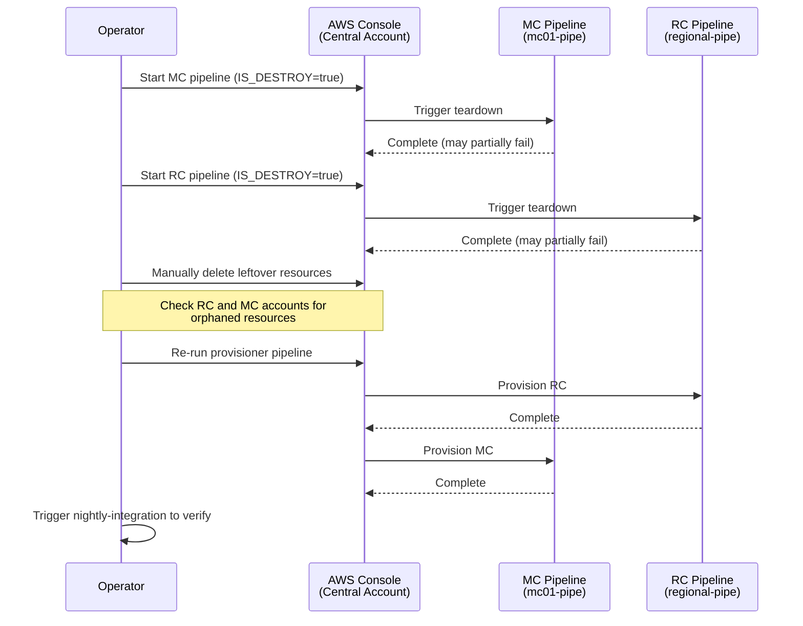

# Rebuild the Integration Environment

Tear down and re-provision the integration environment when it is unrecoverable through normal pipeline runs.

## Prerequisites

1. AWS Console access to the **central account** (hosts CodePipeline)
2. AWS Console or CLI access to the **RC and MC target accounts** (for manual cleanup of leftover resources)

## Procedure

The rebuild follows a teardown-then-provision cycle. MC must be torn down before RC because it depends on RC resources (IoT certificates, DNS zones).



### Step 1: Tear down the Management Cluster

1. Open the [AWS CodePipeline console](https://console.aws.amazon.com/codesuite/codepipeline/pipelines) in the **central account**.

2. Find the MC pipeline: `mc01-pipe`.

3. Click **Release change** (or **Start execution** in the pipeline detail view). When prompted for pipeline variables, set:

   ```text
   IS_DESTROY = true
   ```

4. Wait for the pipeline to complete. The teardown may partially fail due to dependency violations (e.g., RDS ENIs, EKS-managed resources). This is expected; leftover resources are cleaned up in Step 3.

### Step 2: Tear down the Regional Cluster

1. In the same CodePipeline console, find the RC pipeline: `regional-pipe`.

2. Start execution with:

   ```text
   IS_DESTROY = true
   ```

3. Wait for the pipeline to complete. As with the MC, partial failures are expected.

### Step 3: Clean up leftover resources

After both teardowns complete, three Secrets Manager secrets in the MC account will remain scheduled for deletion with a 30-day recovery window. These block re-provision because Terraform cannot create a secret while another with the same name is pending deletion. Force-delete them:

```bash
for secret in mc01-maestro-agent-cert mc01-maestro-agent-config hypershift/mc01-config; do
  aws secretsmanager delete-secret --secret-id "$secret" --force-delete-without-recovery --region us-east-1
done
```

RC secrets do not need manual cleanup (they use `recovery_window_in_days = 0`).

If the teardown failed more broadly, also check for other leaked resources (ENIs, EBS volumes, VPC components, EKS clusters) using [AWS Resource Explorer](https://resource-explorer.console.aws.amazon.com/) in each account.

### Step 4: Re-provision

Trigger the parent provisioner pipeline to re-create the RC and MC pipelines and start a fresh provision:

1. In the CodePipeline console (central account), find the provisioner pipeline: `pipeline-provisioner`.

2. Click **Release change**. Leave all variables at their defaults (do **not** set `FORCE_DELETE_ALL_PIPELINES`).

3. The provisioner will:
   - Rebuild the RC and MC child pipelines (if needed)
   - Trigger the RC pipeline, which provisions the regional cluster infrastructure
   - Trigger the MC pipeline, which provisions the management cluster infrastructure

4. Monitor both child pipelines until they succeed. The full provision typically takes 30-45 minutes.

   If the provision fails due to leftover resources from Step 3, delete the conflicting resources and re-trigger the failed pipeline.

## Post-Rebuild

### Update CI credentials

The RHOBS API Gateway uses a raw `execute-api` URL that changes on every rebuild (unlike the Platform API, which has a stable custom domain). Update the Prow vault secret so the nightly-integration job can reach Thanos and Loki:

1. Get the new RHOBS API Gateway URL from the Terraform state in the RC account:

   ```bash
   aws s3 cp s3://terraform-state-$(aws sts get-caller-identity --query Account --output text)-us-east-1/regional-cluster/regional.tfstate - \
     | jq -r '.outputs.rhobs_api_url.value'
   ```

2. Update the `rhobs_api_url` field in the Vault secret `selfservice/cluster-secrets-rosa-regional-platform-int/integration-creds` with the new URL.

### Verify the rebuild

1. Connect to the RC and MC bastions and verify ArgoCD applications are synced:

   ```bash
   make int-bastion-rc
   # On bastion:
   kubectl get applications -A
   ```

   All applications should show `Synced` and `Healthy`.

2. Test the Platform API:

   ```bash
   make int-shell
   # In shell:
   awscurl --service execute-api $API_URL/v0/live
   ```

   Expected response: `{"status":"ok"}`

3. Trigger the nightly-integration CI job to confirm end-to-end tests pass. Follow the [manual trigger instructions](../../ci/README.md#triggering-the-e2e-job-manually):

   ```bash
   curl -X POST \
       -H "Authorization: Bearer $(oc whoami -t)" \
       'https://gangway-ci.apps.ci.l2s4.p1.openshiftapps.com/v1/executions/' \
       -d '{"job_name": "periodic-ci-openshift-online-rosa-hyperfleet-main-nightly-integration", "job_execution_type": "1"}'
   ```

## Reference

- [Provision a New Environment](../environment-provisioning.md) for the full provisioning guide
- [CI Jobs](../../ci/README.md) for CI job details and manual trigger instructions
- Pipeline buildspec scripts: [`scripts/buildspec/provision-infra-rc.sh`](../../scripts/buildspec/provision-infra-rc.sh), [`scripts/buildspec/provision-infra-mc.sh`](../../scripts/buildspec/provision-infra-mc.sh)
- Pipeline names are derived from `regional_id` and `management_id` in the environment config (`config/<environment>/<region>.yaml`), constructed as `<id>-pipe` in the pipeline Terraform modules
